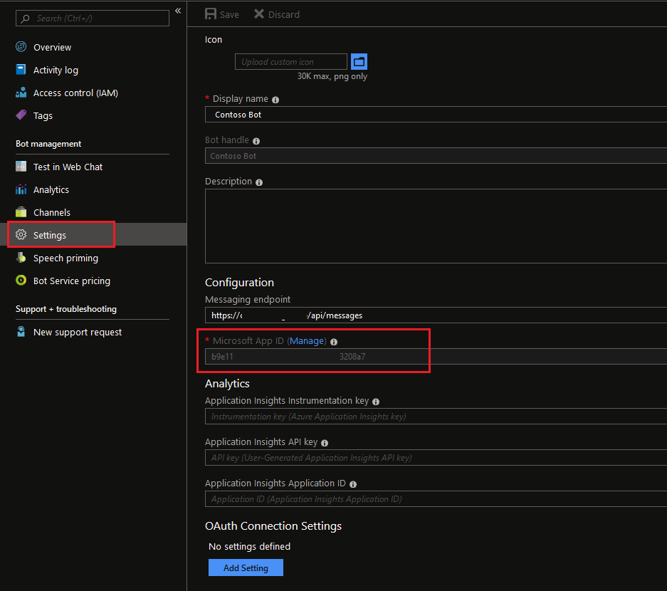
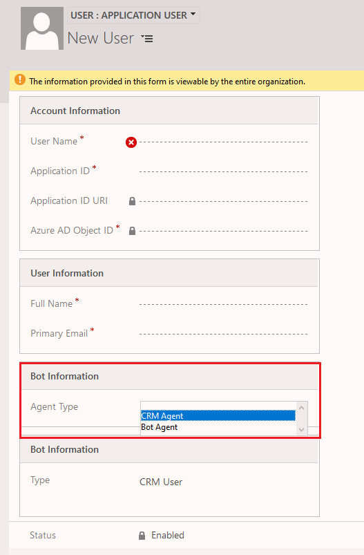
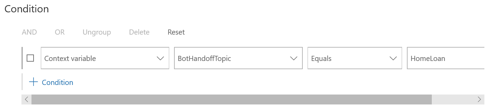

# Integrate a bot

Applies to Dynamics 365 for Customer Engagement apps version 9.1.0

[!include[cc-beta-prerelease-disclaimer](../../includes/cc-beta-prerelease-disclaimer.md)]

A bot is a program that provides automated responses in a conversational manner to a customer. It can also help in resolving customer queries by using case deflection. A bot can also collect basic information from a customer and then provided it to a customer service agent to work further on the issue raised by the customer.  

A bot eases the load on your customer service agents by handling basic queries. This saves some of your agent's time and they can work on more complex issues. You can configure your bots to escalate the query to a human agent as and when required by the customer.

In Omni-channel Engagement Hub, you can integrate a bot to start the conversation with a customer, provide automated responses, and then shift the conversation to a human agent, if required. Let's now see how to integrate a bot with Omni-channel Engagement Hub.

## Integrate a bot with Omni-channel Engagement Hub

**Prerequisites**: You must have a bot that is built using Microsoft Bot Framework. For more information on how to build a bot, see [Azure Bot Service Documentation](https://docs.microsoft.com/en-us/azure/bot-service/?view=azure-bot-service-4.0).

To integrate a bot with Omni-channel Engagement Hub, you must:

1.	[Create a bot user](#step-1-create-a-bot-user)
2.	[Add a bot user to the queue(s)](#step-2-add-a-bot-user-to-the-queues)
3.	[Set escalation rules](#step-3-set-escalation-rules)

### Step 1: Create a bot user

A bot user is created as an application user and assigned with the **Omni-channel agent** role. Creating an application user is supported in the Web Client only. To create a bot user, you must:

1.	Get the Microsoft App ID of the bot.
2.	Create an application user and add bot specific information to the application user.

To get Microsoft App ID of the bot:

1.	Open [https://portal.azure.com](https://portal.azure.com) and select **Bot Services** in the **All services** section.

2.	Search for the appropriate **Bot Channels Registration** in the list and select it.

    > [!div class=mx-imgBorder]
    > 

3.	Select **Settings** and then copy the value in the **Microsoft App ID** field. This value is your bot's application ID to be used while creating a bot user.

    > [!div class=mx-imgBorder]
    > 

To create a bot user:

1.	[Create an application user](https://docs.microsoft.com/en-us/dynamics365/customer-engagement/developer/use-multi-tenant-server-server-authentication#create-an-application-user--associated-with-the-registered-application--in-).

2.	On the **New User** page, enter or select the following information for bot:
    - **Agent type**: Select **Bot Agent**.
    - **Bot application ID**: Bot's application ID from Azure AD that you copied in the previous step.

    > [!NOTE]
    > You'll see two sections as **Bot Information**. You must enter information in the first **Bot Information** section.
    >
    > 

3.	Save the record.

4.	Select **Manage Roles** on the command bar.

5.	In the **Manage User Roles** window, select **Omni-channel agent**, and then select **OK**.

    > [!NOTE]
    > By default, the bot user is assigned the same capacity as other users. You must assign the maximum capacity to the bot user among all users in a queue if you want the bot to handle the customer queries first. The capacity of a bot user doesn't reduce when a query is handled by it.

### Step 2: Add a bot user to the queue(s)

Queues distribute the incoming customer queries among bots and agents. You must ensure that the bot user has the highest capacity among all users in queue. This ensures that the bot user receives the customer query first. 

> [!NOTE]
> The bot works with the chat widget, work stream, and queues created in Omni-channel Engagement Hub.

You can add a bot user to specific queues where you want the bot to handle the customer queries first. Alternatively, you can also create a queue with the bot user only. If you create a queue with the bot user only, ensure that the routing rules are set in a way that customer queries are sent to this queue first. This ensures that the bot acts as a first line of defense for all queries.

You can set escalation rules to allow a bot to send customer queries to a customer service agent. More information: [Step 3: Set escalation rules](#step-3-set-escalation-rules)

### Step 3: Set escalation rules

Escalation rules allow you to create rules for the bot to escalate the queries to the appropriate agent. For escalation rules, you must create a context variable and appropriate routing rules to route the customer queries.

If the bot escalates the customer query, it is routed to the appropriate queue as per the defined routing rule. If the customer query in redirected to the same queue, another agent in the queue will pick the conversation as per the capacity. For information on working with queues, see [Work with queues in Omni-channel Engagement Hub](queues-omni-channel.md).

> [!NOTE]
> If you've only one queue with bot and agents, and you didn't create a routing rule, the customer query is redirected to the same queue in case of escalation and picked up by an agent.

#### Create a context variable

You must create a context variable for the bot to handle the customer queries appropriately. The context variable is used in routing the incoming customer queries to the appropriate bots and agents. For information on creating context variables, see [Understand and create work streams](work-streams-introduction.md).

#### Create routing rules

Routing rules route the incoming customer queries to their respective queues. Each routing rule has a condition and a destination queue. If the condition is evaluated as true, the customer query is routed to the destination queue. For bots, the condition is built by using the context variable.

Bots are developed to receive customer queries first, gain information of the query,  and then pass the query to a human agent, if required. To achieve this behavior, you must add a bot user to the queue and configure routing rules in a way that the incoming customer queries are routed to the queue with bot user.

Ensure to map the routing rules to the correct queues so that the queries are routed appropriately. For information on creating a routing rule, see [Create and manage routing rules](routing-rules.md).

## Sample configuration to integrate a bot

This sample provides exact steps and configuration values to integrate a bot and then escalate the query to a human agent. In this sample, three queues and three routing rules will be created. A bot user is added to one queue and agents are added to two other queues. Routing rules are defined in a way that whenever a customer initiates a chat, it will be sent to the bot first and then escalated to a human agent as per the conditions defined in the routing rules. The work stream used in this sample is **ChatWorkStream**.

1.	Follow the instructions in [Step 1](#step-1-create-a-bot-user) to create a bot user.

2.	Follow the instructions in [Step 2](#step-2-add-a-bot-user-to-the-queues) to create three queues and add users as follows:
    - **BotQueue**: Add the bot user to this queue.
    - **CreditCardQueue**: Add agents who will handle credit card related queries.
    - **HomeLoanQueue**: Add agents who will handle home loan related queries.

3.	Follow the instructions in [Step 3](#step-3-set-escalation-rules) to create escalation rules. Let's say you create a context variable named **BotHandoffTopic** in the **ChatWorkStream** work stream. 

4.	Create three routing rules in the **ChatWorkStream** work stream in the following order:
    - **BotRule**: Specify the work stream and queue as **ChatWorkStream** and **BotQueue** respectively. Add the condition as follows:
        > [!div class=mx-imgBorder]
        > 
    - **CreditCardRule**: Specify the work stream and queue as **ChatWorkStream** and **CreditCardQueue** respectively. Add the condition as follows:
        > [!div class=mx-imgBorder]
        > 
    - **HomeLoanRule**: Specify the work stream and queue as **ChatWorkStream** and **HomeLoanQueue** respectively. Add the condition as follows:
        > [!div class=mx-imgBorder]
        > 

When a chat is initiated by a customer, the query is routed to the bot through the **BotRule** routing rule. If the bot escalates the query, it is sent to the appropriate agent as per the configured routing rules. Bot needs to send the correct context variable and its value in the escalation request to route the query appropriately. For more information on setting up of context variable and escalation request, see [Enable a bot to escalate and end conversation](../developer/bot-escalate-end-conversation.md).

## Privacy notice

You understand that your data may be transmitted and shared with external systems and that your data may flow outside of your organization’s compliance boundary (even if your organization is in a Government Cloud environment). For more information on how we process your data, please refer to the [Microsoft Privacy Statement](https://privacy.microsoft.com/en-us/privacystatement).

### See also

[Understand and create work streams](work-streams-introduction.md) 
[Work with queues in Omni-channel Engagement Hub](queues-omni-channel.md) 
[Create and manage routing rules](routing-rules.md) 
[Add a chat widget](add-chat-widget.md) 
[Enable a bot to escalate and end conversation](../developer/bot-escalate-end-conversation.md)
