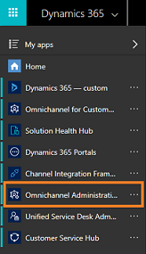
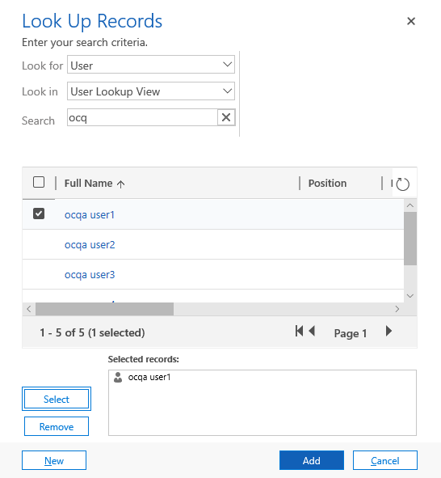

# Configure to view Intraday Insights dashboard in Omnichannel for Customer Service

Supervisors have a dual responsibility with respect to agents and customers. They monitor and manage agents, and make sure that they remain highly productive. At the same time, they help guarantee a superior experience for customers. To help supervisors carry out this dual responsibility, the dashboard consists of real-time monitoring and intraday health tracking of agent productivity and performance.

> [!IMPORTANT]
> The supervisor overview dashboard is not available in the GCC region (Gulf Cooperation Council).

As an administrator, you must configure the overview dashboard in your organization before supervisors can use it. To configure the dashboard on **Omnichannel for Customer Service** app, follow these steps:

1. [Review prerequisites](#review-prerequisites)
2. [Create Power BI datasets in your workspace](#create-power-bi-datasets-in-your-workspace)
3. [Verify workspace creation in Power BI](#verify-workspace-creation-in-power-bi)
4. [Configure dashboards in Power BI](#configure-dashboards-in-power-bi)
5. [Configure supervisor dashboard in Omnichannel for Customer Service](#configure-supervisor-dashboard-in-omnichannel-for-customer-service)
6. [Share dashboard in Omnichannel for Customer Service](#share-dashboard-in-omnichannel-for-customer-service)

## Review prerequisites

Review the following prerequisites before configuring the supervisor dashboard: 

-  You have administrative privileges for Dynamics 365. 

-  You must have Power BI Pro license for all supervisors. 

-  You must enable to embed Power BI reports in Dynamics 365.
    1.	Sign in to **Dynamics 365 for Customer Service** and go to **Settings** > **Administration** > **System Settings**.
    2.	Go to **Reporting** tab and configure **Allow Power BI visualization embedding** as **Yes**.
    
      > [!div class=mx-imgBorder]
      > 
    
    3.	Select **OK**.

-  As a system administrator, you must configure the following in Power BI service:

   1. Create a [security group in Azure Active Directory (AAD)](https://docs.microsoft.com/azure/active-directory/fundamentals/active-directory-groups-create-azure-portal), and add **Omnichannel Customer Service** to that security group.  

   2. As a Power BI admin, you need to enable service principal in the **Developer settings** in the Power BI admin portal. Add the security group that you created in Azure AD to the **Specific security group** section in the **Developer settings**.

        > [!IMPORTANT]
        > Service principals inherit the permissions for all Power BI tenant settings from their security group. To restrict permissions, create a dedicated security group for service principals and add it to the 'Except specific security groups' list for the relevant, enabled Power BI settings.
        
        > [!div class=mx-imgBorder]
        >   

-  Verify that your administrator has allowed Omnichannel Customer Service to read and write data on behalf of users in your organization. To learn more, see [Provide data access consent](omni-channel-provision-license.md).  

## Create Power BI datasets in your workspace

You must configure the Power BI workspace in Dynamics 365 Customer Engagement to import the data sets that are defined for supervisor in Power BI. Follow these steps to create the supervisor datasets to your workspace.

1.  Sign in to **Dynamics 365** and open **Omnichannel Administration** app. 

    > [!div class=mx-imgBorder]
    > 

2.  From the **Site Map** , select **Supervisor Experience**, **Overview Dashboard**.  

    > [!div class=mx-imgBorder]
    > 

    The Power BI configuration view opens.

    > [!div class=mx-imgBorder]
    > 

3.  Select **+ New**. 

    The **Power BI Analytics Configuration** form opens.

    > [!div class=mx-imgBorder]
    > 

4.  In the **Power BI workspace** section, select **Create New Workspace** and enter a name for the workspace in **Power BI workspace** (this name must be unique).

    > [!div class=mx-imgBorder]
    >   

5.  Select **Configure**. The workspace creation takes a few seconds and a confirmation message is displayed with the generated workspace ID.

    > [!NOTE]
    > You can also see the status of different configuration stages such as workspace, dashboard, and data. When a workspace is created successfully, all the statuses will be in Green check. If failed, the respective configuration stage check will be in Red, and an error message is displayed. You can take necessary steps to resolve the error and create the workspace again.

    > [!div class=mx-imgBorder]
    >   

    In Power BI, a workspace is created.

6.  Save and close the configuration. 

    After you save the configuration, it may take up to 15 minutes for the datasets, dashboard, and reports to appear in your created workspace.

    > [!IMPORTANT]
    > Don't create more than one analytics configuration in your Dynamics 365. If you have more than one record, the application would use the configuration that you last created. If you want to add a new analytics configuration, delete or deactivate any existing configuration.

## Verify workspace creation in Power BI

To verify the creation of workspace in Power BI, follow these steps:

1.  Sign in to **Power BI** service.

2.  Go to **Workspaces** and verify that a workspace with the name that you have entered is created.

    > [!div class=mx-imgBorder]
    >   

3.  Open the workspace that you have created and verify that the following are available:

    -   An empty dashboard with the name of the workspace.

    -   The report and datasets **IntradayMonitoring**.

## Configure dashboards in Power BI

Configuring the Power BI workspace provides you only the **IntradayMonitoring** report. Create the dashboard out of **IntradayMonitoring** Power BI report after it is available.

> [!NOTE]
> If you want up-to-the-minute reports with less than 15 minutes refresh rate, import and create the **LiveMonitoring** Power BI report.

> [!IMPORTANT]
> Share the Power BI dashboards with all Omnichannel Customer Service supervisor users. This allows supervisors to access the dashboards when they sign in to Omnichannel Customer Service on Unified Service Desk. For more information, see [Share your Power BI dashboards and reports with coworkers and others](https://docs.microsoft.com/en-us/power-bi/service-share-dashboards).

Follow these steps to configure Power BI dashboards.

1.  Go to [Insider portal](https://experience.dynamics.com/insider/campaign/program-downloads/?id=f962cc7f-a2cd-e811-a96b-000d3a1be7ad) and download **IntradayMonitoring** pbit file to your local folder.  

2.  Open the **Power BI Desktop** and sign in with your credentials.

3.  Go to **File** > **Import** > **Powers BI template** and select the downloaded **IntradayMonitoring.pbit**.

    A dialog displays.

4.  Select **Edit** on the message.

5.  Change to your created workspace and select the dataset **IntradayMonitoring**.

6.  Publish and save the pbix file to the created workspace. 

    The **IntradayMonitoring** report is created.

7.  In [Power BI Service](https://app.powerbi.com), open the reports that are available in the workspace. To learn more, see [Open a report in Power BI service](https://docs.microsoft.com/en-us/power-bi/consumer/end-user-report-open).

8.  Pin the required tiles to dashboards. To learn more, see [Pin a tile to a Power BI dashboard from a report](https://docs.microsoft.com/en-us/power-bi/service-dashboard-pin-tile-from-report).

    The following screen shows how to pin a visual to the dashboard.

<!--need to get this image-->
   > [!div class=mx-imgBorder]
   >   

9.  Select **Set as featured** for the created dashboard.

10.  Share the dashboard with supervisor users. To learn more, see [Share your Power BI dashboards and reports with coworkers and others](https://docs.microsoft.com/en-us/power-bi/service-share-dashboards).  

11.  Copy the URL of the dashboard.  

   The dashboard is ready, and you can configure the **Unified Service Desk** or **Omnichannel for Customer Service** to make the dashboard available for supervisors.

## Configure supervisor dashboard in Omnichannel for Customer Service

To view the supervisor dashboards in **Omnichannel for Customer Service**, you must add the Power BI reports to your app.

1.  Sign in to Dynamics 365 for Customer Service app.

2.  On the site map, select add icon (**+**) and then select **Dashboards**.

    > [!div class=mx-imgBorder]
    >   

3.  On the dashboard page, select **New** > **Power BI Dashboard**.

    > [!div class=mx-imgBorder]
    >   

4.  On the **Power BI Dashboard Properties** dialog, select **Workspace** in which you have the dashboards and then select **Dashboard**.

    > [!div class=mx-imgBorder]
    >   

5.  Select **Save**.

    The supervisor dashboard is added to **Omnichannel for Customer Service**.

## Share dashboard in Omnichannel for Customer Service

You must share the Intraday insights dashboard with supervisors in your organization to access the dashboard in **Omnichannel for Customer Service**. To share the dashboard, follow these steps:

1.  Sign in to **Dynamics 365 for Customer Service** and open **Omnichannel for Customer Service**.

2.  From the dashboard view selector, under My Dashboards, select the Intraday insights dashboard that you want to share with supervisors. In this example, we are selecting Contoso updates.

<!--need to get this image-->
   > [!div class=mx-imgBorder]
   >   

3.  Select **Share Dashboard**.

   > [!div class=mx-imgBorder]
   >   

4.  On the **Share user dashboard** dialog, select **Add User/Team**.

   > [!div class=mx-imgBorder]
   >   

5.  On the **Look Up Records** dialog, search for the team or users you want to add and select **Select**.

   > [!div class=mx-imgBorder]
   >   

6.  Select **Add**. 

    The users/teams are added to the share list

7. Select the users and privileges that you want to grant. Select **Share**.

   > [!div class=mx-imgBorder]
   >   

    The Intraday insights dashboard is shared with the users or teams that you have selected.

### See also