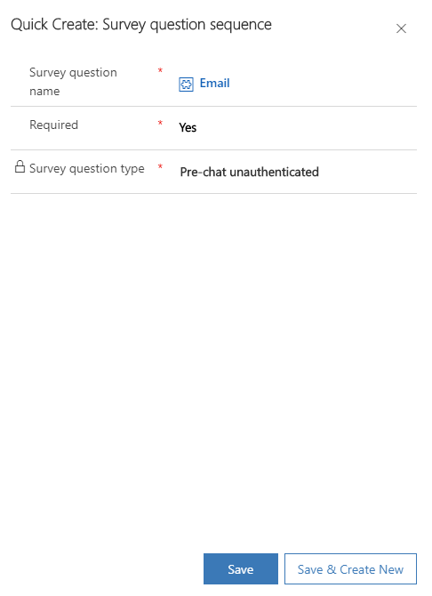
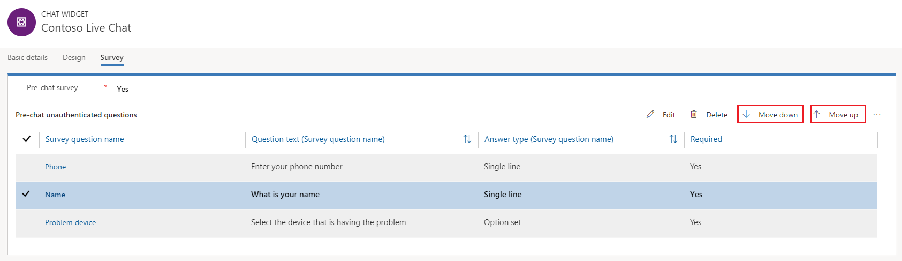

# Configure a pre-chat survey

Applies to Dynamics 365 for Customer Engagement apps version 9.1.0

[!include[cc-beta-prerelease-disclaimer](../../includes/cc-beta-prerelease-disclaimer.md)]

You can configure your chat widget to show users a survey that they should respond to before they start the conversation.

1. Sign in to Omni-channel Engagement Hub.
2. Go to **Administration** &gt; **Chat**.
3. Open the chat widget in which you need to configure pre-chat survey.
4. On the **Survey** tab, in the **Pre-chat survey** field, select **Yes**.
5. Select **Add question**.

    > [!NOTE]
    > You can add only five questions to a pre-chat survey.

6. In the **Quick Create: Survey Question Sequence** pane, browse and select a question that is already created, and specify whether it's required or optional. To create a new question, see [Create a survey question](create-question-library.md).

    > [!NOTE]
    > Validations in pre-chat survey are supported only for mandatory fields.

    > [!div class=mx-imgBorder]
    > 

7. Select **Save and Close**.

    The questions are added to the pre-chat survey.

    > [!div class=mx-imgBorder]
    > 

8. To change the order of a question, select it, and then select **Move up** or **Move down**.

    > [!div class=mx-imgBorder]
    > 

More information: [Automatically identify customers using pre-chat responses](record-identification-rule.md)

### See also

[Add a chat widget](add-chat-widget.md)  
[Create a survey question](create-question-library.md)  
[Create quick replies](create-quick-replies.md)  
[Create and manage operating hours](create-operating-hours.md)  
[Create chat authentication settings](create-chat-auth-settings.md)  
[Embed chat widget in Dynamics 365 for Customer Engagement Portal](embed-chat-widget-portal.md)
