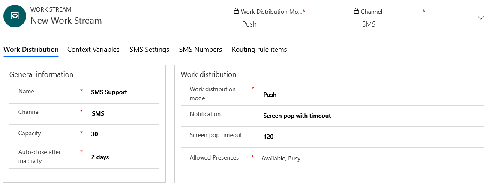
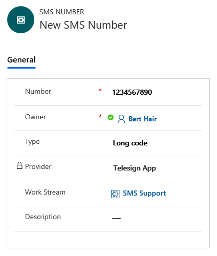
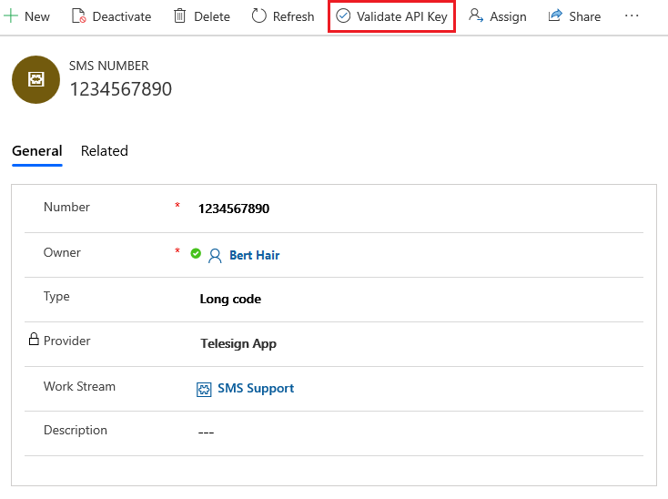

# Configure an SMS channel

Applies to Dynamics 365 for Customer Engagement apps version 9.1.0

[!include[cc-beta-prerelease-disclaimer](../../includes/cc-beta-prerelease-disclaimer.md)]

An SMS channel allows your organization to connect to customers by using text messages. When you configure an SMS channel, your customers can send text messages and connect with an appropriate customer service agent. This provides your customers the flexibility to connect with their mobile devices even if there is no internet connection for connecting to a chat channel.

Agents can view the incoming SMS requests in their dashboard and respond accordingly.

To add SMS support for your organization, you must first register with TeleSign and get your customer ID and API key, and purchase a phone number. You can then add SMS support through Omni-channel Engagement Hub.

> [!NOTE]
> - The maximum number of characters supported for sent and received messages is 1600.
> - SMS is an asynchronous mode of communication. Agents can close the conversation and then work on them later. Ending the conversation will mark it as resolved. More information: [Understand conversation states](../agent/agent-oceh/oceh-conversation-state.md)

## Sign up for TeleSign account

An SMS channel is enabled within Omni-channel Engagement Hub by integrating with TeleSign. This integration uses public APIs of TeleSign for sending and receiving text messages. You must sign up for a TeleSign account to enable an SMS channel in your organization.

To sign up for TeleSign:

1.	Go to [TeleSign](https://www.telesign.com/) to sign up for an account if you don't have one already.

2.	Purchase support phone numbers through your TeleSign account. For preview, only long code type US phone numbers are supported.

3.	Get the customer ID and API key from your TeleSign account. You will need to provide these while setting up the SMS channel in Omni-channel Engagement Hub.

4.	You are provided with a callback URL that must be sent to TeleSign at [support@telesign.com](mailto:support@telesign.com). This callback URL is specific to your organization. The callback URL is available when adding SMS support for your organization.

## Add SMS support for your organization

1.	Sign in to Omni-channel Engagement Hub.

2.	Go to **Administration** > **Work Streams**.

3.	Select **New** to create a work stream.

4.	On the **Summary** tab, in the **Channel** field, select **SMS**.

5.	In the **Auto-close after inactivity** field, select a duration of at least 8 hours.

    > [!div class=mx-imgBorder]
    > 

6.	On the **SMS Settings** tab, enter the following information:
    - **Customer ID**: Customer ID generated from the TeleSign account.
    - **API key**: API key generated from the TeleSign account.

7. Copy the value from the **TeleSign inbound URL** field and send it to TeleSign at [support@telesign.com](mailto:support@telesign.com). This value is the callback URL that is used to process incoming SMS messages.

    > [!div class=mx-imgBorder]
    > 

8.	Select **Save**.

9.	On the **SMS Numbers** tab, select **Add new SMS number**.

10.	On the **New SMS Number** page, enter the following information:
    - **Number**: Phone number purchased from TeleSign.
    - **Type**: Select if the number is long code, short code, or toll free.
    - **Description**: Optional description for the number.
    
    > [!NOTE]
    > For this preview, only one phone number is supported per work stream.

    > [!div class=mx-imgBorder]
    > 

11.	Select **Save**.

12.	Select **Validate API Key** from the toolbar at the top of the page to validate the customer ID and API key.

    > [!div class=mx-imgBorder]
    > 

13. Open the work stream you created for SMS.

14.	On the **Routing rules items** tab, create a routing rule to transfer the SMS to an appropriate agent. Routing rule for SMS works on the **Mobile Phone** field of the Contact entity. The customer is identified based on the **Mobile Phone** field and the conversation is automatically linked to the contact record.

## Flow of data between Omni-channel Engagement Hub - SMS channel and TeleSign

### Incoming text messages

For an incoming text message sent by a customer to the support phone number, the message is first sent to the TeleSign service and then pushed by TeleSign to Omni-channel Engagement Hub using the callback URL. After this, the message gets routed and associated to either a new or an existing conversation by Omni-channel Engagement Hub.

### Outgoing Text Messages

For an outgoing message sent by an agent from within Dynamics 365, the message is first sent to the TeleSign service and then TeleSign sends it to the customer. In addition to the text message, Omni-channel Engagement Hub uses the APIs provided by TeleSign to send the customer's phone number, support phone number (TeleSign SenderID), and the TeleSign account information (CustomerID and the API Key) to the TeleSign service.

### TeleSign API Key Validation

When you validate the API key while setting up the SMS channel, a call is made to TeleSign to validate customer ID and the API key.

### See also

[Understand and create work streams](work-streams-introduction.md) 
[Create and manage routing rules](routing-rules.md)
