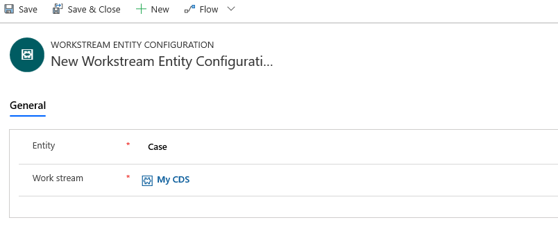

# Configure an entity channel

Applies to Dynamics 365 for Customer Engagement apps version 9.1.0

[!include[cc-beta-prerelease-disclaimer](../../includes/cc-beta-prerelease-disclaimer.md)]

Use entity channel to route entities from Common Data Service to the Omni-channel Engagement Hub so that they can be automatically distributed and assigned to agents.

Follow these steps to configure an entity channel.

1. In the Omni-channel site map, go to **Channels \> Entity**.

2. On the command bar, select **New** to create a new entity channel.
3. In the **General** tab:
 
    - Select the entity to be routed in the **Entity** drop-down list.

        > [!NOTE]
        > You can route any activity enabled entity.

    - A default work stream is associated in the **Work stream** field. Select the search icon to associate another entity work stream. Select **New** to create a new entity work stream. For more information, see [Set up an entity work stream](work-streams-introduction.md#set-up-an-entity-work-stream).

4. Select **Save** to save the channel.

    > [!div class=mx-imgBorder]
    > 

### See also 

[Understand and create work streams](work-streams-introduction.md)

