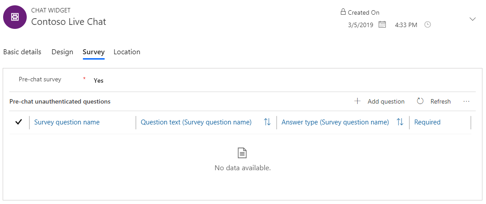
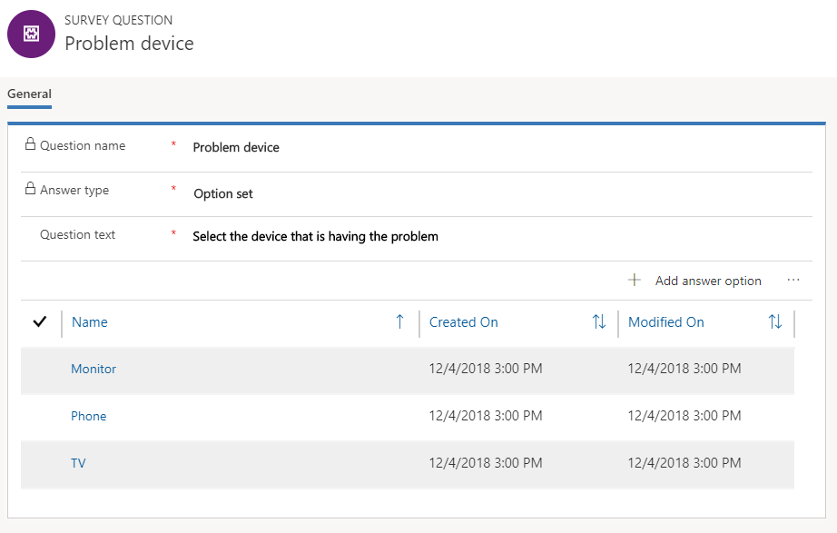
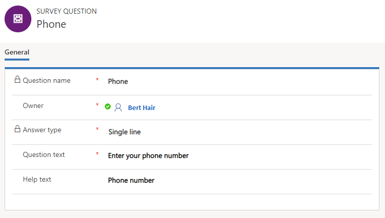

# Create a survey question

Applies to Dynamics 365 for Customer Engagement apps version 9.1.0

[!include[cc-beta-prerelease-disclaimer](../../includes/cc-beta-prerelease-disclaimer.md)]

You can create survey questions and associate them with a work stream. You can then use those questions to create pre-chat surveys for chat widgets that are associated with the work stream.

1. Sign in to Omni-channel Engagement Hub.
2. Go to **Administration** &gt; **Chat**.
3. Open the chat widget in which you need to add a question.
4. On the **Survey** tab, in the **Pre-chat survey** field, select **Yes**.
5. Select **Add question**.

    > [!div class=mx-imgBorder]
    > 
    
6. In the **Quick Create: Survey Question Sequence** pane, browse for a question and select **New**.
5. On the **New Survey Question** page, provide the following information:

    - **Question name**: Enter a name for the question. The name must be unique within a work stream.
    - **Work stream**: Browse and select the work stream to which the must be associated.
    - **Answer type**: Select the type of answer that is required from users:

        - **Single line**: The user can enter a single line of text.
        - **Multiple lines**: The user can enter multiple lines of text.
        - **Option set**: The user can select an option in a drop-down list. If you select this answer type, you must save the question before you can specify the answer options.

        > [!div class=mx-imgBorder]
        > 

    - **Question text**: Enter the text of the question.
    - **Help text**: Enter help text that will be shown to the user as a watermark.

        > [!div class=mx-imgBorder]
        > 

6. Select **Save**.

### See also

[Add a chat widget](add-chat-widget.md)  
[Configure a pre-chat survey](configure-pre-chat-survey.md)  
[Create quick replies](create-quick-replies.md)  
[Create and manage operating hours](create-operating-hours.md)  
[Create chat authentication settings](create-chat-auth-settings.md)  
[Embed chat widget in Dynamics 365 for Customer Engagement Portal](embed-chat-widget-portal.md)
