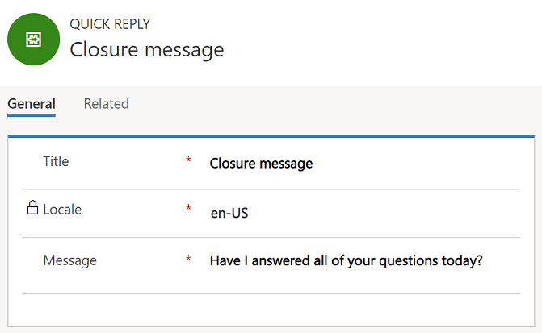

# Create quick replies

Applies to Dynamics 365 for Customer Engagement apps version 9.1.0

[!include[cc-beta-prerelease-disclaimer](../../includes/cc-beta-prerelease-disclaimer.md)]

Quick replies are pre-defined messages that can be created for agents to quickly reply to common questions by customers. For information on agent experience of quick response, see [Send quick replies in the chat](../agent/agent-usd/left-control-panel.md#send-quick-replies-in-the-chat).  

1. Sign in to Omni-channel Engagement Hub.
2. Go to **Administration** &gt; **Quick Replies**.
3. Select **New** to add a quick reply. To edit an existing quick reply, select the name of the quick reply.
4. Provide or change the following information:

    - **Title**: Enter the title of the message.
    - **Locale**: Specify the locale of the message.

        > [!NOTE]
        > In this preview, the **Locale** field can't be edited.

    - **Message**: Enter the text of the message.

        > [!NOTE]
        > This field supports slugs, but the slug editor isn't available in this preview.

    > [!div class=mx-imgBorder]
    > 

6. Select **Save**.

### See also

[Add a chat widget](add-chat-widget.md)  
[Create a survey questions library](create-question-library.md)  
[Configure a pre-chat survey](configure-pre-chat-survey.md)  
[Create and manage operating hours](create-operating-hours.md)  
[Create chat authentication settings](create-chat-auth-settings.md)  
[Embed chat widget in Dynamics 365 for Customer Engagement Portal](embed-chat-widget-portal.md)
