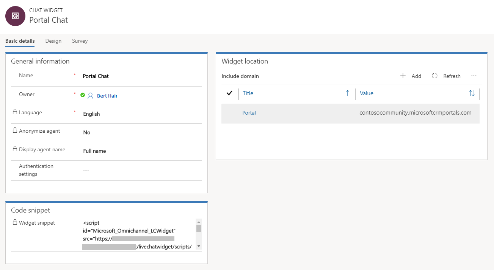
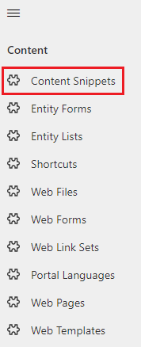
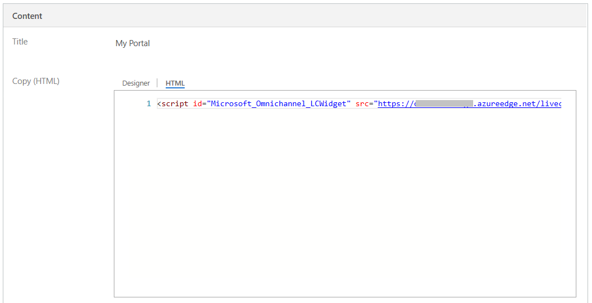
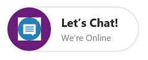
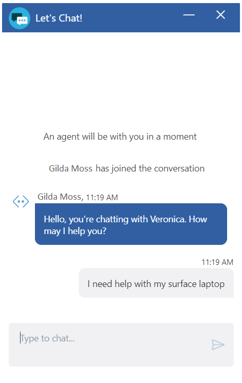
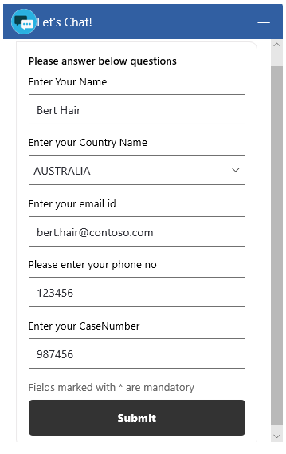

# Embed chat widget in Dynamics 365 for Customer Engagement Portal

Applies to Dynamics 365 for Customer Engagement apps version 9.1.0

[!include[cc-beta-prerelease-disclaimer](../../includes/cc-beta-prerelease-disclaimer.md)]

To embed a chat widget in Dynamics 365 for Customer Engagement Portal:

1.	Sign in to Omni-channel Engagement Hub.
2.	Go to **Administration** &gt; **Chat**.
3.	Open the chat widget you want to embed in Dynamics 365 for Customer Engagement Portal.
5.	On the **Basic details** tab, copy the widget snippet code from the **Code snippet** section.
    > [!div class=mx-imgBorder]
    > 
6.	Open the Dynamics 365 for Customer Engagement Portal app.
7.	Go to **Portal** > **Content Snippets**.
8.	Find the **Chat Widget Code** content snippet and open it.
    > [!div class=mx-imgBorder]
    >     
9.	On the **General** tab, scroll-down to the **Value (HTML)** section.
10.	Paste the chat widget snippet code in the **HTML** tab.
    > [!div class=mx-imgBorder]
    > 
11.	Save the changes. The chat widget is now embedded into the portal.

## Customer experience of chat widget

After the chat widget is configured, it has the following capabilities:

- **Minimized mode**: By default, the chat widget is shown in minimized mode. If any messages are received while the widget is in this mode, a count of the messages is shown.

    > [!div class=mx-imgBorder]
    > 

- **Maximized mode**: A user can maximize the chat widget to start a conversation with an agent.

- **System events**: System-generated messages are shown for events, such as when an agent joins a chat, or a chat is transferred to another agent.

    > [!div class=mx-imgBorder]
    > 

- **Pre-chat survey**: If a survey has been configured by an admin, it's shown to the user before the conversation is started. This survey also helps the user connect to an appropriate agent.

    > [!div class=mx-imgBorder]
    > 

- **Chat notifications**: Chat notifications are shown when the chat widget is in minimized mode, and when it's opened on a different browser tab. When the chat widget is in minimized mode, it shows a message count. If you move away from the browser tab where you're chatting, the message count is shown on the tab.
- **End chat**: A customer can end the chat by selecting the **Close chat** button. A confirmation message is displayed before ending the chat.

> [!NOTE]
> For advanced configuration like embedding chat widget on specific web pages, see [Manage portal content](../../portals/manage-portal-content.md).

### See also

[Add a chat widget](add-chat-widget.md)  
[Create a survey questions library](create-question-library.md)  
[Configure a pre-chat survey](configure-pre-chat-survey.md)  
[Create quick replies](create-quick-replies.md)  
[Create and manage operating hours](create-operating-hours.md)  
[Create chat authentication settings](create-chat-auth-settings.md)  
