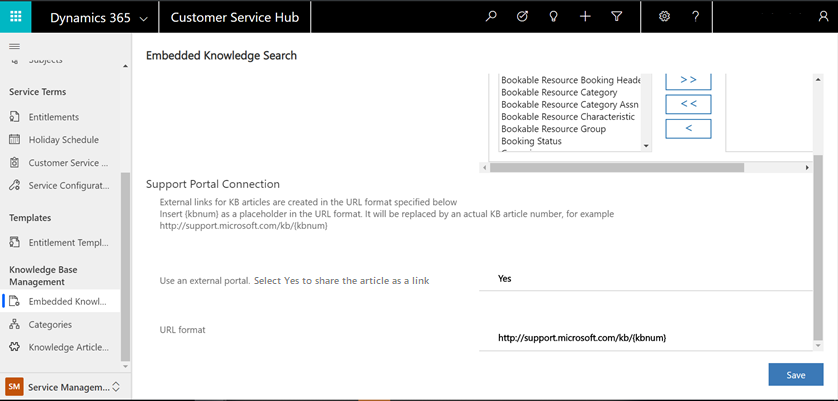

# Share knowledge articles in the Omni-channel Engagement Hub

Applies to Dynamics 365 for Customer Engagement apps version 9.1.0

[!include[cc-beta-prerelease-disclaimer](../../includes/cc-beta-prerelease-disclaimer.md)]

Enable knowledge article sharing in the Omni-channel Engagement Hub so that customer queries can be resolved quickly. You can configure an external portal in the **Customer Service Hub** app, so that your customer service agents can share knowledge article links with the customers from within the Omni-channel Engagement Hub app.

Follow these steps to enable knowledge article sharing.

1. In the Customer Service Hub sitemap, go to **Service Management** and select **Knowledge Base Management** > **Embedded Knowledge Search**. 

2. In the **Support Portal Connection** section, enter the following:  

    a. **Use an external portal**. Select **Yes** to enable the external portal and share the article as a link.  

    b. **URL Format**. Type the portal URL that will be used to create external (public-facing) portal links for knowledge articles, which the service agents can share with the customers. The external URL is created in the following format: 
            *http://\<support portal URL>/kb/{kbnum}* 
  
     The placeholder "{kbnum}" is replaced by an actual knowledge article number.  

3. Select **Save** to save the settings.

    > [!div class=mx-imgBorder]
    > 

To know more about how to configure external portal in the **Customer Service Hub** app, see [Set up knowledge management (Customer Service Hub)](../../customer-service/set-up-knowledge-management-embedded-knowledge-search.md#set-up-knowledge-management-customer-service-hub).

### See also

[Search and share knowledge articles](../agent/agent-usd/left-control-panel.md#search-for-and-share-knowledge-articles)
