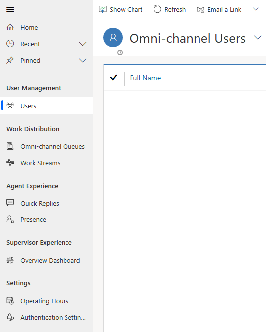

# Omni-channel Engagement Hub for administrators

[!INCLUDE[cc-applies-to-update-9-0-0](../../includes/cc_applies_to_update_9_0_0.md)]

Omni-channel Engagement Hub is a customizable application, that you can effectively configure to meet the requirements of your business. Use Omni-channel Engagement Hub to manage users (agents and supervisors), work streams, conversations, and queues, and effectively route important conversations to agents quickly. You can manage the capacity of the agents so that they handle conversations effectively and assist the customers better. You can manage the types of conversations that agents receive using the work streams and queues configurations.

## Access Omni-channel Engagement Hub for administrators

1. Provision the Omni-channel Engagement Hub app. Follow the steps given in [Provision Omni-channel Engagement Hub](omni-channel-provision-license.md) to set up and enable the Omni-channel Engagement Hub app in your Dynamics 365 instance.

2. Once the app is enabled, go to the Dynamics 365 for Customer Engagement site map, navigate to the app switcher and then select **Omni-channel Administration**.

    > [!div class=mx-imgBorder] 
    > 

You can view the entities in the **Omni-channel Administration** site map.

  > [!div class=mx-imgBorder] 
  > 

## In this section

- [Understand unified routing and work distribution](unified-routing-work-distribution.md)
- [See how unified routing and work distribution works](routing-work-distribution-scenario.md)
- [Create a chat widget](set-up-chat-widget.md)

## How-to topics
- [Enable users for Omni-channel Engagement Hub](add-users-assign-roles.md)
- [Manage a user in omni-channel](users-user-profiles.md#manage-a-user-in-omni-channel) 
- [Create a new live chat work stream](create-work-streams.md#create-a-new-live-chat-work-stream) 
- [Create a new CDS Entity work stream](create-work-streams.md#create-a-new-cds-entity-work-stream) 
- [Set up record identification rule](record-identification-rule.md) 
- [Create custom presence status](presence-custom-presence.md#create-custom-presence-status) 
- [Create a new omni-channel queue](queues-omni-channel.md#create-a-new-omni-channel-queue) 
- [Create a routing rule](routing-rules.md#create-a-routing-rule) 
- [Enable knowledge articles in the Omni-channel Engagement Hub](knowledge-management-oc.md)  
- [Add a chat widget](add-chat-widget.md) 
- [Configure a pre-chat survey](configure-pre-chat-survey.md) 
- [Create a question library](create-question-library.md) 
- [Create quick replies](create-quick-replies.md) 
- [Create and manage operating hours](create-operating-hours.md) 
- [Create chat authentication settings](create-chat-auth-settings.md) 
- [Embed chat widget in Dynamics 365 for Customer Engagement Portal](embed-chat-widget-portal.md)
