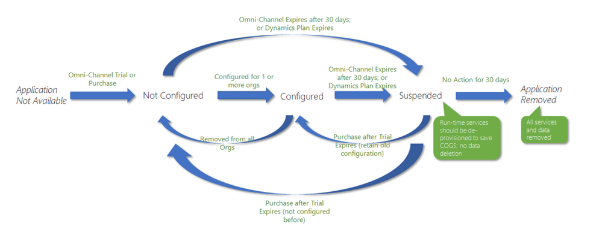

# Provision Omni-channel Engagement Hub

Omni-channel Engagement Hub for Microsoft Dynamics 365 is a cloud-based application that helps you extend the power of Microsoft Dynamics 365 for Customer Service. It lets customer service agents instantly connect to and engage with customers, so that they can quickly resolve the customers' queries.

Quick customer engagement and problem solving help improve customer satisfaction. Omni-channel Engagement Hub provides a modern, customizable, high-productivity app that lets agents help customers across different channels via a unified interface.

Omni-channel Engagement Hub lets customers start a conversation with a support agent via social media but then seamlessly transition to another channel, such as email, text, or chat. It lets organizations choose the channel that suits their business needs, and helps guarantee that a high level of responsive, quality service is received across channels.

As an administrator, you can provision Omni-channel Engagement Hub by purchasing an add-on in the Microsoft Office portal. You can set up the add-on from the Dynamics 365 Administration Center, and then start using it in one or more organizations.

> [!NOTE]
> If you've set up a trial version, you should purchase the add-on license after the trial expires. Otherwise, your access to the application will be suspended.

The following illustration shows the complete provisioning and licensing cycle for the omni-channel engagement hub.

System users that an omni-channel license is provisioned for are referred to as omni-channel users. The licensed version of Omni-channel Engagement Hub provisions the following channels and capabilities for omni-channel users.

**Channels**

- Chat
- Short Message Service (SMS)
- Secure asynchronous messaging (enabled with Portal)

> [!NOTE]
> You can install, enable, and use the preceding channels independently of each other.

**Capabilities**

- Routing and presence
- Profile and work distribution
- Enhanced agent and supervisor experience

Follow these steps to provision and license Omni-channel Engagement Hub.

1. Provision the Omni-channel Engagement Hub package.
2. Enable Omni-channel Engagement Hub in an organization.

    1. On the **Manage Omni-channel Instances** page, select **Add Org** to add an organization and begin the omni-channel installation.

        The **First run experience** wizard is opened.

    2. Select an organization in the drop-down list to begin the installation.
    3. Enable Unified Service Desk (USD) as part of the omni-channel installation.

        Select the check box to enable USD together with the omni-channel organization.

        > [!IMPORTANT]
        > USD version 4.0 or later is required for omni-channel. If you have an older version of USD, this installation will update USD to the latest version.
        >
        > If USD is already installed in the organization, you should select the check box for a single-page application.

    4. Select the check box to enable the **Chat** channel for your organization.
    5. Select the check box to enable the **SMS** channel for your organization.
    6. Select the check box to enable the **Async Messaging** channel for your organization.
    7. On the **Summary** page, you can view the progress of the installation.

    As the installation proceeds, the following channels and capabilities are enabled for omni-channel:

    - Routing
    - Presence
    - Agent profile
    - Work distribution
    - Unified Service Desk
    - Chat
    - SMS

    After the installation is completed, you receive an email that shows the status of the installation.

    > [!NOTE]
    > On the **Manage Instances** page, admins can view the organizations where omni-channel is enabled.

    For example, the following illustration shows that all the channels and capabilities are correctly installed in the organization.

3. Set up the Domain Name System (DNS) for Omni-channel Engagement Hub.
4. Create users, and assign system user roles to them.
5. License Omni-channel Engagement Hub.
