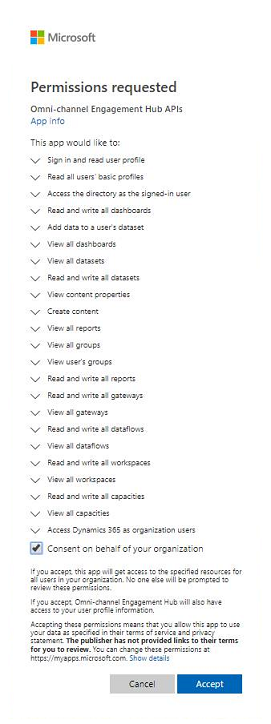

# Provision Omni-channel Engagement Hub

Applies to Dynamics 365 for Customer Engagement apps version 9.1.0

Omni-channel Engagement Hub provides a modern, customizable, high-productivity app that lets agents help customers across different channels via a unified interface. It lets organizations choose the channel that suits their business needs. It also ensures that a high level of responsive, quality service is received across channels.

> [!IMPORTANT]
> Before you can provison Omni-channel Engagement Hub on your org, a **Global Tenant Admin** must [Allow sideloading of external apps in Microsoft Teams](#allow-sideloading-of-external-apps-in-microsoft-teams) and [Provide data access consent](#provide-data-access-consent). 

## Allow sideloading of external apps in Microsoft Teams

To allow sideloading of external apps in Microsoft Teams, follow the below steps:

1. Go to [Microsoft 365 admin center](https://portal.office.com/adminportal/home#/homepage).
2. Select **Settings** > **Services & add-ins** > **Microsoft Teams**.
3. Expand **Apps** in **Tenant-wide settings**.
4. In the **External Apps** section, for the **Allow sideloading of external apps** option, switch the toggle button position to **On**.

For more information, see [Admin settings for apps in Microsoft Teams](https://docs.microsoft.com/en-us/microsoftteams/admin-settings).

## Provide data access consent

To allow Omni-channel Engagement Hub to read and write data on behalf of users, follow the below steps:

1. Go to [Data access consent URL](https://go.microsoft.com/fwlink/?linkid=2070932).
2. Login using **Global Tenant Admin** credentials.
3. Select the checkbox **Consent on behalf of your organization**.
4. Select **Accept** to grant data access consent.

    > [!div class=mx-imgBorder]
    > 

## Provision Omni-channel Engagement Hub application

> [!IMPORTANT]
> Ensure that you are either a **Global Tenant Admin** or **Dynamics 365 Service Admin** of your Dynamics 365 org to be able to provision the Omni-channel Engagement Hub application.

Follow these steps to set up Omni-channel Engagement Hub.

**Step 1**: Get the Omni-channel Engagement Hub app.

   1. Sign up for the Omni-channel Engagement Hub preview from the [Dynamics Insider Portal](http://experience.dynamics.com/insider). 

   2. Once you receive a confirmation email from Microsoft, you can view the app in **Manage applications** in the **Dynamics 365 Administration Center**.
    
        > [!div class=mx-imgBorder]
        > 

**Step 2**: Set up Omni-channel Engagement Hub.

   1. In the **Dynamics 365 Administration Center**, select **Manage**.
      
        > [!div class=mx-imgBorder]
        > 

       The **Manage Omni-channel Instances** page is displayed.

   3. On the **Manage Omni-channel Instances** page, select **Add Org** to add an organization.   Omni-channel is set up on the organization instance that you add here.
   
       > [!div class=mx-imgBorder]
       > 

       > [!IMPORTANT]
       > As an admin, you can configure Omni-channel on multiple org instances. You can view the status of all org instances where the Omni-channel app has been configured in the **Manage Instances** view.

   3. Select the organization in the **Organization Selector** drop-down list. 

        > [!div class=mx-imgBorder]
        > 

       
      You must select the checkboxes for **Microsoft Privacy Statement** and **Terms and Conditions** to accept the terms and proceed with the set up. You can read the privacy and preview conditions by selecting them in the **Terms & Conditions** section. 

        > [!div class=mx-imgBorder]
        > 
        
      Select **Continue** to proceed.

   4. Ensure that the check box to enable **Chat** channel on your org is selected by default. Select **Continue** to proceed.

       > [!div class=mx-imgBorder]
       > 

       > [!NOTE]
       > In this preview, **Chat** check box is selected by default as this preview supports the set up of only the **Chat** channel. You cannot un-select the check box.
   
       Once the set up is completed successfully, you can see the **Chat** channel enabled on the **Summary** page.

      > [!div class=mx-imgBorder]
      > 

On successful set up, you can view the org and the enabled channel in the **Manage Instances** view.

> [!div class=mx-imgBorder]
> 

### See also

[Assign roles and enable users for Omni-channel Engagement Hub](add-users-assign-roles.md)

[Manage users](users-user-profiles.md)

[Understand unified routing and work distribution](unified-routing-work-distribution.md)
