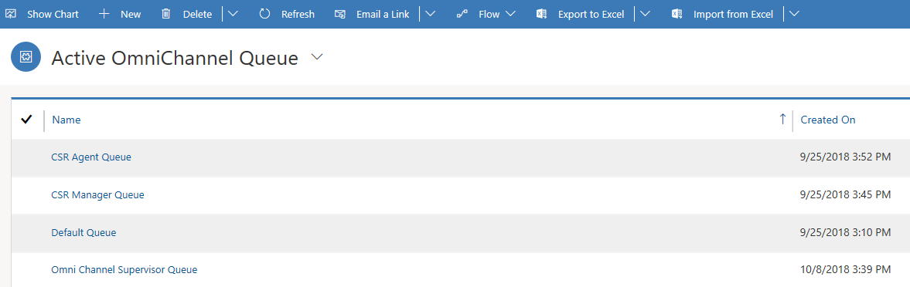
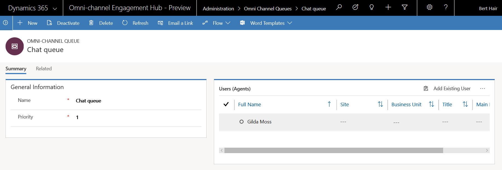

# Work with queues in Omni-channel Engagement Hub

Applies to Dynamics 365 for Customer Engagement apps version 9.1.0

[!include[cc-beta-prerelease-disclaimer](../../includes/cc-beta-prerelease-disclaimer.md)]

Omni-channel queues are used to collect and distribute workload among agents. Workload includes conversations, such as Chat or SMS or Entity records like Cases or Leads. Agents are added as queue members to the queues and the workload is distributed among these agents.

Omni-channel queues are proxies for skills or domains. For example, you can create separate queues for billing issues, investment issues, and so on. When a customer query comes for these issue types, it is routed to its designated queue.
    
> [!div class=mx-imgBorder]
> 

You can assign priority to queues. All conversations in a queue take the priority of the queue and higher priority conversations are allocated first. For example, if there are two chat conversations coming from two queues with priorities assigned as Priority 1 and Priority 2 respectively, chat conversation with Priority 1 will be allocated to an agent first.

## Default queue
There is a default Omni-channel queue for each organization. Admins can't delete the default queue. By default, all Omni-channel users are members of the default queue. Therefore, the membership of this queue can't be changed.

  > [!NOTE]
  > When no queues or routing rules are defined, all conversations are collected in the **Default** queue.

## Create a new Omni-channel queue

Follow these steps to create a new Omni-channel queue.

1. In the Omni-channel site map, go to **Queues & Users \> Omni-channel Queues**.

    The **Active Omni-channel Queue** view is shown.

2. On the command bar, select **New** to create an Omni-channel queue.
3. On the **Summary** tab, in the **General Information** section, provide the following information:

    1. **Name**: Enter a name for the queue.
    2. **Priority**: Assign a priority to define how quickly a conversation should be picked from the queue.

4. Select **Save** to save the new queue.

    The **Users (Agents)** section is shown for the queue.

5. In the **Users (Agents)** section, select **Add Existing User** to add existing agents to the queue.
6. On the **Lookup Records** flyout menu, select the agents to add, and then select **Add**.

    > [!TIP]
    > To select users from other views, you can change the view by selecting **Change View**.

> [!div class=mx-imgBorder]
> 

### See also

[Understand and create work streams](work-streams-introduction.md)

[Understand unified routing and work distribution](unified-routing-work-distribution.md)
