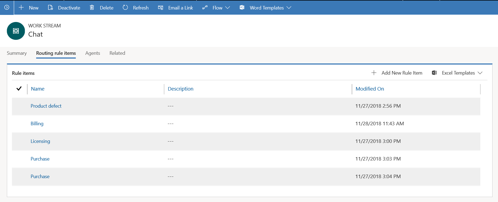
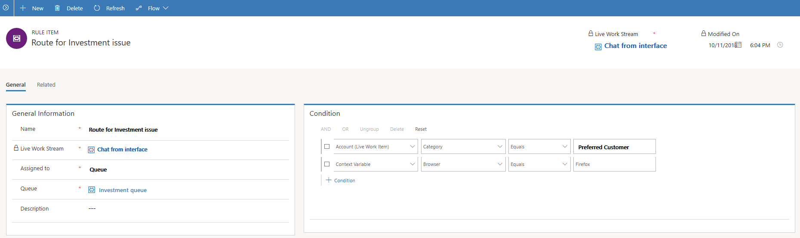

# Create and manage routing rules

Routing rules in Omni-channel Engagement Hub unify conversations from multiple work streams and distribute them to the correct agents, so that customers get help quickly. Routing rules are an entry point into the routing and work distribution ecosystem. When routing rules are invoked, they evaluate the destination of an incoming conversation and route it to the correct queue.

Routing rules are configured for each work stream. A single work stream can have multiple routing rules.

> [!div class=mx-imgBorder] 
> 

> [!NOTE]
> The destination for the conversation can be a queue or an agent. However, in this preview, only queues are supported as destinations.

Routing rules evaluate conversations based on the context channel, customer attributes, and agent attributes. For example, you can define a routing rule so that chats from high priority customers who have specific queries about investments can be routed to a specific queue. The following illustration shows the rule configuration for this example.

> [!IMPORTANT]
> Routing rule items are run in a specific order, and the conversations are routed according to the destination. Collectively, the conditions form a criterion for a rule item. Therefore, for a conversation, if the criterion in a rule item is evaluated as true, the conversation is routed to the designated destination. Otherwise, the criterion in the next rule item is evaluated.   If the criteria in all the rule items are evaluated as false, the conversation goes to a **Default** queue.

## Create a routing rule
To create a routing rule, select a work stream by navigating to **Work Distribution Management** > **Work Streams**, and define a new rule in the **Routing Rule Item** tab.

1. Select **Add New Rule Item** to add a new routing rule item.  
    - In the **General information** section of the **General** tab, provide the following information: 
      1. **Name**. Name of the rule item
      2. **Work Stream** is auto populated
      3. **Queue**. Look up a queue or select New to add a new queue.   **More information**: [Create a new omni-channel queue](queues-omni-channel.md#create-a-new-omni-channel-queue)
      4. **Description**. A brief description of the rule item.
              
    - In the **Condition** section, provide the conditions for the omni-channel rule. Based on the conditions defined, the conversations are routed to the correct agents or queues. When you define conditions for the omni-channel routing rules, you can choose from:
        - Entity
        - Attribute
        - Operator
        - Value

       So, for an entity, you can choose from a set of attributes, operators, and values related to the entity. 
       With the help of using appropriate conditions in the routing rules, you can achieve many more routing combinations to route conversations, like:
         - Incoming customer chat request from the portal with specific pre-chat answers should be routed to a specific queue.
         - Incoming custom entities like Change_Requests, etc. should be routed to omni-channel queue with live agents.

       > [!div class=mx-imgBorder]
       > 

2. Select **Save** to save the rule.

### See also

[Create and manage work streams](work-streams.md)

[Understand unified routing and work distribution](unified-routing-work-distribution.md)
