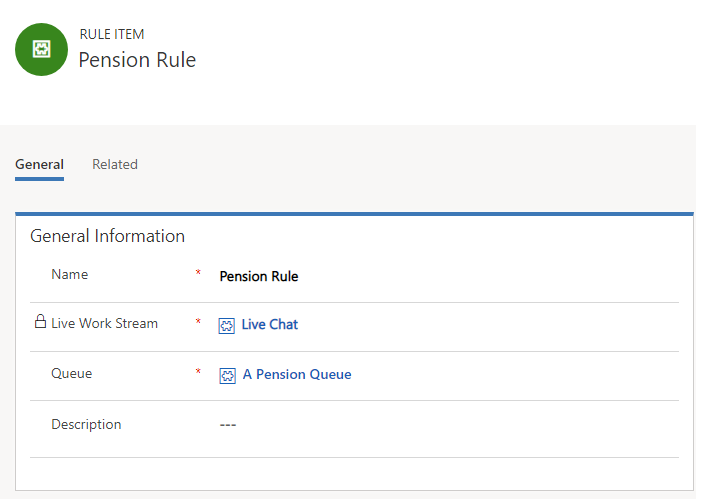

# Create and manage routing rules in omni-channel

Routing rules in Omni-channel Engagement Hub unify conversations from multiple work streams and distribute them to the right agents so that customers are assisted quickly. They are an entry point to the routing and work distribution eco-system. As soon as the routing rules are invoked, they evaluate the destination of an incoming conversation and route it to the correct queue.

Routing rules are configured for each work stream. There can be multiple routing rules for a work stream where they help in collecting conversations according to the condition applied and route them to the right queue.

 

**Note**: The destination for the conversation can be a queue or an agent. In private preview, only queues are supported as the destination.

 

Routing rules evaluate the conversations based on the context channel, customer attributes, and agent attributes.

For example, you can define a rule so that chats from preferred customers who have specific queries about investments can be routed to a specific queue. For the above example, the rule configuration will be:

Rule items are executed in an order and the conversations are routed according to the destination. Conditions collectively form a criteria for a rule item. So, for a conversation, the criteria in a rule item should be true for it to be routed to the designated destination. Else, the next rule item’s criteria is evaluated for validation.

In case all the configured rule items are evaluated as false, the conversations land in a **Default queue**.

## Create a routing rule
To create a routing rule, select a work stream by navigating to **Work Distribution Management** > **Work Streams**, and define a new rule in the **Routing Rule Item** tab.

1. Select **Add new Rule Item** to add a new routing rule item.  
    - In the **General information** section of the **General** tab, provide the following information: 
      - **Name**. Name of the rule item
      - **Work Stream** is auto populated
      - **Queue**. Look up a queue or select New to add a new queue.   **More information**: [Create a new omni-channel queue](queues-omni-channel.md#create-a-new-omni-channel-queue)
      - **Description**. A brief description of the rule item.
              
    - In the **Condition** section, provide the conditions for the omni-channel rule. Based on the conditions defined, the conversations are routed to the correct agents or queues. When you define conditions for the omni-channel routing rules, you can choose from:
        - Entity
        - Attribute
        - Operator
        - Value

       So, for an entity, you can choose from a set of attributes, operators, and values related to the entity. 
       With the help of using appropriate conditions in the routing rules, you can achieve many more routing combinations to route conversations, like:
         - Incoming customer chat request from the portal with specific pre-chat answers should be routed to a specific queue.
         - Incoming custom entities like Change_Requests, etc. should be routed to omni-channel queue with live agents.

2. Select **Save** to save the rule.

