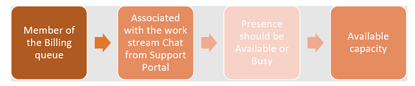
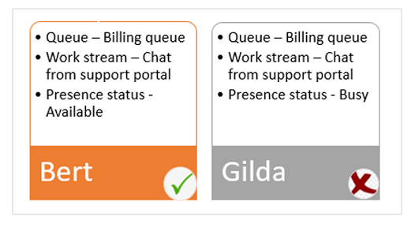

# Understand how unified routing and work distribution works

[!INCLUDE[cc-applies-to-update-9-0-0](../../includes/cc_applies_to_update_9_0_0.md)]

The following scenario should help you understand how the routing and work distribution mechanism works.

- As an admin, you configure the following entities in the omni-channel system.

    | Entity                     | Value |
    |----------------------------|-------|
    | Work stream and capacity   | **Chat from Support Portal** with a capacity of **50** units |
    | Channel                    | **Chat** |
    | Work distribution mode     | **Push** |
    | Omni-channel routing rules | <ul><li>If **Category** = **Billing**, assign to **Billing Queue**</li><li>If **Category** = **Product**, assign to **Product Queue**</li></ul> |
    | Omni-channel queues        | <ul><li>**Billing Queue**: Members = **Gilda**, **Bert**</li><li>**Product Queue**: Members = **Jill**, **Shana**</li> |
    | Users   | Agents = **Gilda**, **Bert**, **Jill**, **Shana** |
    | Presence status            | **Available** or **Busy** |

- All incoming conversations are marked with a unique work stream name, and they inherit the properties that were defined in that work stream during runtime evaluation.

    In this scenario, if a chat request comes in, and the **Chat from Support Portal** work stream name is associated with it, the chat request inherits the properties of the defined work stream.

- The routing and work distribution mechanism comes in to play. This mechanism is a two-step process:

    1. Routing rules evaluate the incoming conversation and determine that the destination is an omni-channel queue.

        > [!NOTE]
        > Incoming conversations include contextual data (a combination of context variables and related entity records). Routing rules are based on these context variables. In the preceding entity configuration, **Category** is a context variable. If the category of an incoming conversation is **Billing**, the conversation is routed to the **Billing Queue** omni-channel queue in real time.

    2. After the conversation reaches the correct omni-channel queue, work distribution rules are applied, and the conversation is allocated to one of the agents.

        The conversation is assigned to the agent who satisfies the following conditions:

        

        Here is an example that shows how these conditions might be evaluated:

        - Both Gilda and Bert are members of the **Billing Queue** omni-channel queue.
        - Bert's presence status is **Available**, whereas Gilda's presence status is **Busy**.
        - Bert has the required capacity.

        In this case, the conversation is assigned to Bert.

        

- Other rules play a part in the assignment of a conversation. Here are some examples:

     - If the conversation is coming in for reassignment after some follow-up, it's allocated to the agents who previously worked on it. This principle is known as **agent affinity**.
      - The conversation is first allocated to the agent who has the most available capacity.
      - If multiple agents qualify for the conversation and have the same capacity, the conversation is allocated to the agent who has been idle at that capacity for the longest time.

In this scenario, if the presence status of both Gilda and Bert is **Available**, both agents qualify for the incoming conversation, because they both meet these conditions:

- They are members of the **Billing Queue** omni-channel queue.
- Their presence status is **Available**.

> [!NOTE]
> Agent affinity doesn't apply, because the conversation is coming in for the first time.

The following table shows the evaluation that will be used to assign the conversation. In this table, *X* represents Gilda's capacity, and *Y* represents Bert's capacity.

|                          | X &gt; Y                               | Y &gt; X                              | X = Y |
|--------------------------|----------------------------------------|---------------------------------------|-------|
| **Gilda's capacity (X)** | 100 units                              | 50 units                              | 50 units (for one hour) |
| **Bert's capacity (Y)**  | 50 units                               | 100 units                             | 50 units (for two hours) |
| **Condition evaluation** | Gilda has more capacity than Bert.     | Bert has more capacity than Gilda.    | Bert and Gilda have equal capacity (50 units). However, Bert is available for two hours, whereas Gilda is available for one hour. |
| **Result**               | The conversation is assigned to Gilda. | The conversation is assigned to Bert. | The conversation is assigned to Bert, because he has been idle for a longer time than Gilda. |
|||

## Automated work distribution

If a conversation remains in an omni-channel queue assigned to any agent, it becomes available for automated work distribution:

- Conversations that have priority-1 queues are distributed before conversations that have priority-2 queues. All items that belong to an omni-channel queue have equal priority.
- Conversations are queued according to their age.
- As soon as agents become available and have enough capacity to take on the work, the items start to be allocated to them.
- Agents work on the conversations and take one of the following actions:
    - Transfer the conversation to another queue or agent. This action often occurs because customers selected incorrect interactive voice response (IVR) options or answered questions on the pre-chat survey incorrectly.
    - Move the conversation to **Waiting for Customer Input** or other internal tasks that the agent can't act on. When the customer responds, the conversation will be moved from the **Waiting** state to the **Open** state.
    - Resolve the conversation and move it to the **Closed** state.

### Adjusting an agent's capacity based on conversation allocation

When an agent accepts a conversation, his or her capacity is reduced. Here are the actions that occur:

- The conversation is added to the agent's **My Items** list.
- The agent's presence status might change to **Busy** or **Busy DND**, depending on the total capacity that is used.
- The agent's utilized capacity increases.
- The agent's available capacity decreases.

### Adjusting an agent's capacity based on closure of active conversations

When an agent has finished working on a conversation, the capacity should be added back to the agent's availability. Here are the actions that occur:

- The conversation is removed from the agent's **My Items** list.
- The agent's presence status might change to **Busy** or **Available**, depending on the total capacity that is used.
- The agent's utilized capacity decreases.
- The agent's available capacity increases to the extent of his or her free capacity.
- If any conversations that are waiting in the queue can be assigned to the agent, they are allocated as soon as the agent becomes available.

## See also

[Understand unified routing and work distribution](unified-routing-work-distribution.md)
