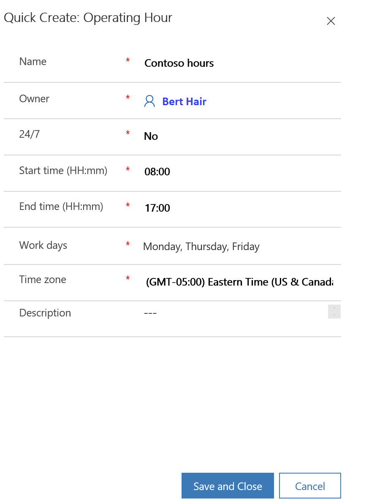

# Set up a chat widget

As an administrator, you can set up and configure a chat widget for your website to engage with your customers.

## Add a chat widget

1.  Sign in to Omni-channel Engagement Hub.

2.  Go to **Administration** &gt; **Work Streams**.

3.  To create a new work stream, select **New**.

4.  Under the **Summary** tab, select **Live Chat** from the **Stream Source** drop-down list.

5.  Specify values under **Agents**, **Agent Profiles**, and **Context Variable**. More information: [Work streams](work-streams.md).  

6.  Under the **Chat settings** tab, select **Add** from **Chat engagements** section.

7.  On the **New Chat Widget** page, enter the following details:

    1. **Basic details** tab

        1.  Under the **General information** section, enter name of the chat engagement. You can optionally specify authentication settings. Save the record to enter more details. More information on setting up authentication settings: [Set up authentication settings](#set-up-authentication-settings).

        2.  Under the **Widget location** section, select **Add** to specify the website domain where the chat widget needs to be displayed. If no domain is specified,  the chat widget is displayed in all configured domains. The domain format should not include the protocol (for example, http, https).

        3.  Copy the value from the **Code snippet** section and embed it into the HTML source of your website.

            > [!div class=mx-imgBorder]
            > 

    2. **Design** tab: Use this tab to specify the theme color, logo, title, subtitle, position, and operating hours of chat widget. More information on setting up operating hours: [Set up operating hours](#set-up-operating-hours).

       > [!div class=mx-imgBorder]
       > 

    3. **Survey** tab: Use this tab to set up a pre-chat survey. This survey is displayed to a user before initiating a conversation. More information: [Set up a pre-chat survey](#set-up-a-pre-chat-survey)

       > [!div class=mx-imgBorder]
       > 

## Set up a pre-chat survey

You can configure your chat engagement to display a survey for a user to respond before starting the conversation.

1.  Sign in to Omni-channel Engagement Hub.

2.  Go to **Administration** &gt; **Work Streams**.

3.  Select the work stream under which your widget is created.

4.  Under the **Chat settings** tab, select the chat widget name.

5.  Go to the **Survey** tab.

6.  In the **Pre-chat survey** field, select **Yes**.

7.  Select **Add question** to add questions from the question library. More information: [Set up a question library](#set-up-a-question-library)  

    > [!NOTE]
    > You can add only five questions to the pre-chat survey.

8.  In the **Quick Create: Survey Question Sequence** pane, select a question from the question library and specify whether it is mandatory or optional.

    > [!NOTE]
    > Validations in pre-chat survey are not supported in this preview.

9.  Select **Save**.

    > [!div class=mx-imgBorder]
    >   

10. The questions are added to the pre-chat survey.

    > [!div class=mx-imgBorder]
    >   

11. To change the order of a question, select the question, and then select **Move up** or **Move down**.

    > [!div class=mx-imgBorder]
    >   

## Set up a question library

You can create questions in a question library, which will be used to create pre-chat surveys for a chat widget. All chat widgets that are created within a work stream can use questions from the question library.

1.  Sign in to Omni-channel Engagement Hub.

2.  Go to **Administration** &gt; **Work Streams**.

3.  Select the work stream in which you need to create a question library.

4.  Under the **Survey questions library** tab, select **Add question**.

    > [!div class=mx-imgBorder]
    >   

5.  On the **New Survey Question** page, enter the following values:

    1. **Question name**: Name of the question. The name must be unique across work stream.

    2. **Answer type**: Type of the answer required from a user. You can select either of the following:

       - **Single line**: Allows a user to enter a single line of text.

       - **Multiple lines**: Allows a user to enter multiple lines of text.

       - **Option set**: Allows a user to select an option from the drop-down list. If you select this option, you must first save the question to specify the answer options.

         > [!div class=mx-imgBorder]
         >   

    3. **Question text**: Text of the question.

    4. **Help text**: Help text to be displayed to a user as a watermark.

        > [!div class=mx-imgBorder]
        >   

6.  Select **Save**.

## Set up quick replies

Quick replies are the template messages that can be created for agents to quickly reply to common questions by customers. For information on agent experience of quick response, see [Send quick replies in the chat](../agent/customer360-overview-existing-challenges.md#send-quick-replies-in-the-chat).  

1.  Sign in to Omni-channel Engagement Hub.

2.  Go to **Administration** &gt; **Quick Responses**.

3.  To add a new quick reply, select **New**.

4.  To edit an existing quick reply, select the quick reply name.

5.  Enter or modify the following values:

    1. **Title**: Title of the message.

    2. **Locale**: Locale of the message.

        > [!NOTE]
        > This field is not editable in this preview.

    3. **Message**: Text of the message.

        > [!NOTE]
        > This field supports slugs, but the slug editor is not available in this preview.

        > [!div class=mx-imgBorder]
        > 

6.  Select **Save**.

## Set up operating hours

You can create operating hours to set the hours during which your organization’s customer support team is active and available to serve customers. This helps your customers and organization to work together and resolve an issue. After you create an operating hour record, you must add it in the **Design** tab of the appropriate chat widget to make it function.

> [!NOTE]
> The chat widget will be hidden during non-operating hours.

1.	Sign in to Omni-channel Engagement Hub.

2.	Go to **Administration** > **Operating Hours**.

3.	To add a new operating hour record, select **New**.

4.	In the **Quick Create: Operating Hour** pane, enter the following values:

    1. **Name**: Name of the operating hour record.

    2. **24/7**: Select Yes if the chat widget should be enabled 24/7 or No if the chat widget should be enabled on particular 
    days of the week. By default, No is selected.
    
    3. **Start time (HH:mm)**: Start time of the operating hour in 24-hour format.
    
    4. **End time (HH:mm)**: End time of the operating hour in 24-hour format.
    
        > [!NOTE]
        > The end time should not be set earlier than the start time or closer than five minutes to the start time.
    
    6. **Work days**: Days of the week on which the customer support is available.
    
    7. **Time zone**: Time zone of the operating hour.
    
    8. **Description**: Optional description of the operating hour record.

        > [!div class=mx-imgBorder]
        > 

5.	Select **Save and close**.

## Set up authentication settings

You can create authentication settings to validate a signed-in customer from a domain and extract information based on the defined context variables. You can differentiate your anonymous customers and authenticated customers and can create rules based on the context variables. For example, you can have separate queues for anonymous customers and authenticated customers. Since you have more information about your authenticated customers, you can also prioritize them based on certain variables such as shopping cart value or a privileged status.

After you create an authentication settings record, you must add it in the **Basic details** tab of the appropriate chat widget to make it function.

1.	Sign in to Omni-channel Engagement Hub.

2.	Go to **Administration** > **Chat Authentication**. A list of existing authentication settings is displayed.

3.	To add a new chat authentication record, select **New**.

4.	On the **New Authentication Settings** page, enter the following values:

    1. **Name**: Name of the authentication setting.

    2. **Public key URL**: Public key URL of the domain. It is used to validate the information coming in from the JSON Web Token (JWT) of the domain from which a customer has signed in.
    
    3. **JavaScript client function**: JavaScript client function to be used for authentication. This function extracts token from the token endpoint.
    
    For details on getting the public key URL and JavaScript client function, see [Setup for Dynamics 365 portal](#setup-for-dynamics-365-portal ) or [Setup for portals not using Dynamics 365 (custom portal)](#setup-for-portals-not-using-dynamics-365-custom-portal).

5.	Select **Save**.

When a signed-in customer on a portal opens the chat widget, the JavaScript client function will pass the JWT from client to server. The JWT is decrypted and validated using the public key and the information is passed to the chat agent within Omni-channel Engagement Hub. As an administrator, you can also pass additional information of a signed-in customer in JWT by defining custom context variables. The context variables must be defined exactly as they are defined in CDS.

### Setup for Dynamics 365 portal

If you are adding authentication for a chat widget on a Dynamics 365 portal, public key URL, JavaScript client function, and JWT are available out-of-the-box. You can get the required values as follows:

- **Public key URL**: `<portal_base_URL>/_services/auth/publickey`
- **JavaScript client function**: `auth.getAuthenticationToken`
- **Token endpoint**: `<portal_base_URL>/_services/auth/token`

### Setup for portals not using Dynamics 365 (custom portal)

If you are adding authentication for a chat widget on a portal not using Dynamics 365 (a custom portal), you must set up the environment as follows:

1.	Define the private - public key pairs on your server. These keys are used to sign and encrypt the JWT sent to the server. Only RSA256 keys are supported.

    Sample code to generate private - public key pairs:

    ```
    openssl genpkey -algorithm RSA -out private_key.pem -pkeyopt rsa_keygen_bits:2048
    openssl rsa -pubout -in private_key.pem -out public_key.pem
    ```

2.	Expose the public key endpoint as a URL which contains public key as a string.

3.	Create a client-side JavaScript function that returns the signed JWT and the public key.

    Sample code to define JavaScript client function:

    ```
    window["getAuthenticationToken"] = function(callback){
            var xhttp = new XMLHttpRequest();
            xhttp.onreadystatechange = function() {
                if (this.readyState == 4 && this.status == 200) {
                        callback(xhttp.responseText);
                }
            };
            xhttp.onerror = function(error) {
                callback(null);
            };
            xhttp.open("GET", "https://contosohelp.com/token", true);
            xhttp.send();
    }
    ```

4.	After authenticating, you must identify your customer from Dynamics 365 contacts. You need to extract the GUID used by Dynamics 365 for the contact. For example: `87b4d06c-abc2-e811-a9b0-000d3a10e09e`

5.	Create a JSON payload that includes sub (GUID) and three attributes (iss, iat, exp) as mandatory claims.

    Sample JWT payload:

    ```
    {
                    "sub" : "87b4d06c-abc2-e811-a9b0-000d3a10e09e",
                    "preferred_username" : "a184fade-d7d0-40e5-9c33-97478491d352",
                    "phone_number" : "1234567",
                    "given_name" : "Bert",
                    "family_name" : "Hair",
                    "email" : "admin@contosohelp.com",
                    "lwicontexts" :”{\”msdyn_cartvalue\”:\”10000\”, \”msdyn_isvip\”:\”false\”}”,
                    "iat" : 1542622071,
                    "iss" : "contosohelp.com",
                    "exp" : 1542625672,
                    "nbf" : 1542622072
    }
    ```

6.	Add custom context variables, if required. The context variables must be defined exactly as they are defined in CDS.

    Sample definition of custom context variables:

    ```
    def create_token(user_json):
        with open('private_key.pem', 'r') as myfile:
            data = myfile.read()
        json_token = json.loads(user_json)
        lwicontexts = {}
        lwicontexts['msdyn_cartvalue'] = 10000
        lwicontexts['msdyn_isvip'] = "false"
        json_token['lwicontexts'] = json.dumps(lwicontexts)
        encoded_jwt = jwt.encode(json_token, data, algorithm='RS256')
        return encoded_jwt
    ```

    > [!NOTE]
    > - The `user_json` parameter comes from the identity provider (for example, Azure AD, Google)
    > - lwicontexts is the key whose value should have the custom context variable serialized as string. lwicontexts must be specified in lowercase.

7.	Sign and encrypt this payload by using the private key to generate the JWT. 

    Sample code to encrypt the payload (this is included in the sample code to define custom context variables):

    ```
    encoded_jwt = jwt.encode(json_token, data, algorithm='RS256')
    return encoded_jwt
    ```


