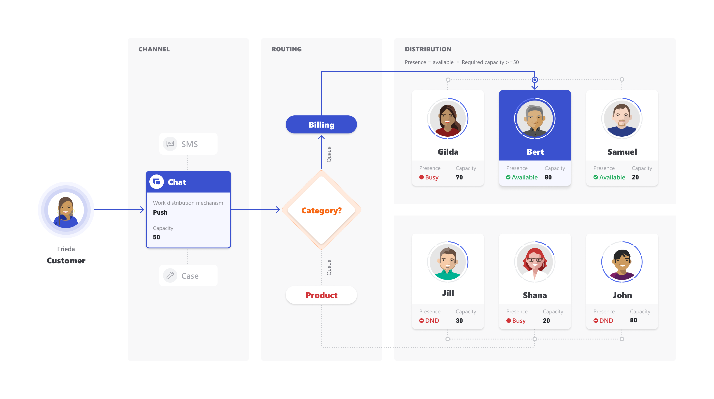

# Understand unified routing and work distribution

Applies to Dynamics 365 for Customer Engagement apps version 9.1.0

[!include[cc-beta-prerelease-disclaimer](../../includes/cc-beta-prerelease-disclaimer.md)]

Unified routing and work distribution ensures that conversations from all the channels are routed to agents efficiently. This is a two-step process:

1. Routing dispatches conversations into the right Omni-channel queues.
2. Work distribution allocates the conversations in a queue to agents in real time, based on capacity and presence.

For example, a customer initiates a chat regarding a query about **Billing**. In this case, unified routing and work distribution helps route the chat to the **Billing** queue and assign the chat to an agent who is a member of the queue and has the required presence and required capacity. This is shown in the following illustration.

> [!div class=mx-imgBorder]
> 

Here are some of the benefits of unified routing and work distribution:

- Conversations are evenly allocated to the agents.
- Conversations are allocated to agents based on priorities.
- Agents’ productivity is tracked by tracking time spent on various conversations.

## Scenario walk-through of unified routing and work distribution 

Refer the following scenario to understand how unified routing and work distribution works and how conversations are assigned to agents.

## Step 1: Configure the basics

Configure the following entities in the Omni-channel Engagement Hub. Once configured, the app is ready to route and distribute conversations to agents.

|Entity   |Value   |
|---------|---------|
|Omni-channel users   *Name - Presence : Capacity*     |  Gilda – Busy : 70 units   Bert – Available : 80 units   Samuel – Available : 20 units  Jill – DND : 30 units  Shana – Busy : 20 units   John – DND : 80 units |
|Work stream      |  Product & Billing live chat        |
|Capacity     |   50 units        |
|Work distribution mode     | Push       |
|Omni-channel routing rules      |  If *category* = **Billing**, assign to **Billing** queue    If *category* = **Product**, assign to **Product** queue |
|  Omni-channel queues & members     |   Billing Queue = Gilda, Bert, Samuel   Product Queue = Jill, Shana, John |
|    |         |

## Step 2: Process the chat conversation
A chat conversation originates from the customer.

- For every incoming conversation, the associated channel is identified, and the routing and work distribution properties are applied 
- In this case, properties of the work stream **Product & Billing live chat** are imparted to the incoming chat. So, the conversation  carries a capacity of **50 units**.   This implies that this chat, when assigned to an agent, will block 50 units of agent’s capacity.

## Step 3: Apply routing and work distribution rules

At this point, routing and work distribution mechanism comes in.

 - With the help of context variables (*category* in the above table), **routing rules** determine that the chat belongs to the **Billing** queue.     The chat is routed it to the **Billing** queue. 

- As the chat reaches the Billing queue, the conversation is allocated to one of the agents of the Billing queue, who satisfy the following criteria:

    - Has the required capacity of **50 units**
    - Presence should be **Available**

In this case, **Bert** has the required capacity and presence, so the chat is assigned to **Bert**. As Bert starts working on the chat conversation,  his presence changes to **Busy** and his capacity is updated to **30 units**.

### Adjusting an agent's capacity based on conversation allocation

An agent's capacity is adjusted when a conversation is allocated. Here are the actions that occur:

- The conversation is added to the agent's **My Items** list.
- The agent's presence status changes to **Busy** or **Busy DND**.
- The agent's utilized capacity increases.
- The agent's available capacity decreases.

### Adjusting an agent's capacity based on closure of allocated conversation

When an agent has finished working on a conversation, the capacity should be added back to the agent's availability. Here are the actions that occur:

- The conversation is removed from the agent's **My Items** list.
- The agent's presence status changes to **Available**.
- The agent's utilized capacity decreases.
- The agent's available capacity increases to the extent of free capacity.

If conversations are waiting to be assigned, they are allocated as soon as the agent becomes available.

To effectively route and distribute work to agents, admins can set up the following items in Omni-channel Engagement Hub:

- [Enable users for Omni-channel Engagement Hub](add-users-assign-roles.md)
- [Manage users](users-user-profiles.md)
- [Understand and create work streams](work-streams-introduction.md)
- [Configure a chat channel](set-up-chat-widget.md)
- [Configure an entity channel](create-entity-channel.md)
- [Configure an SMS channel](configure-sms-channel.md)
- [Work with queues](queues-omni-channel.md)
- [Set up record identification rule](record-identification-rule.md)
- [Create and manage routing rules](routing-rules.md)
- [Configure and manage presence status](presence-custom-presence.md)

###  See also

[Omni-channel Engagement Hub for administrators](omni-channel-engagement-hub-administrator.md)

