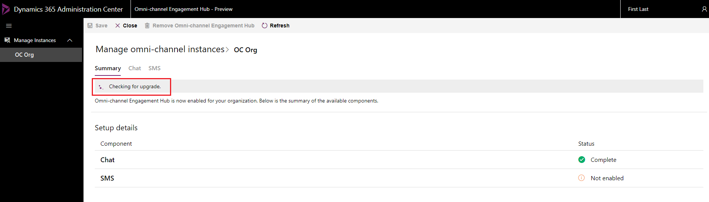
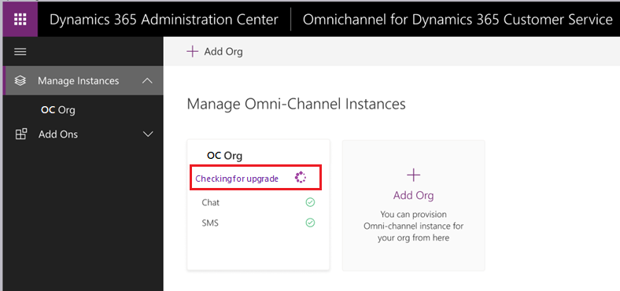
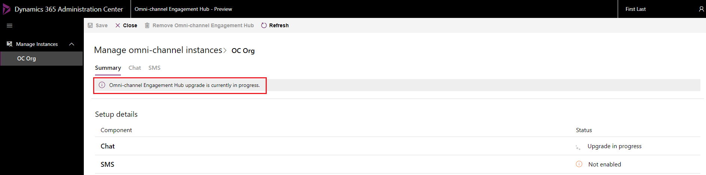
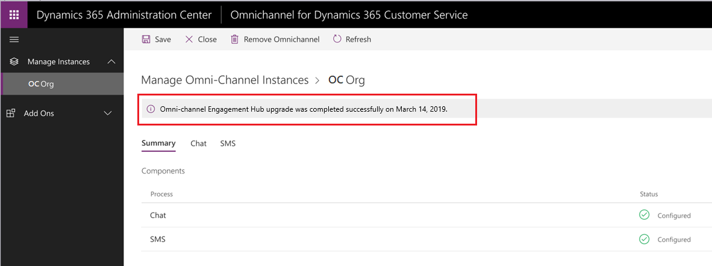

# Upgrade Omni-channel Engagement Hub

Upgrade to the latest version of Omni-channel Engagement Hub to unlock the benefits of new features. You can now upgrade to the latest release of Omni-channel Engagement Hub from the **Manage Instances** page in **Dynamics 365 Admin Center**. 

See [What's new in Omni-channel Engagement Hub](https://go.microsoft.com/fwlink/?linkid=2083527) to learn about the new features in the latest release.

Follow these steps to upgrade Omni-channel Engagement Hub:

1. Log in to the [Dynamics 365 Admin Center](https://admin.microsoft.com/adminportal/home#/homepage).

2. Select **Manage Instances** and navigate to your org in the **Manage Omni-channel Instances** page. 
3. Check for an upgrade notification for your org. 

    > [!div class=mx-imgBorder] 
    > 

    As an upgrade is available, select the **Upgrade** button to upgrade your org to the latest version.

     > [!div class=mx-imgBorder] 
     > 

    The system begins the upgrade and displays the message **Omni-channel Engagement Hub upgrade is currently in  progress**.
         
     > [!div class=mx-imgBorder] 
     > 

    When the upgrade process is completed successfully, your org is upgraded to the latest version and the message **Omni-channel Engagement Hub upgrade was completed successfully** is displayed with the date.

    > [!div class=mx-imgBorder] 
    > 

## Upgrade Omni-channel Engagement Hub package on Unified Service Desk

If you are using Omni-channel Engagement Hub on Unified Service Desk, refer [Deploy package on Dynamics 365 for Customer Engagement instance](omni-channel-engagement-hub-package.md#deploy-package-on-dynamics-365-for-customer-engagement-instance) to upgrade.

### See also

[Enable SMS channel](omni-channel-provision-license.md#enable-sms-channel)

[Pre-requisites and system requirements of Omni-channel Engagement Hub - Preview](../system-requirements-omni-channel-engagement-hub.md)

[Provision Omni-channel Engagement Hub](omni-channel-provision-license.md)
