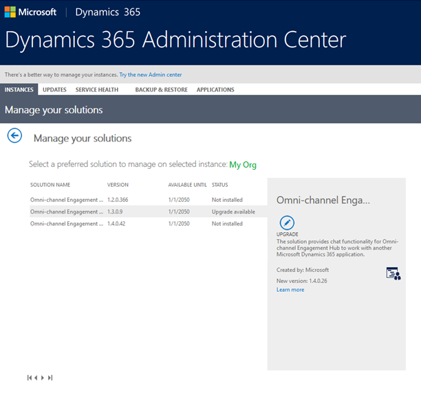

# Upgrade Omni-channel Engagement Hub

Upgrade to the latest version of Omni-channel Engagement Hub to unlock the benefits of new features. You can now upgrade to the March 2019 release of Omni-channel Engagement Hub from **Dynamics 365 Admin Center**.

See [What's new in Omni-channel Engagement Hub](https://go.microsoft.com/fwlink/?linkid=2083527) to know about the new features in the March 2019 release.

To upgrade the Omni-channel app to the latest version, upgrade the following solutions from the **Manage your solutions** section in Admin Center.

- Omni-channel Engagement Hub – Chat Package for Dynamics 365
- Omni-channel Engagement Hub – Customer Service Hub

Follow these steps to upgrade Omni-channel app.

1. Go to [Dynamics 365 Admin Center](https://portal.office.com/adminportal/home#/homepage).
2. Select **Instances** tab and navigate to your Dynamics 365 instance. 
3. In the **Manage your solutions** section, select **Omni-channel Engagement Hub – Chat Package for Dynamics 365** from the list of solutions.
4. Select **Upgrade** to upgrade the solution.

    > [!div class=mx-imgBorder] 
    > 

    > [!NOTE]
    > Upgrade may take up to an hour. Please wait for the installation to complete successfully.

5. Similarly, select **Omni-channel Engagement Hub – Customer Service Hub** from the list of solutions and select **Upgrade**.

    > [!div class=mx-imgBorder] 
    > 

    Once both the solutions are installed and the upgrade is complete,  you are now ready to use the Omni-channel app.

### See also

[Manage updates in Dynamics 365](../../admin/manage-updates.md)

[Pre-requisites and system requirements of Omni-channel Engagement Hub - Preview](../system-requirements-omni-channel-engagement-hub.md)

[Provision Omni-channel Engagement Hub](omni-channel-provision-license.md)
