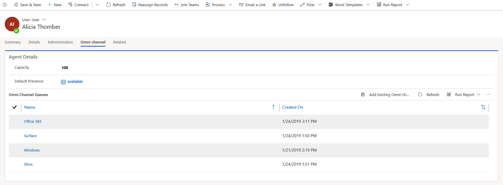

# Manage users in Omni-channel Engagement Hub

Applies to Dynamics 365 for Customer Engagement apps version 9.1.0

[!include[cc-beta-prerelease-disclaimer](../../includes/cc-beta-prerelease-disclaimer.md)]

All Dynamics 365 users who are assigned the **Omni-channel administrator**, **Omni-channel supervisor**, or **Omni-channel agent** security role are enabled for Omni-channel and become Omni-channel users.

For more information on how to create users and assign security roles, see [Assign roles and enable users for Omni-channel Engagement Hub](add-users-assign-roles.md).

Navigate to **Queues & Users > Users** to view the list of Omni-channel users in the **Omni-channel Users** view.

> [!div class=mx-imgBorder] 
> 

## Manage a user in Omni-channel

1. In the Omni-channel site map, go to **Queues & Users \> Users**.

    The **Omni-channel Users** view is shown. 

2. Select a user and in the **Omni-channel** tab, provide the following information:

    - In the **Agent Details** section:  

        - **Capacity** - Allocate capacity to agent. 

        - **Default Presence** - Assign a default presence status for agent. This is the status that the agent is logged in with, in the Omni-channel app.
     
3. Select **Save** to the save the user record.

> [!div class=mx-imgBorder]
> 

### See also

[Work with queues in Omni-channel Engagement Hub](queues-omni-channel.md)

[Configure and manage presence status](presence-custom-presence.md)
