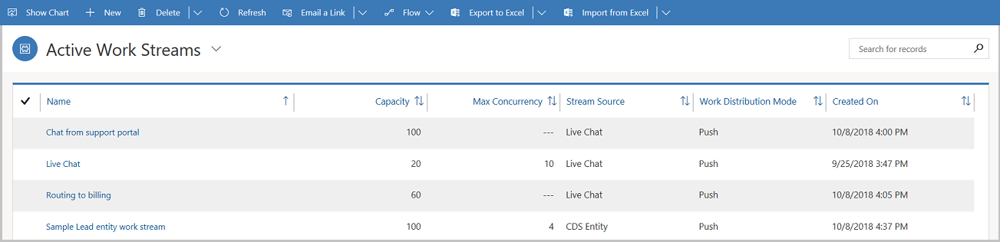
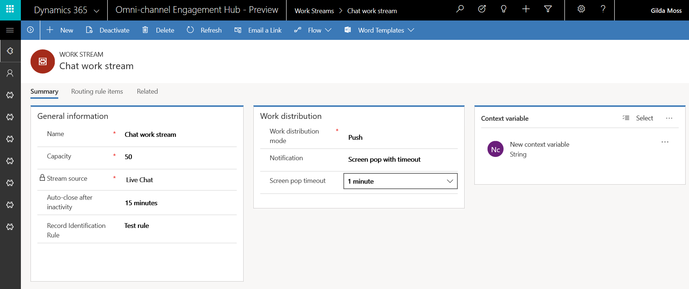
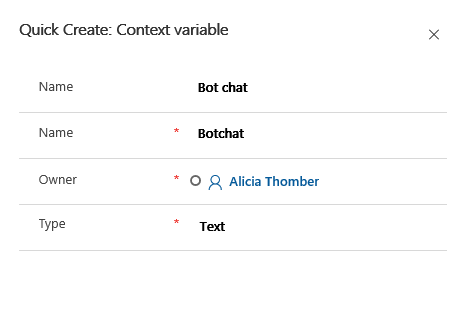
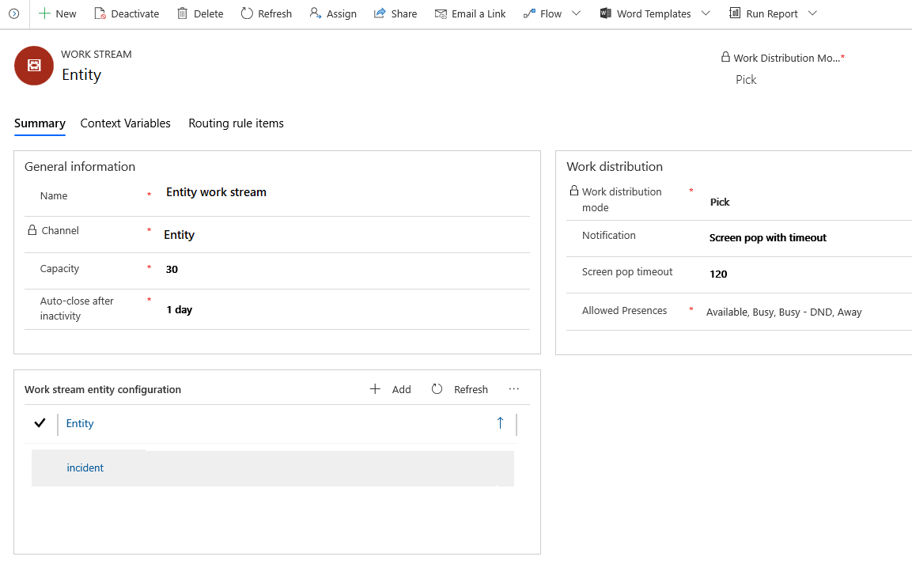
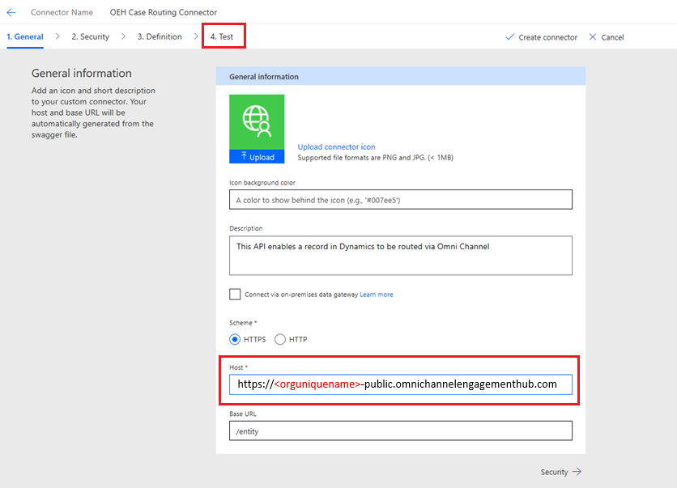
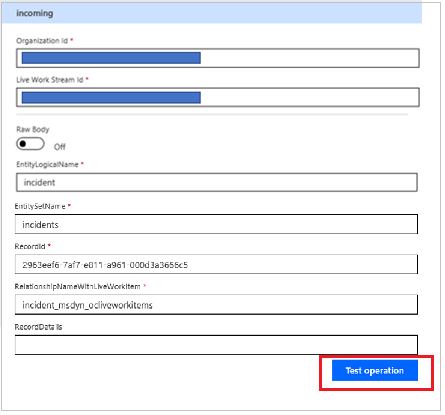

# Understand and create work streams 

Applies to Dynamics 365 for Customer Engagement apps version 9.1.0

[!include[cc-beta-prerelease-disclaimer](../../includes/cc-beta-prerelease-disclaimer.md)]

A work stream is a collection of routing and work distribution settings. Routing settings define how conversations should be routed to queues. Work distribution settings define how conversations should be allocated to agents within a queue. 

In Omni-channel Engagement Hub, you can create the following types of work streams:

- Live chat work stream
- Entity work stream

> [!NOTE]
> A work stream can belong to multiple channels of same type, like multiple chat channels. In this case, all the conversations from these channels inherit the routing and work distribution settings of the work stream they belong to.

## Create a work stream

Follow these steps to create a new work stream in Omni-channel Engagement Hub.

1. In the Omni-channel site map, go to **Work Distribution Management \> Work Streams**.

    The **Active Work Streams** view is shown. 

    > [!div class=mx-imgBorder] 
    > 

2. On the command bar, select **New** to create a work stream.

3. In the **Summary** tab of the new work stream, follow these steps:

   - In the **General information** section, provide the following information:  
      1. **Name**: Enter a name for the work stream.
      2. **Channel**: Channel is defined as a medium through which a customer reaches out for support. For example, a customer can contact an agent through chat.     Select a channel from the drop-down list.  
            - **Live Chat**  
            - **Entity**  
            - **SMS**  

           > [!IMPORTANT]
           > If you select **Entity**, see the [Set up an entity work stream](#set-up-an-entity-work-stream) section later in this topic to configure an entity work stream.

      3. **Capacity**: Specify the units of capacity that are required to process a conversation for the work stream in the text box.
      
      4. **Auto-close after inactivity**: Enter the unit of time after which a conversation is moved from the **Waiting** state to the **Closed** state because of inactivity. 
      5. Select **Save** to save the work stream.

    - In the **Work distribution** section, follow these steps: 

      1. Select whether the **Work distribution mode** should be **Push** or **Pick**.   Work distribution mode defines the experience of how agents can take up a conversation - via **Push** or **Pick** mode. 
            - In **Push** mode, a conversation is dispatched to agents automatically via a screen-pop. 
            - In **Pick** mode, a conversation is dispatched to agents when they explicitly pick a conversation from the **Open work items** in agent dashboard.
      2. In the **Notification** field, select the type of notification setting from the drop-down list.
            - Directly open session
            - Screen pop with timeout
            - Screen pop with decline
      3. In the **Screen pop timeout** field, select the time in which the screen pop times out from the drop-down list .
      4. Select the **Allowed Presences** from the drop-down list. For more information, see [Configure and manage presence status](presence-custom-presence.md).

      > [!div class=mx-imgBorder] 
      > 

4. View and quickly create context variables in the **Context variables** tab. Context variables enrich conversations with pre-chat data, channel data, and custom context data. These attributes can then be used to define routing rules to route conversations into different queues. 

    - Select **New** to create a new context variable in the **Quick Create** window. 
        - Enter **Display Name** for the new variable. **Name** field is populated accordingly.
        - Select the **Type** of the variable from the drop-down list. You can choose from **Text** or **Number**.

            > [!div class=mx-imgBorder] 
            > 

5. Define routing rule items in the **Routing rule items** tab. Routing rule items are configured for each work stream, so that conversations can be routed to the correct queues. To learn how to configure a routing rule, see [Create and manage routing rules in Omni-channel](routing-rules.md). 

6. Select **Save** to save the work stream.

## Associate work streams with channel artefacts

You can associate work streams with channel artefacts so that the conversations can be assigned to agents seamlessly. For example, for a live chat widget, a default work stream is already associated in the **Work stream** field. You can select the search icon to associate another work stream. Select **New** to create a new work stream from within the live chat widget.

To learn more about how to set up channels and associate work streams, see the following topics: 

- [Configure a chat channel](set-up-chat-widget.md)
- [Configure an entity channel](create-entity-channel.md)
- [Configure an SMS channel](configure-sms-channel.md)

## Set up an entity work stream

Entity work streams help route entities from **Common Data Service** to the Omni-channel Engagement Hub. For example, you can enable high-priority cases to be routed to Omni-channel so that they can be automatically distributed and assigned to agents.

> [!NOTE]
> You can route any activity enabled entity.

To set up entity routing, you need to configure an entity work stream in **Omni-channel Engagement Hub** and set up a corresponding flow in **Microsoft Flow**. Follow the detailed steps as given below.

### In Omni-channel Engagement Hub

1. In the Omni-channel site map, go to **Work Distribution Management \> Work Streams**.
2. Fill in the **General information** section as given in [Create a work stream](work-streams-introduction.md#create-a-work-stream).
    For entity work stream, select **Channel** as **Entity**. 
3. Fill in the **Work distribution** section as given in [Create a work stream](work-streams-introduction.md#create-a-work-stream).
4. In the **Work stream entity configuration** section, select **Add** to add a new work stream entity configuration. For more information, see [Configure an entity channel](create-entity-channel.md). 
5. Set up routing rules and queues for the work stream as given in [Create a work stream](work-streams-introduction.md#create-a-work-stream).

      > [!div class=mx-imgBorder]
      > 

### In Microsoft Flow

1. Go to [admin.microsoft.com](https://www.office.com/?auth=2&home=1), and select **Flow** in the list of apps.

   

2. Go to **Settings \> Custom Connectors**, and then select **Create Custom Connector** to create a custom connector.

    
    
3. On the **Create Custom Connector** menu, select **Import an API file**  

4. Enter a name for the custom connector, import **CSS-Entity.swagger.json** file and select **Continue**.

    
    
    > [!NOTE]
    > You can get **CSS-Entity.swagger.json** file from Insider portal. 

5. Update the host name in the **General** tab in the following format:  
    *https://**orguniquename**-crm.omnichannelengagementhub.com*

    You can get **orguniquename** from  [Organization unique name](../../developer/developer-resources-page.md#organization-unique-name).

    > [!div class=mx-imgBorder] 
    > 

6. Go to **Test** tab to test the connector.

1. Select **Create connector** to create a new connector.

    

7. After the connector is created, select **New Connection**. A new connection is created, and the connection name is automatically selected.
8. Provide the following information, and then select **Test Operation** to test the connection:

      1. **Organization ID**: Enter your organization ID.
      2. **Work stream ID**: Enter the ID of work stream configured in Dynamics 365. You can get this ID from URL of the work stream record page.  
      3. **Entity logical name**: Enter the logical name of the entity that you choose to be routed.
      4. **Entity set name**: Enter the set name of the entity that you choose to be routed. (Typically, this is a plural form of the logical name.)
      5. **Record ID**: Enter the ID of work stream entity configuration record, configured in Dynamics 365. You can get this ID from the URL of the work stream entity configuration record page.
      6. **Relationship name with work stream**: Enter the name of the entity relationship with the work stream. You can get this relationship name from **Settings** > **Customizations** > **Entities**.

         

      > [!NOTE]
      > You should receive response 202 when this connection is successfully set up. Usually this takes around 15 minutes.

9. Once the connection is successfully set up, go to **My Flows**.
10. Select **Create from Blank** to create a flow.

    

12. Search for the **Dynamics 365 - When a record is created** trigger and select it.

    

13. Select **New Step \> Add an action**. Search for the custom connector you configured, and then select the action to send entity information.
14. Provide the following information:

      1. **Entity Logical Name**: Enter the logical name of the entity that you choose to be routed.
      2. **Entity Set Name**: Enter the set name of the entity that you choose be routed. (Typically, this is a plural form of the logical name.)
      3. **Record ID**: Use **Add dynamic content** option to search for and select entity name. For example for case entity select **Case** from dyanmic content 
      4. **Name of Entity Relationship With**: Enter the name of the entity relationship with the work stream. You can get this relationship name from **Settings** > **Customizations** > **Entities**. For example for case entity the relationship name would be  **incident\_msdyn\_ocliveworkitems**.
      5. **Record details**: Use **Add dynamic content** option and select **value-key-item-output**.
      6. **Organization ID**: Enter the ID of your organization.
      7. **Work Stream ID**: Enter the ID of work stream configured in Dynamics 365. You can get this ID from the URL of the work stream record page.

         
         
16. After all the information is entered, save and select **Test** to test the flow. Then select **I'll perform the trigger action and save the flow**.

    To test the flow with the entity, create a new record for the entity that you've selected to route.
   
    After a successful run, you should see the following page.

    

### See also

[Automatically identify customers using pre-chat responses](record-identification-rule.md)
