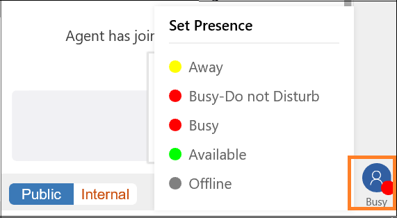

# View Conversation control

Conversation control is a communication panel where you interact with the customer. When you sign in to the application, conversation control displays the welcome screen.

  

Using the chat conversation channel, you can send quick replies and search for and share knowledge articles with the customer with whom you are interacting. You can transfer the work item to another agent or queue. Use the consult option if you need help to resolve the work item. Also, you can switch between internal and public mode to send messages to the internal participants (other agents and/or supervisors).

The landing page explains some of the key features of Omni-channel Engagement Hub and conversation control. When you interact with a customer, you can see the following interface in conversation control.

  

In conversation control, you can see the following options:

 - Public and internal mode

 - Refresh session overview

 - Quick replies

 - Notes

 - Knowledge articles

 - Link to conversation

 - Consult

 - Transfer

### Reply messages with Public and internal mode

While you consult with an agent or supervisor, the customer is also present in the conversation, and you might want to share certain messages only with the consulting agent or supervisor and not with the customer. In this situation, you can choose to reply only to the agent or supervisor. The messages you send are visible only to the agent or supervisor and are classified as **Internal**. The customer who is on the conversation cannot see **Internal** messages.

When you want to send a message to the customer and the agent or supervisor who are present in the conversation, you can send those messages using the **Public** button. These messages are classified as public messages.

You can use the keyboard shortcut to reply only to the agent or supervisor and to all the participants in the interaction.

**/i** (forward slash, letter i) is the keyboard shortcut to send the message as internal to the agents and/or supervisor.

**/p** (forward slash, letter p) is the keyboard shortcut to send the message as public to all participants in the interaction.

### Customer 360 (Session overview)

The Customer 360 page displays details about a customer with whom you interact. When you are conversing with more than one customer simultaneously, and when you switch from one chat conversation to another, you need to refresh the Customer 360 page to get the details of the customer to whom you switched. Use the Refresh button to refresh the Customer 360 page to get relevant details about the customer based on chat conversations with the customer.

### Send quick replies in chat

When you chat with a customer, your organization might have a process that requires you to interact with a set of standard questions and answers. You can use the **Quick replies** option to retrieve the standard set of questions and replies when you are interacting with customers.

  

These questions and answers are stored in templates. You can use keyboard shortcuts to see the list of quick replies.

**/q** (forward slash, letter q) is the keyboard shortcut to see a list of quick replies.

### Take notes specific to conversation

Interaction with customers will lead to information exchanges between the customer and you. Use the notes option to capture information specific to the conversation when you interact with the customers. Use the shortcut to launch the notes.

  

  

When you select the notes option from the conversation control, the application displays the notes panel next to the conversation control. You can capture the points and select **Add**. The notes will be linked to the conversation for you to access at a later point.

### Search and knowledge articles

From the conversation control, you can search for relevant knowledge articles based on the context of the session and share it with the customers through the conversation control. Use the shortcut to launch knowledge articles search.

  

**/kb** (forward slash, letter k, and letter b) is the keyboard shortcut to launch the knowledge articles search control. You can search and share the article with the customer through the conversation control. Use the **Send link** button to share the knowledge article link with the customer.

### Link to conversation

When you have a conversation with a customer, you can link the conversation to the record (case or account/contact).

### Consult with agent or supervisor

When you are interacting with a customer, you might want the expertise of another agent or supervisor. In such scenarios, you can invite the agent or supervisor using the consult option in the chat panel. To invite another agent or supervisor, select the ellipses next to knowledge articles and then select **consult**.

  

You can use the keyboard shortcut to see the list of available agents and/or supervisors with whom you can consult.

**/co** (forward slash, letter c, and letter o) is the keyboard shortcut to see a list of agents and/or supervisors who are available for consult.

### Transfer the conversation

When you work on a conversation request, you might come across the following scenarios:

-   You have minimal knowledge and want to route the request to another agent in the same queue.

-   You identify the request as belonging to a different queue.

In the above-mentioned scenarios, you can transfer the request. However, you can transfer the request only to agents who are configured within the same work stream and queue. If the request belongs to another queue, you can transfer the request and the routing rules will automatically push to the respective queue accordingly.

Use the keyboard shortcut to launch the agent and queue tab to transfer the conversation.

   

**/t** (forward slash, letter t) launches the **Agent** and **Queue** tabs. Select either tab and then select the agent or the queue from the list to transfer the conversation to. The **/t** shortcut keeps the focus on the agent tab whereas the **/tq** shortcut keeps the focus on the queue tab.

### Presence

Presence is the indication of your (agent) availability or status. A presence status is composed of the base presence elements that indicate the category of availability. The five standard base presence elements are Available, Away, Busy, Do Not Disturb, and Offline.

To set the presence, select the status icon at the bottom-right corner and then select the status from the list.

> [!div class="nextstepaction"]
> [Next topic: View notifications and screen pops](csh-notifications-screen-pops.md)

## See also

- [Sign in to Dynamics 365 Customer Service hub](csh-sign-dynamics-365-customer-service-hub.md)
- [Introduction to the agent interface](csh-introduction-agent-interface-omni-channel-engagement-hub-customer-service-hub.md)
- [Sitemap](csh-sitemap.md)
- [Navigation bar](csh-navigation-bar.md)
- [Navigation bar buttons](csh-navigation-bar-buttons.md)
- [View My dashboard and agent work items](csh-my-dashboard.md)
- [Customer 360 overview of the existing challenges](csh-customer-360-overview-of-the-existing-challenges.md)
- [View conversations and sessions in Dynamics 365 Customer Engagement apps](csh-view-conversations-sessions-dynamics-365-apps.md)
- [View customer summary for an incoming conversation request](csh-view-customer-360-incoming-conversation-request.md)
- [Create a record](csh-create-record.md)
- [Search and link record to the conversation](csh-search-link-record.md)