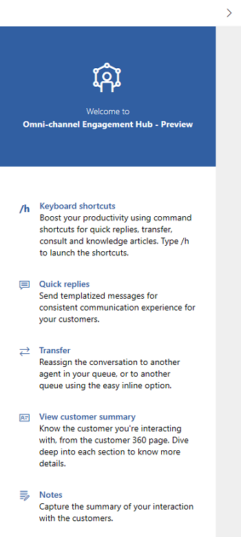
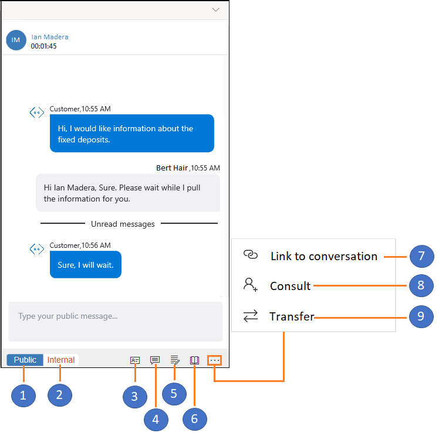
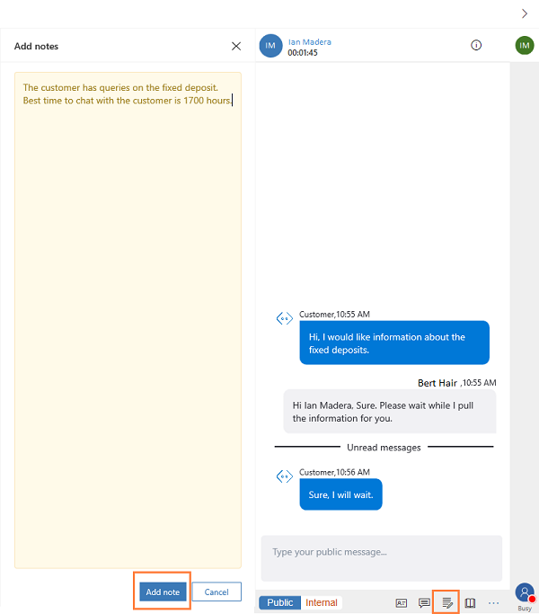
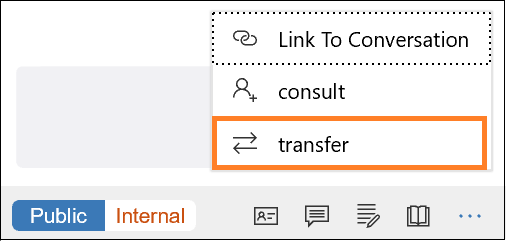
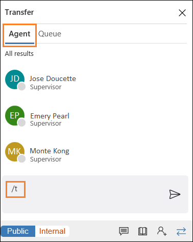
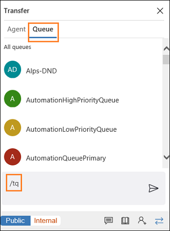

# View communication panel

[!INCLUDE[cc-applies-to-update-9-0-0](../../../includes/cc_applies_to_update_9_0_0.md)]

Communication panel is a conversation control where you interact with the customer. When you sign in to the application, conversation control displays the welcome screen.

 > [!div class=mx-imgBorder] 
 >   

Using the chat channel, you can send quick replies and search for and share knowledge articles with the customer with whom you are interacting. You can transfer the work item to another agent or queue. Use the consult option if you need help to resolve the work item. Also, you can switch between internal and public mode to send messages to the internal participants (other agents and/or supervisors).

The landing page explains some of the key features of Omni-channel Engagement Hub and communication panel. When you interact with a customer, you can see the following interface in communication panel.

 > [!div class=mx-imgBorder]
 >   

In communication panel, you can see the following options:
 
 | Option           | Description                                   |
 |------------------|-----------------------------------------------|
 | Public           | Send messages to public |
 | Internal         | Send messages to internal users |
 | Customer summary | View customer summary |
 | Quick replies    | Send templatized messages  |
 | Notes            | Take notes specific to conversation |
 | Knowledge articles | Search for knowledge articles and share |
 | Link to conversation | Link the record to this conversation |
 | Consult          | View list to consult with other users | 
 |  Transfer        | View list to transfer the request |

### Send messages using Public and Internal mode

The communication panel allows you send messages in two ways - **Internal** and **Public**. 

When you want to send messages only to the internal participants like other agents and/or supervisors, then use the **Internal** option. The internal messages are not shown to the customers.

 > [!div class=mx-imgBorder]
 > 

You can use keyboard shortcuts to send internal and public messages:

- **Slash+I** – Press the Slash (/) key and the letter I to send an internal message to other agents and/or a supervisor.

- **Slash+P** – Press the Slash (/) key and the letter P to send a public message to all the participants in the interaction.

### Customer summary

The Customer summary page displays details about a customer with whom you interact. When you are conversing with more than one customer simultaneously, and when you switch from one chat conversation to another, you need to refresh the Customer summary page to get the details of the customer to whom you switched. Use the Refresh button to refresh the Customer summary page to get relevant details about the customer based on chat conversations with the customer.

 > [!div class=mx-imgBorder]
 > 

### Send templatized messages in the chat

The communication panel allows you to send templatized messages to the customer with whom your're interacting with. These templatized messages are stored as quick replies. Select the **Quick replies** button to retrieve the messages and send it to the customers.

 > [!div class=mx-imgBorder] 
 >   

You can use a keyboard shortcut to see the list of quick replies. Press the Slash (/) key and the letter Q (**/+Q**).

### Take notes specific to conversation

Use the notes option to capture information specific to the conversation when you interact with the customers. Use the shortcut to launch the notes.

 > [!div class=mx-imgBorder]
 >   

 > [!div class=mx-imgBorder]
 >   

When you select the notes option from the communication panel, the application displays the notes panel next to the communication panel. You can capture the points and select **Add**. The notes will be linked to the conversation for you to access at a later point.

### Search and knowledge articles

From the communication panel, you can search for relevant knowledge articles based on the context of the session and share it with the customers through the communication panel. Use the shortcut to launch knowledge articles search.

 > [!div class=mx-imgBorder]
 >   

**/kb** (forward slash, letter k, and letter b) is the keyboard shortcut to launch the knowledge articles search control. You can search and share the article with the customer through the communication panel. Use the **Send link** button to share the knowledge article link with the customer.

### Link to conversation

When you have a conversation with a customer, you can link the conversation to the record (case or account/contact).

### Consult with agent or supervisor

The communication panel allows you to consult with other agents and/or supervisor using the consult option. You can invite the agent or supervisor by selecting the **Consult** button in the communication panel.

 > [!div class=mx-imgBorder]
 >   

You can use a keyboard shortcut to see the list of agents and/or the supervisor who are available for consultation. Press the Slash (/) key and the letters C and O (**/+C+O**).

### Transfer the conversation

The communication panel allows you to transfer a conversation request. You can transfer the conversation (work item) either to an agent or a queue.

 > [!div class=mx-imgBorder]
 > 

You can transfer a request only to agents who are configured in the same work stream and queue. If the request belongs to another queue and when you transfer the request, routing rules assigns the conversation (work item) to the appropriate agent in the queue.

Use a keyboard shortcut to see the list of agents and/or the supervisor who are available for transfer. Press the Slash (/) key and the letters t (**/+t**).

Use a keyboard shortcut to see the list of queues to transfer the conversation request. Press the Slash (/) key and the letters T and Q (**/+T+Q**).

  

**/T** (forward slash, letter t) launches the **Agent** and **Queue** tabs. Select either tab and then select the agent or the queue from the list to transfer the conversation to. The **/T** shortcut keeps the focus on the agent tab whereas the **/TQ** shortcut keeps the focus on the queue tab.

> [!div class="nextstepaction"]
> [Next topic: Set user presence](csh-set-user-presence-status.md)

## See also

- [Sign in to Dynamics 365 Customer Service Hub app](csh-sign-dynamics-365-customer-service-hub.md)
- [Introduction to the agent interface](csh-introduction-agent-interface-omni-channel-engagement-hub-customer-service-hub.md)
- [Know the sitemap navigation](csh-sitemap.md)
- [Navigate using the navigation bar](csh-navigation-bar.md)
- [Navigation bar buttons](csh-navigation-bar-buttons.md)
- [View notifications and screen pops](csh-notifications-screen-pops.md)
- [View agent dashboard and agent work items](csh-my-dashboard.md)
- [View customer summary and know everything about customers about your cusotmers](csh-customer-360-overview-of-the-existing-challenges.md)
- [View conversations and sessions in Dynamics 365 for Customer Engagement apps](csh-view-conversations-sessions-dynamics-365-apps.md)
- [View customer summary for an incoming conversation request](csh-view-customer-360-incoming-conversation-request.md)
- [Create a record](csh-create-record.md)
- [Search and link record to the conversation](csh-search-link-record.md)
