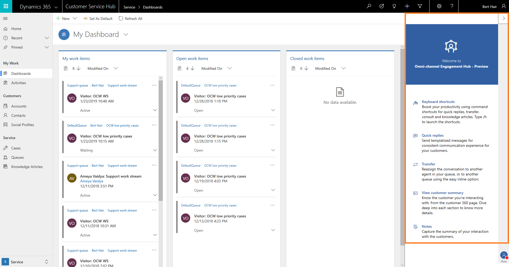

# Introduction to the agent interface of Omni-channel Engagement Hub in Customer Service Hub app

Applies to Dynamics 365 for Customer Engagement apps version 9.1.0

[!include[cc-beta-prerelease-disclaimer](../../../includes/cc-beta-prerelease-disclaimer.md)]

When you sign in to Customer Service Hub app, the Omni-channel Engagement Hub interface has the following components:

1.  Sitemap

2.  Navigation bar

3.  Navigation bar buttons

4.  My Dashboard

5.  Conversation control (Collapsed mode)

 
 > [!div class=mx-imgBorder]
 >   

Conversation control in expanded mode

 > [!div class=mx-imgBorder]
 > 

> [!div class="nextstepaction"]
> [Next topic: Know the sitemap navigation](csh-sitemap.md)

## See also

- [Sign in to Dynamics 365 Customer Service Hub app](csh-sign-dynamics-365-customer-service-hub.md)
- [Navigation bar buttons](csh-navigation-bar-buttons.md)
- [View agent dashboard and agent work items](csh-my-dashboard.md)
- [View communication panel](csh-conversation-control.md)
- [Set user presence](csh-set-user-presence-status.md)
- [View notifications and screen pops](csh-notifications-screen-pops.md)
- [View customer summary and know everything about customers](csh-customer-360-overview-of-the-existing-challenges.md)
- [Search for and share knowledge articles](csh-search-knowledge-articles.md)
- [Take notes specific to conversation](csh-take-notes.md)
- [View conversations and sessions in Dynamics 365 for Customer Engagement apps](csh-view-conversations-sessions-dynamics-365-apps.md)
- [View customer summary for an incoming conversation request](csh-view-customer-360-incoming-conversation-request.md)
- [Create a record](csh-create-record.md) 
- [Search and link record to the conversation](csh-search-record.md)
