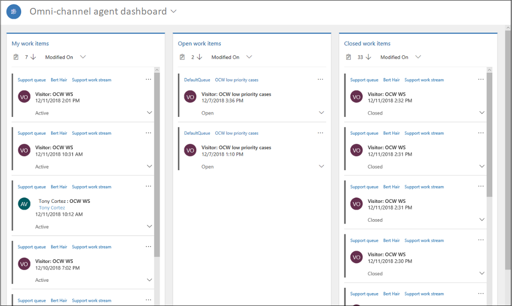

# View agent dashboard and agent conversations (work item)

Applies to Dynamics 365 for Customer Engagement apps version 9.1.0

[!include[cc-beta-prerelease-disclaimer](../../../includes/cc-beta-prerelease-disclaimer.md)]

The My Dashboard is a default view when you sign in to the application. The dashboard displays the following streams:

-   My work items

-   Open work items

-   Closed work items

 

### My work items

In this stream, you see the conversations (work items) that you are actively working on. Select the ellipses and select the **Open** option to open the work item in a session.

### Open work items

In this stream, you see the conversations (work items) in a waiting state from all queues that are available for you to pick. You can see the conversations (work item) for the work streams where you are added as a member. Select the ellipses and select the **Pick** option to assign the work item to yourself. When you select **Pick**, the system moves the work item from the **Open work items** stream to the **My work items** stream, and you can see the message **Work item picked successfully. Work item: < subject of work item >**. 

### Closed work items

In the **Closed work items** stream, the stream refreshes and shows you all the conversations that you've closed in the past 24 hours. To view a closed work item, select the ellipsis button (**...**) for it, and then select **Open** to view the details.

> [!div class="nextstepaction"]
> [Next topic: View communication panel](csh-conversation-control.md)

## See also

- [Sign in to Dynamics 365 Customer Service Hub app](csh-sign-dynamics-365-customer-service-hub.md)
- [Introduction to the agent interface](csh-introduction-agent-interface-omni-channel-engagement-hub-customer-service-hub.md)
- [Know the sitemap navigation](csh-sitemap.md)
- [Navigate using the navigation bar](csh-navigation-bar.md)
- [Navigation bar buttons](csh-navigation-bar-buttons.md)
- [Set user presence](csh-set-user-presence-status.md)
- [View notifications and screen pops](csh-notifications-screen-pops.md)
- [View customer summary and know everything about customers](csh-customer-360-overview-of-the-existing-challenges.md)
- [Search for and share knowledge articles](csh-search-knowledge-articles.md)
- [Take notes specific to conversation](csh-take-notes.md)
- [View conversations and sessions in Dynamics 365 for Customer Engagement apps](csh-view-conversations-sessions-dynamics-365-apps.md)
- [View customer summary for an incoming conversation request](csh-view-customer-360-incoming-conversation-request.md)
- [Create a record](csh-create-record.md)
- [Search and link record to the conversation](csh-search-record.md)
