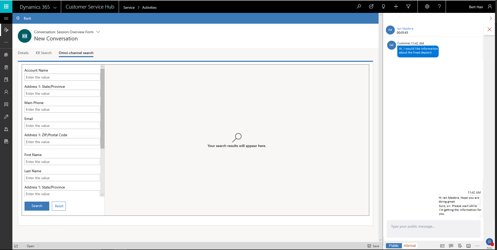
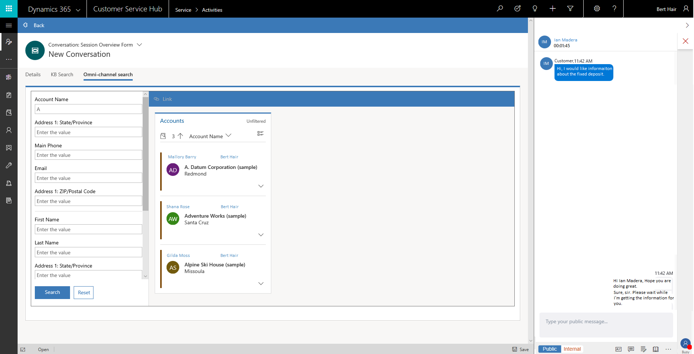
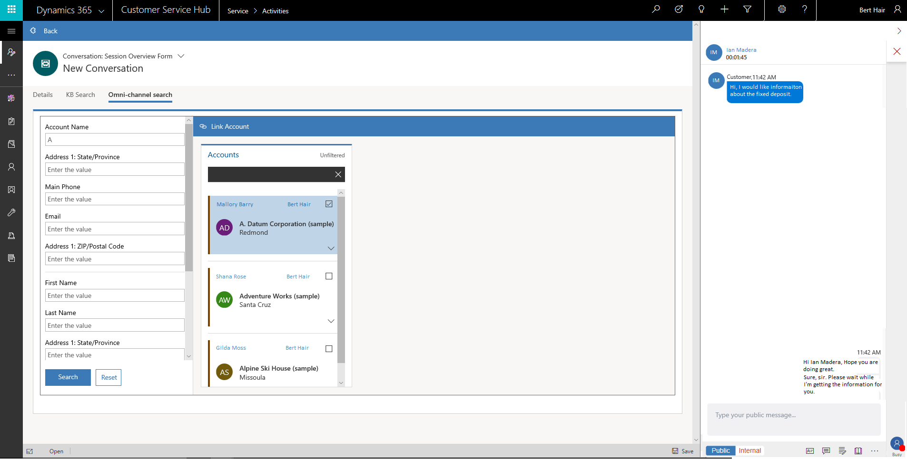

# Search and link a record in Omni-channel Engagement Hub

The topic explains how to search a record in Omni-channel Engagement Hub and link the record to the conversation.

## Search for a record

You can search for the records in two ways.

### Search for a record using the search option

Search the Omni-channel records using the search option. When you select the Search icon, the search page launches in the application management toolbar. Specify the details and select **Search**. You will see the details in the form of a list.

  

1.  Select the search icon . The application launches the Omni-channel search tab.  

2. Specify any of the following values based on your search requirements.

 - Account Name
 - Address 1: State/Province
 - Main Phone
 - Email
 - Address 1: ZIP/Postal Code
 - First Name
 - Last Name
 - Address 1: State/Province
 - Business Phone
 - Email
 - Address 1: ZIP/Post Code
 - Case Number

3. Select **Search** and the search list appears.

 

### Search for a record using inline search option

You accept an incoming conversation request and there is no customer record identified in the Omni-channel Engagement Hub. In this case, use the inline search option in the **Customer profile** form and **Issue snapshot** form to search for a contact or account and case respectively.

> [!div class=mx-imgBorder]
> 

After the search results, selecting a record links the conversation to the selected record and loads the **Customer summary** form with the details.

> [!div class=mx-imgBorder]
> 

## Link a record

Based on the search results, you can choose to link a record from the list. You can link only one record to a conversation.

  

1.  Select the  icon to view the selection list.  

 

2.  Select the check box next to the record you want to link.

   

3.  Select the link button at the top.

 

After you link the record to the conversation, the Customer summary page refreshes and reflects the details. Similarly, you can link other record types.

## See also

- [Sign in to Dynamics 365 Customer Service hub](csh-sign-dynamics-365-customer-service-hub.md)
- [Introduction to the agent interface](csh-introduction-agent-interface-omni-channel-engagement-hub-customer-service-hub.md)
- [Sitemap](csh-sitemap.md)
- [Navigation bar](csh-navigation-bar.md)
- [Navigation bar buttons](csh-navigation-bar-buttons.md)
- [View agent dashboard and agent work items](csh-my-dashboard.md)
- [Conversation control](csh-conversation-control.md)
- [View notifications and screen pops](csh-notifications-screen-pops.md)
- [View customer summary and know everything about customers](csh-customer-360-overview-of-the-existing-challenges.md)
- [View conversations and sessions in Dynamics 365 Customer Engagement apps](csh-view-conversations-sessions-dynamics-365-apps.md)
- [View customer summary for an incoming conversation request](csh-view-customer-360-incoming-conversation-request.md)
- [Create a record](csh-create-record.md)