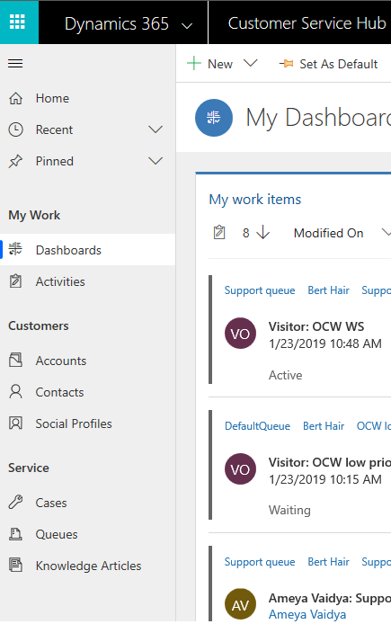

# Know Omni-channel Engagement Hub sitemap in Customer Service Hub app

Applies to Dynamics 365 for Customer Engagement apps version 9.1.0

[!include[cc-beta-prerelease-disclaimer](../../../includes/cc-beta-prerelease-disclaimer.md)]

A sitemap is a place for you to access the customer service record types. By default, the sitemap is in expanded mode. To collapse the sitemap, select the Sitemap icon .

 > [!div class=mx-imgBorder]
 >   

The Sitemap displays the following record types:

- **Dashboards**

  When you sign in to the application, you see a dashboard that gives you easy-to-read information about the tasks you are working. There are several dashboards tailored for your role. To see the other dashboards, select the drop-down list next to **My dashboard**. Also, you can see any dashboard as your default view using the **Set As Default** option in the command bar. By default, you see **My Dashboard**, which displays information about the tasks that you work on. As an agent, when you sign in to the application. The dashboard displays the following forms:

   - My work items
   - Open work items
   - Closed work items

- **Activities**

  Activities help you keep track of all your customer communications in the form of **Conversation** and **Session** record types. Activities are the details of the interactions between the customer and you, such as the history of the conversation, a transcript of the conversation, session details, and more.

- **Accounts**

  Account records are used to store the information that you collect from the customer with whom you interact. That is, you store the details about the companies in the accounts. An account might have more than one contact associated with it.

- **Contacts**

  Contact records help you manage and store information about the customers you work with. Usually, multiple contacts work in the same organization, and as a result, you can associate these contacts with the account (organization).

- **Social Profiles**

  Social profiles are the profiles that contact or account of the customer has on social media. You use the social profiles to interact with the customer on social media and track all the conversations in Common Data Service for apps.

- **Cases**

  Cases (tickets or incidents) are the requests, inquiries, issues, feedbacks, complaints, and so on about the product or service that your customers need assistance to resolve. The cases will be routed to the queues to which you are added as an agent. You link the cases to the conversation and the details appear in the **Customer summary** form.

- **Queues**

  Queues are the route where the cases are assigned to you. Your organization creates queues and agents based on the business requirement. This ensures that you get conversations (work items) from the queues to which you are added as a member (agent). You can view and work on the conversations only to the queues you are assigned as a member (agent).

- **Knowledge articles**

  Knowledge articles are articles about the questions, issues, feedback, resolutions, best practices, and guidelines that are helpful. You can share the articles with the customers and help them to resolve the cases.

> [!div class="nextstepaction"]
> [Next topic: Navigate using the navigation bar](csh-navigation-bar.md)

## See also

- [Sign in to Dynamics 365 Customer Service Hub app](csh-sign-dynamics-365-customer-service-hub.md)
- [Introduction to the agent interface](csh-introduction-agent-interface-omni-channel-engagement-hub-customer-service-hub.md)
- [Navigation bar buttons](csh-navigation-bar-buttons.md)
- [View agent dashboard and agent work items](csh-my-dashboard.md)
- [View communication panel](csh-conversation-control.md)
- [Set user presence](csh-set-user-presence-status.md)
- [View notifications and screen pops](csh-notifications-screen-pops.md)
- [View customer summary and know everything about customers](csh-customer-360-overview-of-the-existing-challenges.md)
- [Search for and share knowledge articles](csh-search-knowledge-articles.md)
- [Take notes specific to conversation](csh-take-notes.md)
- [View conversations and sessions in Dynamics 365 for Customer Engagement apps](csh-view-conversations-sessions-dynamics-365-apps.md)
- [View customer summary for an incoming conversation request](csh-view-customer-360-incoming-conversation-request.md)
- [Create a record](csh-create-record.md)
- [Search and link record to the conversation](csh-search-link-record.md)
