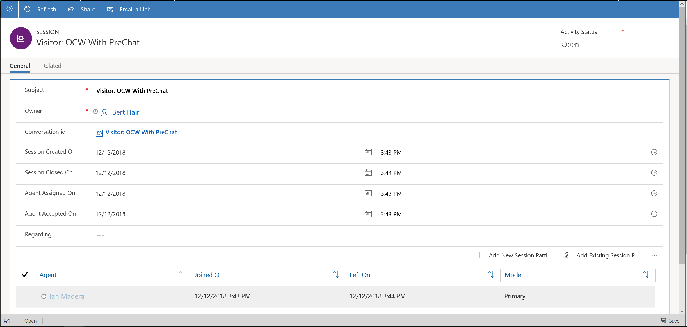

# View Omni-channel conversations and Omni-channel sessions in Dynamics 365 apps

Your organization might have a classification where certain agents work in the contact center that uses Omni-channel Engagement Hub on the web and certain agents work in another contact center that uses Dynamics 365 for Customer Engagement apps. In this case, if you are an agent who works on Dynamics 365 for Customer Engagement apps and you need to analyze the conversation request from Omni-channel Engagement Hub on the web, you can find the information through **Activities** in Dynamics 365 for Customer Engagement apps.

You can find the following activity types in Dynamics 365 for Customer Engagement apps:

-   Conversation Form

-   Session Form

### Conversation Form

The Conversation Form displays information about an engagement request.

  

| **Tab** | **Section**     | **Fields**        |
|---------|-----------------|-------------------|
| Details | Details         | Title             |
|         |                 | Customer          |
|         |                 | Work stream       |
|         |                 | Active agent      |
|         |                 | Activity status   |
|         |                 | Status reason     |
|         |                 | Status updated on |
|         |                 | Regarding         |
|         |                 | Queue             |
|         | History         | Create on         |
|         |                 | Closed on         |
|         |                 | Modified on       |
|         |                 | Transfer count    |
|         |                 | Escalation count  |
|         | Session Details | Subject           |
|         |                 | Date created      |
|         | Chat Transcript | Download          |

### Session form

The session form displays information about a conversation request.

  

| **Tab** | **Section**          | **Field**          |
|---------|----------------------|--------------------|
| General | Header               | Activity Status    |
|         | General              | Subject            |
|         |                      | Owner              |
|         |                      | Conversation id    |
|         |                      | Session Created On |
|         |                      | Session Closed On  |
|         |                      | Agent Assigned On  |
|         |                      | Agent Accepted On  |
|         |                      | Regarding          |
|         |                      | Name               |
|         |                      | Created on         |
|         | Session Participants | Agents             |
|         |                      | Joined On          |
|         |                      | Left On            |
|         |                      | Mode               |

The Session Participants section lets you add the related session participant or a session participant that already exists to the record you are working with.

> [!div class="nextstepaction"]
> [Next topic: View customer summary and know everything about customers](csh-customer-360-overview-of-the-existing-challenges.md)

## See also

- [Sign in to Dynamics 365 Customer Service hub](csh-sign-dynamics-365-customer-service-hub.md)
- [Introduction to the agent interface](csh-introduction-agent-interface-omni-channel-engagement-hub-customer-service-hub.md)
- [Know the sitemap navigation](csh-sitemap.md)
- [Navigate using the navigation bar](csh-navigation-bar.md)
- [Navigation bar buttons](csh-navigation-bar-buttons.md)
- [View agent dashboard and agent work items](csh-my-dashboard.md)
- [Conversation control](csh-conversation-control.md)
- [View notifications and screen pops](csh-notifications-screen-pops.md)
- [Create a record](csh-create-record.md)
- [Search and link record to the conversation](csh-search-link-record.md)