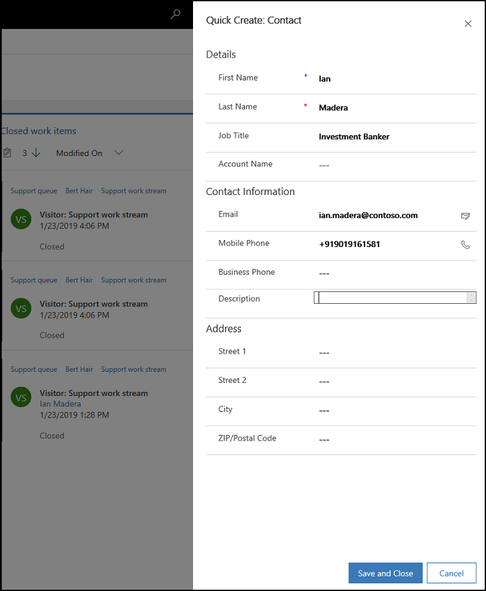

# Create a record

Applies to Dynamics 365 for Customer Engagement apps version 9.1.0

[!include[cc-beta-prerelease-disclaimer](../../../includes/cc-beta-prerelease-disclaimer.md)]

When no records are linked to the conversation in the Omni-channel Engagement Hub, you can create a record using the quick create (**+**) option. After you create the record, it is automatically linked to the conversation.

1.  Select the **+** icon to create a new record.

2.  Select a record type from the list.  
 - Case
 - Contact
 - Account

 > [!div class=mx-imgBorder]
 > 

3. In the left pane, you can see a new record page. Specify the details in the form.

4. Select **Save and Close** to save the changes and close the form.

 > [!div class=mx-imgBorder]
 > 

After you save the changes, the record is linked to the conversation. You can see the linked conversation in the Customer summary page.

> [!div class="nextstepaction"]
> [Next topic: Search, link, and unlink a record](oceh-search-link-unlink-record.md)

## See also

- [View customer summary and know everything about customers](oceh-customer-360-overview-of-the-existing-challenges.md)
- [View conversation and session activity types in the Customer Engagement apps](oceh-view-conversations-sessions-dynamics-365-apps.md)
- [View customer summary for an incoming conversation request](oceh-view-customer-360-incoming-conversation-request.md)
