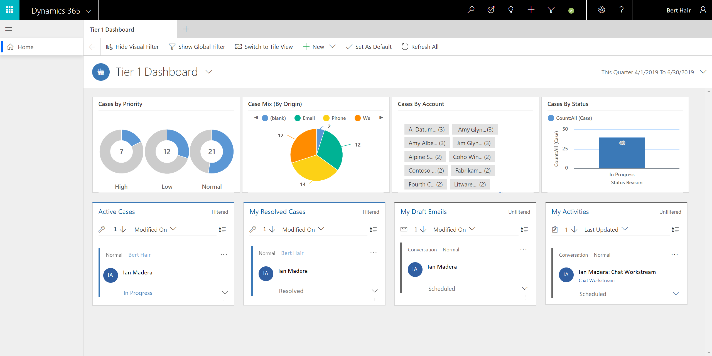
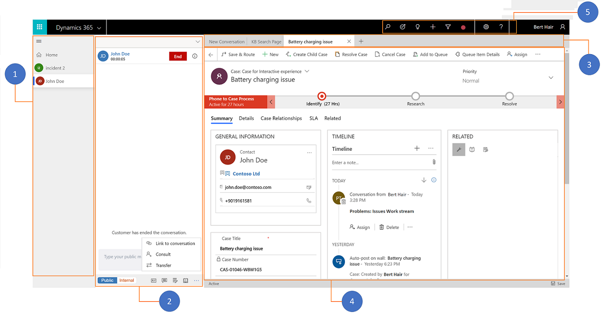
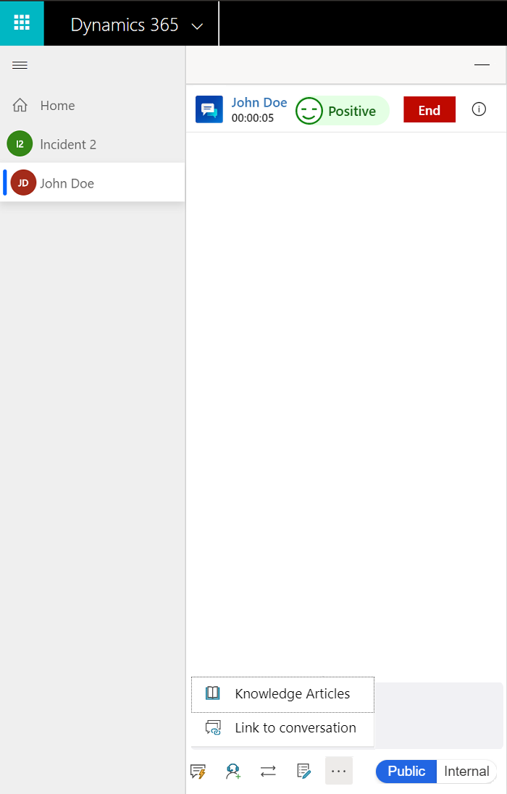
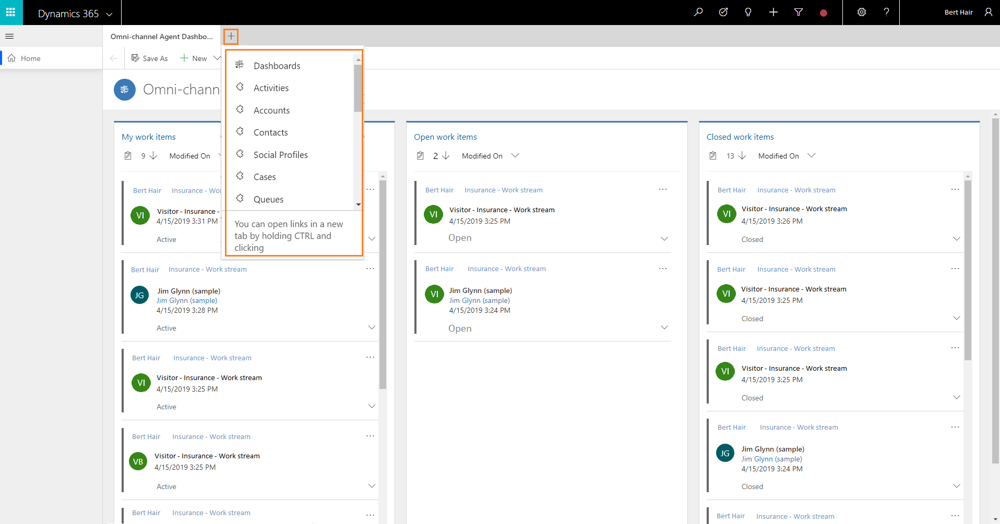
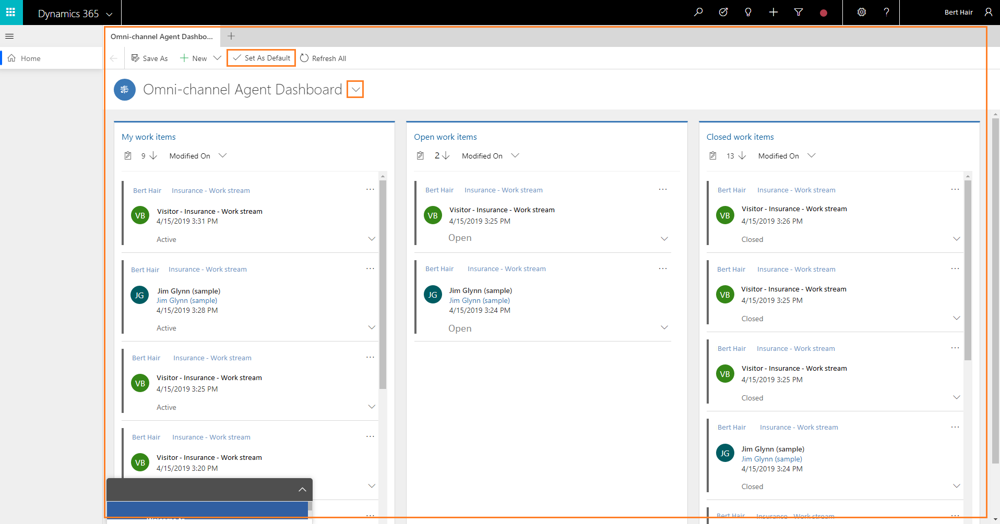
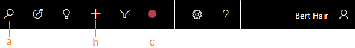
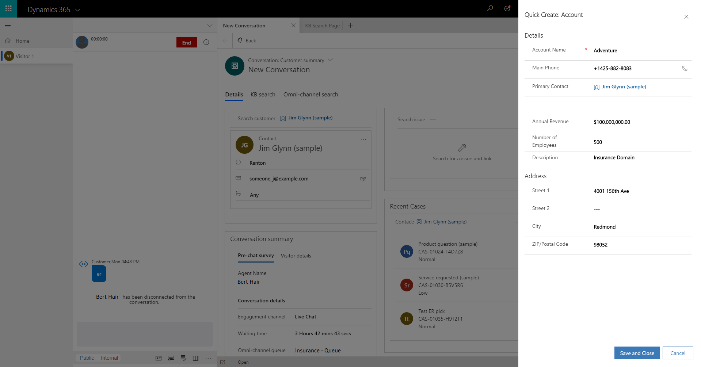

# Introduction to the agent interface of Omni-channel Engagement Hub

Applies to Dynamics 365 for Customer Engagement apps version 9.1.0

[!include[cc-beta-prerelease-disclaimer](../../../includes/cc-beta-prerelease-disclaimer.md)]

The Omni-channel Engagement Hub app for Dynamics is a cloud-based service that enables organizations to instantly connect and engage with their customers via channels like Live Chat and SMS. The app provides context rich multi-tasking experience across different customer interactions.

## Value propositions of Omni-channel Engagement Hub app:

- **Unified experience:** The app provides unified and consistent experience for the agents to access Line-of-Business applications from within the Omni-channel Engagement Hub app.

- **Multi-session and application management:** The app enables agents to handle multiple customer sessions and contextual applications related to the sessions with ease, which in-turn leads to faster case resolution and customer satisfaction.

- **Single-view interface:** The app provides agents the a single-view experience where agents can view the customer information and communication details simultaneously and side-by-side.

- **Deployment and upgrade:** The app is available as a web application (thin client), which makes the maintenance easy and the upgrades are seamless.

- **Extensibility:** The app is built on the Unified Interface framework, which makes easy for the developers and system customizers to customize and extend the app.

## High-level feature capabilities for the agents

As an agent, you might engage with several customers simultaneously across different channels but managing all the customer sessions is a challenge, especially switching between the sessions while understanding the context of the engagement. Omni-channel Engagement Hub provides a consistent experience regardless of the support channel and organizations can maximize agent productivity.

The Omni-channel Engagement Hub provides key capabilities like:

- Agent dashboard
- Multi-session
- Application tabs associated with sessions
- Customer summary
- Presence management
- Notifications
- Consult with agents and/or supervisors
- Transfer conversation to another agent or queue
- Capture notes specific to the conversation

 > [!div class=mx-imgBorder]
 >  

## Components in the agent interface

When you sign in to the Omni-channel Engagement Hub app, the agent interface has the following components:

1. Session panel

2. Communication panel (hidden mode)

3. Application tab panel

4. Unified Interface application area

5. Navigation bar buttons

 > [!div class=mx-imgBorder]
 >  

## 1. Session panel

The vertical panel on the left side is the session panel that allows you (the agent) to work on multiple customer sessions simultaneously. In addition, as an agent you can switch between sessions without losing context of the conversation and customer details. The ability to handle multiple sessions simultaneously (while preserving customer context) allows you to resolve issues faster and achieve higher productivity.

 > [!div class=mx-imgBorder]
 > 

## 2. Communication panel

The communication panel is where you, as an agent, interact with your customer. When you sign in to the application, by default, the communication panel is in hidden mode. That is, the communication panel appears on the left side next to the session panel only when you accept an incoming conversation request. To learn more, see [View communication panel](oceh-conversation-control.md).

 > [!div class=mx-imgBorder]
 > 

## 3. Application tab panel

The horizontal bar below the Dynamics 365 navigation bar is called the application tab panel. Every customer session has at least one that is not closable; it is called a Anchor tab. The Application tab has a **+** icon. If you select the icon, the menu that has options that are made available by your administrator. The menu shows the out-of-box and custom entities. Also, you can access any third-party Line-of-Business applications that is extended within Omni-channel Engagement Hub app. Select the option from the list to open it in the application tab.

> [!div class=mx-imgBorder]
> 

## 4. Unified Interface application area

 When you sign in to Omni-channel Engagement Hub, as an agent, in the application area, you see a dashboard that is set as default by your administrator. If set as default, Omni-channel Agent Dashboard shows the different work items in streams, and the dashboard is present in the application tab of the **Home** session and you can't close the dashboard tab.

   > [!div class=mx-imgBorder]
   > 

   The dashboard shows the following work item streams:
    - **My work items**
    - **Open work items**
    - **Closed work items**

   To learn more, see [View agent dashboard and work items](oceh-omni-channel-agent-dashboard.md).

## 5. Navigation bar buttons

   The navigation bar buttons of Omni-channel Engagement Hub in the Omni-channel Engagement Hub app contains the following:

   

   a. **Search.** Do a simple search for records using the advanced search option and open the record in a application tab. Advanced Search is also called as Categorized Search.

   b. **Quick create.** Add a new record. The quick-create option provides the list of related records (entities) that you can create. The following are the record types that you can create:
    
   - Activities
   - Appointment
   - Email
   - Phone Call
   - Task
   - Account
   - Case
   - Contact
   - Knowledge Article
    
     Select the expand button next to Activities to create different activities.
    
      
    
     When you select any record, the application displays a new quick create form. For example, select the **Account** record from the list. The application displays the **Quick Create: Account** form. Specify the details in the fields and save the form.
    
   > [!div class="mx-imgBorder"]
   > 

   c. **Presence.** Set presence as per your availability. Select the icon to launch the presence dialog and use the drop-down list to select a status. To learn more, see [Manage presence status](oceh-set-user-presence-status.md).

> [!div class="nextstepaction"]
> [Next topic: Manage sessions](oceh-manage-sessions.md)

## See also

- [Manage applications](oceh-manage-applications.md)
- [Understand conversation states](oceh-conversation-state.md)
- [Sign in to Omni-channel Engagement Hub](oceh-sign-dynamics-365-customer-service-hub.md)
- [View communication panel](oceh-conversation-control.md)
- [View agent dashboard and work items](oceh-omni-channel-agent-dashboard.md)