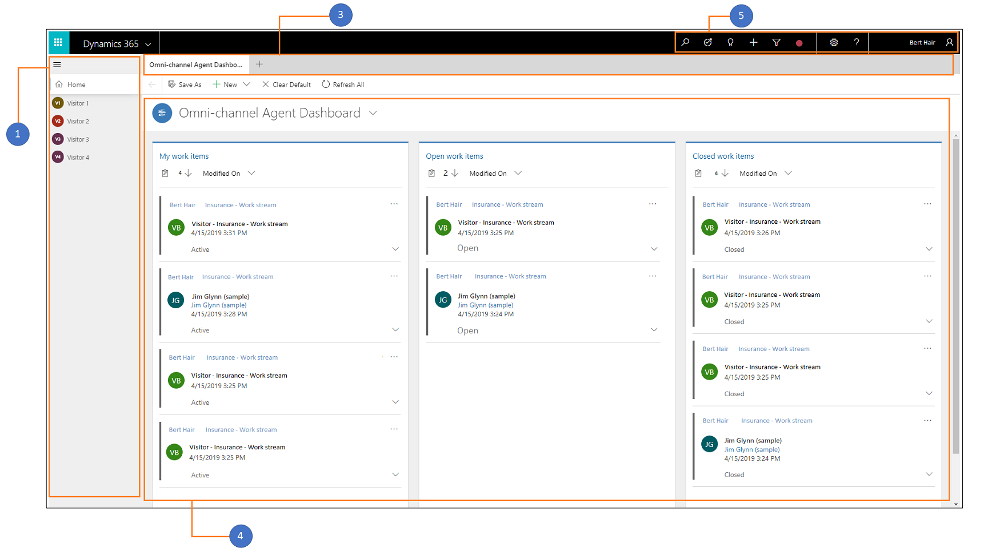
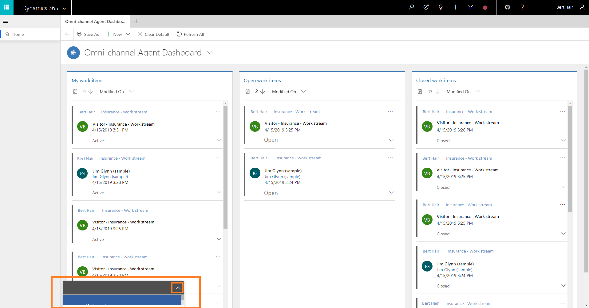

# Introduction to the agent interface of Omni-channel Engagement Hub

Applies to Dynamics 365 for Customer Engagement apps version 9.1.0

[!include[cc-beta-prerelease-disclaimer](../../../includes/cc-beta-prerelease-disclaimer.md)]

## Components in the agent interface

When you sign in to the Omni-channel Engagement Hub app, the agent interface has the following components:

1. Session panel

2. Communication panel (hidden mode)

3. Application tab

4. Omni-channel Agent Dashboard

5. Navigation bar buttons

 > [!div class=mx-imgBorder]
 >  

## 1. Session panel

The vertical panel on the left side is the session panel that allows you (the agent) to work on multiple customer sessions simultaneously. In addition, as an agent you can switch between sessions without losing context of the conversation and customer details. The ability to handle multiple sessions simultaneously (while preserving customer context) allows you to resolve issues faster and achieve higher productivity.

### Start and close a session

As an agent, you can start the sessions in two ways:

- **Manual:** Select **More options** (**...**) in the dashboard and select **Open** or **Pick** to start the session. Open as a session is available for **My work items** and **Open work items** streams. Pick is available in **Open work items** streams.  
In addition, you can press **CTRL** and select on a link that can open as a tab in the application tab. Also, you can press **Shift** and select on a link to open as a session. You can't use the shortcut to open any other links apart from session enabled entities.

- **Accept incoming conversation:** Accept the incoming conversation or by selecting the work items from **Omni-channel Agent Dashboard**. After the session starts, the customer summary page is loaded in the form area.

You can close any session manually by selecting the **X** button next to the session title.

### Mode of Session panel

By default, the session panel is in expanded mode and it is collapsible based on your requirement. The **Home** session is default and you can't close it. The Home session shows the default **Omni-channel Agent Dashboard**.

### Title and icon of the session

By default, the title of session is name of the entity. That is, the title can be of case, account, or contact name. When you get an unauthenticated incoming conversation request, you can search and link the record in the customer or issue snapshot forms. After linking, the session title is automatically updated.

By default, the first two letters of the session title is displayed as the session icon.

 > [!div class=mx-imgBorder]
 > 

## 2. Communication panel

The communication panel is where you, as an agent, interact with your customer. When you sign in to the application, by default, the communication panel is in hidden mode. That is, the communication panel appears on the left side next to the session panel only when you accept an incoming conversation request. To learn more, see [View communication panel](oceh-conversation-control.md).

 > [!div class=mx-imgBorder]
 > 

## 3. Application tab

The horizontal bar below the Dynamics 365 navigation bar is called the application tab. Every customer session has at least one that is not closable; it is called the Anchor tab. The Application tab has a **+** icon. If you select the icon, the sitemap is available as a context menu. The sitemap shows the out-of-box and custom entities. You press **Ctrl** and select any link to open it in the application tab.

> [!div class=mx-imgBorder]
> 

The sitemap displays the following record types:

- **Dashboards**

  When you sign in to the application, you see a dashboard that gives you easy-to-read information about the tasks you are working on. Several dashboards are tailored for your role. To see the other dashboards, select the drop-down list next to **Omni-channel Agent Dashboard**. Also, you can see any dashboard as your default view using the **Set As Default** option in the command bar. By default, you see **Omni-channel Agent Dashboard**, which displays information about the tasks that you work on. As an agent, when you sign in to the application, the dashboard displays the following streams:

    - My work items
    - Open work items
    - Closed work items
    
    To learn more, see [View agent dashboard and work items](oceh-omni-channel-agent-dashboard.md).

- **Activities**

  Activities help you keep track of all your customer communications using the **Conversation** and **Session** form types. Activities are the details of the interactions between the customer and you, such as the history of the conversation, a transcript of the conversation, session details, and more.

To learn more about Accounts, Contacts, Social Profiles, Cases, Queues, and Knowledge articles, see [Understand the sitemap navigation](../../../customer-service/customer-service-hub-user-guide-basics.md#understand-the-sitemap-navigation).

## 4. Omni-channel Agent Dashboard

   When you sign in to Omni-channel Engagement Hub, as an agent, you see the Omni-channel Agent Dashboard that shows the different work items in streams. The dashboard is present in the application tab of the **Home** session and you can't close the dashboard tab.

   > [!div class=mx-imgBorder]
   > 

  - **My work items**

    In this stream, you see the conversations (work items) that you are actively working on. Select the ellipses and select the **Open** option to open the work item in a session.

 - **Open work items**

   In this stream, you see the conversations (work items) in a waiting state from all queues that are available for you to pick. You can see the conversations (work item) for the work streams where you are added as a member. Select the ellipses and select the **Pick** option to assign the work item to yourself.

 - **Closed work items**

   In the **Closed work items** stream, the stream refreshes and shows you all the conversations that you've closed in the past 24 hours. To view a closed work item, select the ellipsis button (**...**) for it, and then select **Open** to view the details.

   To learn more, see [View agent dashboard and work items](oceh-omni-channel-agent-dashboard.md).

## 5. Navigation bar buttons

   The navigation bar buttons of Omni-channel Engagement Hub in the Omni-channel Engagement Hub app contains the following:

   

   a. **Search.** Do a simple search for records using the advanced search option and open the record in a application tab. Advanced Search is also called as Categorized Search.

   b. **Quick create.** Add a new record. The quick-create option provides the list of related records (entities) that you can create. The following are the record types that you can create:
    
   - Activities
   - Appointment
   - Email
   - Phone Call
   - Task
   - Account
   - Case
   - Contact
   - Knowledge Article
    
     Select the expand button next to Activities to create different activities.
    
      
    
     When you select any record, the application displays a new quick create form. For example, select the **Account** record from the list. The application displays the **Quick Create: Account** form. Specify the details in the fields and save the form.

   c. **Presence.** Set presence as per your availability. Select the icon to launch the presence dialog and use the drop-down list to select a status. To learn more, see [Set user presence](oceh-set-user-presence-status.md).

> [!div class="mx-imgBorder"]
> 

> [!div class="nextstepaction"]
> [Next topic: View agent dashboard and work items](oceh-omni-channel-agent-dashboard.md)

## See also
- [Understand conversation states](oceh-conversation-state.md)
- [Sign in to Omni-channel Engagement Hub](oceh-sign-dynamics-365-customer-service-hub.md)
- [View communication panel](oceh-conversation-control.md)