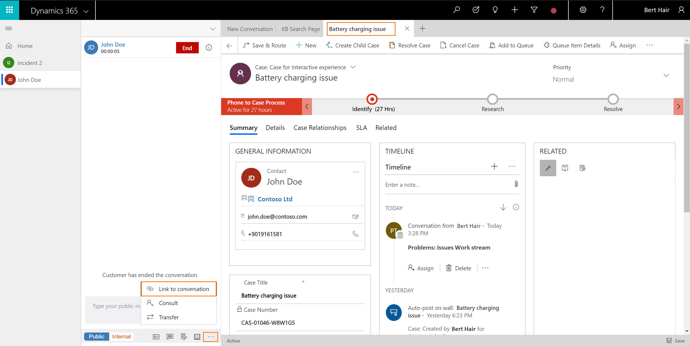

# Link and unlink a record to the conversation

Applies to Dynamics 365 for Customer Engagement apps version 9.1.0

[!include[cc-beta-prerelease-disclaimer](../../../includes/cc-beta-prerelease-disclaimer.md)]

The topic explains how to link and unlink a record to the conversation.

## Link a record to the conversation when doing inline search

> [!div class=mx-imgBorder]
> 

During inline search, the search results are displayed and you can select a record to link the conversation to the selected record. After you link the record, the **Customer summary** form loads with the details.

> [!div class=mx-imgBorder]
> 

> [!Note]
> You can link only one contact or account in the **Customer profile** section and one case in the **Issue snapshot** section.

## Link a record to the conversation

After you search a record using Advanced Search, you can link the record to the conversation from the communication panel. To link a record to the conversation when using Advanced Search, select the record from the list, the record opens in the Application tab. Now, go to the communication panel and select the more options (**...**) and select Link to conversation.

> [!Note]
> You can link only one record to a conversation.

1. Select the record to open it using the Application tab.

2. Select the more options (**...**) in the communication panel, and select **Link to conversation**. The record is linked to the conversation.

> [!div class=mx-imgBorder]
> 

Now, the Customer summary page refreshes and reflects the details. Similarly, you can link other record types.

> [!Note]
> You can link only one contact or account in the **Customer profile** section and one case in the **Issue snapshot** section.

## Unlink a record from the conversation

You can unlink a record only when you are interacting with a customer using the communication panel. That is, after you accept an incoming conversation request and view the **Customer summary** page, you can unlink the record from the conversation. 

> [!div class=mx-imgBorder]
> 

To unlink a record, select the **X** button next to the customer name in the **Customer profile** form. After the record is removed, the **Customer profile** form is blank. 

> [!div class=mx-imgBorder]
> 

> [!Note]
> You can link and unlink only one contact or account in the **Customer profile** section and one case in the **Issue snapshot** section.

## See also

- [View customer summary and know everything about customers](oceh-customer-360-overview-of-the-existing-challenges.md)
- [Search for and share knowledge articles](oceh-search-knowledge-articles.md)
- [Take notes specific to conversation](oceh-take-notes.md)
- [View conversations and sessions in Dynamics 365 for Customer Engagement apps](oceh-view-conversations-sessions-dynamics-365-apps.md)
- [View customer summary for an incoming conversation request](oceh-view-customer-360-incoming-conversation-request.md)
- [Create a record](oceh-create-record.md)
