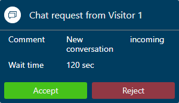

# View notifications

Applies to Dynamics 365 for Customer Engagement apps version 9.1.0

[!include[cc-beta-prerelease-disclaimer](../../../includes/cc-beta-prerelease-disclaimer.md)]

A notification is a visual alert you see as a dialog box each time you get a call, email, chat, or SMS conversation request from a customer. When you get a notification, you see the details of the customer with whom you are going to interact. In addition, in certain types of notifications, you see an accept and reject button that indicates the action you need to perform to accept or reject an incoming conversation request. When you accept the request, a session is started and you can view the contextual information of the customer and case in the customer summary page.

Some of the scenarios for which you can see the screen pop or notifications are:

- Incoming chat conversation

- Incoming SMS conversation

- Incoming email

- Conversation (work item) assignment

- Conversation transfer

- Conversation escalation

## Types of notifications

There are two types of notifications:

- **Toast notifications:** A toast notification or floating notification is a notification message type where you receive information in a dialog, which disappears after a stipulated time. If you select the notification, the associated session or application opens. This type notifications appear for conversation (work item) assignments, conversation escalations, and conversation transfer scenarios and so on. 

- **Alert notifications:** An alert notification is a type of notification where a dialog appears with actionable buttons. When you select the **Accept** button, a screen pops up with Customer summary details. You need to take an action within the stipulated time and the notification disappears when the time is up.

## Incoming chat notification

You receive a notification for an incoming chat request. When you accept the chat request, you’ll see a screen pop with details about the customer in the Customer summary page. A simultaneous session starts, and a chat window expands in the left panel of the Unified Service Desk.

 > [!div class=mx-imgBorder]
 >   

The details you’ll see for a chat channel are:

 - Customer profile (Contact or Account)

 - Case 

 - Conversation summary

 - Recent cases

 - Recent activities

## Incoming SMS notification

You receive a notification for a SMS conversation request. When you accept the SMS request, a session is started, and the communication panel appears where you can exchange messages with the customer. When you select the Customer summary option in the communication panel, the customer details are populated on the Customer summary page.

Identification of a customer happens based on the **Mobile Phone** field present in the Contact record in Dynamics 365 for Customer Engagement. That is, if the incoming SMS conversation is from a phone whose number is present in the mobile phone field of a Contact record, the conversation automatically links to the contact record.

 > [!div class=mx-imgBorder]
 >  

The details you’ll see for a chat channel are:

 - Customer profile (Contact or Account)

 - Case

 - Conversation summary

 - Recent cases

 - Recent activities

> [!div class="nextstepaction"]
> [Next topic: View customer summary and know everything about customers](oceh-customer-360-overview-of-the-existing-challenges.md)

## See also

- [View communication panel](oceh-conversation-control.md)
- [Manage presence status](oceh-set-user-presence-status.md)
- [Search for and share knowledge articles](oceh-search-knowledge-articles.md)
- [Take notes specific to conversation](oceh-take-notes.md)
- [View customer summary for an incoming conversation request](oceh-view-customer-360-incoming-conversation-request.md)