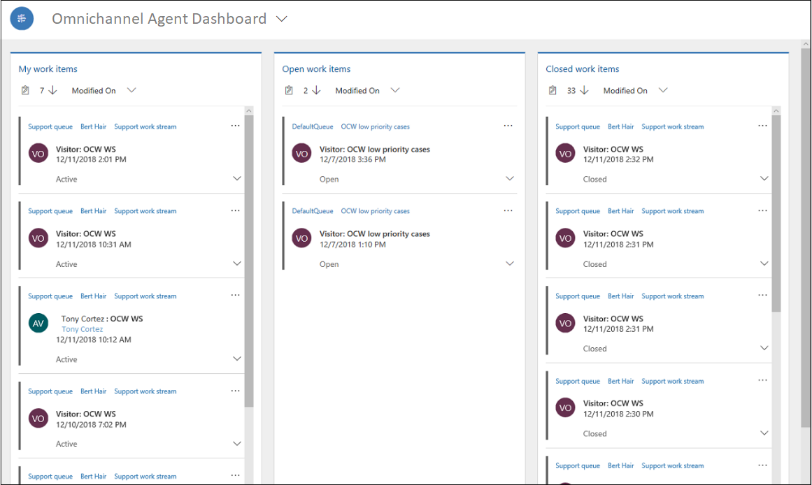

# View agent dashboard and agent conversations (work item)

Applies to Dynamics 365 for Customer Engagement apps version 9.1.0

[!include[cc-beta-prerelease-disclaimer](../../../includes/cc-beta-prerelease-disclaimer.md)]

The Omni-channel Agent Dashboard is a default view when you sign in to the application. The dashboard displays the following streams:

-   My work items

-   Open work items

-   Closed work items

 

### My work items

In this stream, you see the conversations (work items) that you are actively working on. Select the ellipses and select the **Open** option to open the work item in a session.

### Open work items

In this stream, you see the conversations (work items) in a waiting state from all queues that are available for you to pick. You can see the conversations (work item) for the work streams where you are added as a member. Select the ellipses and select the **Pick** option to assign the work item to yourself. When you select **Pick**, the system moves the work item from the **Open work items** stream to the **My work items** stream.

### Closed work items

In the **Closed work items** stream, the stream refreshes and shows you all the conversations that you've closed in the past 24 hours. To view a closed work item, select the ellipsis button (**...**) for it, and then select **Open** to view the details.

> [!div class="nextstepaction"]
> [Next topic: Understand conversation states](oceh-conversation-state.md)

## See also

- [Introduction to the agent interface](oceh-introduction-agent-interface-omni-channel-engagement-hub.md)
- [View communication panel](oceh-conversation-control.md)
