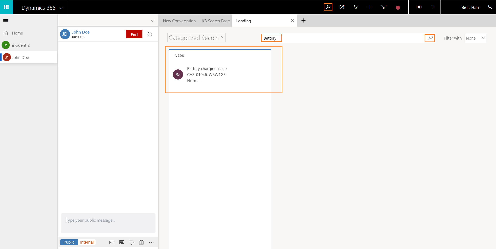

# Search for records in Omni-channel Engagement Hub

Applies to Dynamics 365 for Customer Engagement apps version 9.1.0

[!include[cc-beta-prerelease-disclaimer](../../../includes/cc-beta-prerelease-disclaimer.md)]

The topic explains how to Search for records in Omni-channel Engagement Hub.

You can search for the records in two ways.

## Search for records using inline search option

You accept an incoming conversation request, and there is no customer record identified in Omni-channel Engagement Hub. In this case, use the inline search option in the **Customer profile** form and **Issue snapshot** form to search for a contact or account and case respectively.

The inline search is based on the Lookup View and Quick Find View. You can search the fields (attributes) that is based on the Lookup View and Quick View Field.

For **Customer profile**, you can search for Contact or Account entity. By default, you can search using the following fields.

|Entity|Fields|
|----------|----------|
|Account| <ul> <li>Account Name</li> <li>Account Number</li> <li>Email</li> <li>Main Phone</li> </ul>  |
|Contact| <ul> <li>Company Name </li> <li>Email</li> <li>First Name</li> <li>Last Name</li> <li>Middle Name</li> <li>Full Name</li> <li>Mobile Phone</li> </ul>|

For the **Issue snapshot**, you can search for Case (Incident) entity. By default, you can search using the following fields.

|Entity|Fields|
|--- |--- |
|Case| <ul> <li>Case Number</li> <li>Case Title</li> </ul>|

Only active views are displayed for the search results. Also, you can customize the **Quick Find View** and **Lookup View** to change the searchable fields as per your business requirements. More information [Understand views](/dynamics365/customer-engagement/customize/create-edit-views) and [Unified Interface Lookup view leverages Quick Find View](https://blogs.msdn.microsoft.com/crm/2018/11/02/unified-interface-lookup-now-leverages-quick-find-view/)

To learn on how to link a record, see [Link a record to the conversation](oceh-link-unlink-record.md)

## Search for records using advanced search

Search the records using the advanced search option. When you select the Search icon, the search page launches in the application management toolbar. Specify the details and select the search icon. You will see the details in the form of a list.

You can search for the case, account, contact and its associated fields as enabled by your administrator.

> [!NOTE]
> Advanced Search is also known called as Categorized Search.

  

1. Select the search icon . The application launches the **Advanced Search** tab in the application tab.  

2. In the search box, specify the entity or attribute based on your search requirements and select the search icon.

3. Select **Search**. The search results appear.

 

 > [!div class="nextstepaction"]
 > [Next topic: Link and unlink a record](oceh-link-unlink-record.md)

## See also

- [View customer summary and know everything about customers](oceh-customer-360-overview-of-the-existing-challenges.md)
- [View conversations and sessions in Dynamics 365 for Customer Engagement apps](oceh-view-conversations-sessions-dynamics-365-apps.md)
- [View customer summary for an incoming conversation request](oceh-view-customer-360-incoming-conversation-request.md)
- [Create a record](oceh-create-record.md)