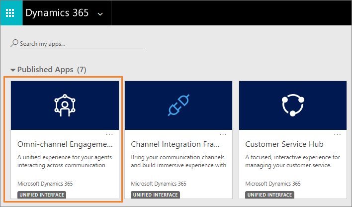

# Sign in to Omni-channel Engagement Hub

Applies to Dynamics 365 for Customer Engagement apps version 9.1.0

[!include[cc-beta-prerelease-disclaimer](../../../includes/cc-beta-prerelease-disclaimer.md)]

The Omni-channel Engagement Hub provides a unified experience for your agents interacting across communication channels to deliver an enhanced customer service.

## Sign in to Omni-channel Engagement Hub

To sign in to Omni-channel Engagement Hub, do the following:

1. Go to `https://<orgURL>.dynamics.com/apps`.

2. Select the **Omni-channel Engagement Hub - Preview** app.

    

> [!div class="nextstepaction"]
> [Next topic: Introduction to the agent interface](oceh-introduction-agent-interface-omni-channel-engagement-hub.md) 

## See also

- [View communication panel](oceh-conversation-control.md)
- [Manage presence status](oceh-set-user-presence-status.md)
