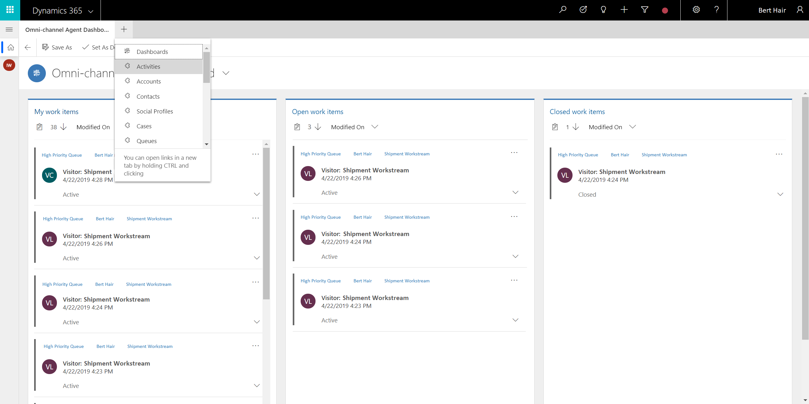
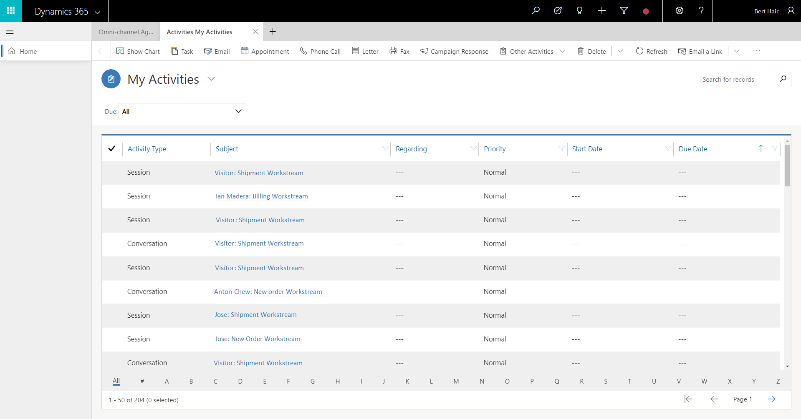
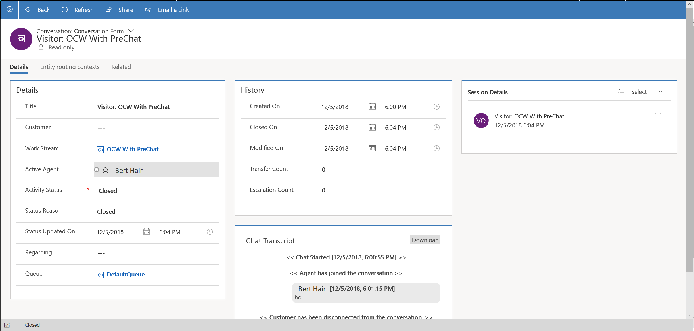
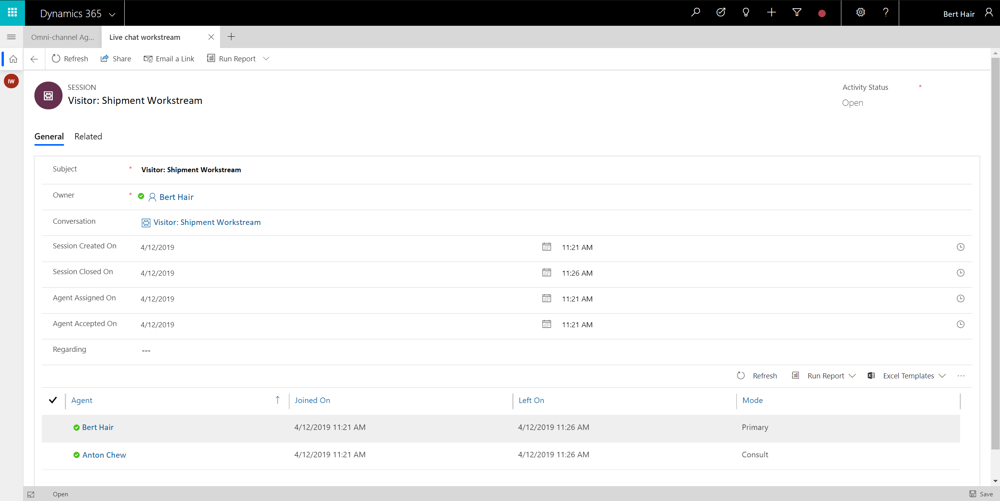

# View conversation and session activity types in the Customer Engagement apps

Applies to Dynamics 365 for Customer Engagement apps version 9.1.0

[!include[cc-beta-prerelease-disclaimer](../../../includes/cc-beta-prerelease-disclaimer.md)]

Your organization might have a classification where certain agents work in the contact center, which uses Omni-channel Engagement Hub on the web and certain agents work in another contact center, which uses Dynamics 365 for Customer Engagement apps. In this case, if you are an agent who works on Dynamics 365 for Customer Engagement apps and you need to analyze the conversation request from Omni-channel Engagement Hub on the web, you can find the information through **Activities** in Dynamics 365 for Customer Engagement apps.

Select the plus icon in the application tab to view the sitemap and select **Activities**.

> [!div class=mx-imgBorder]
> 

You can find the following activity types in Dynamics 365 for Customer Engagement apps:

- Conversation

- Session

> [!div class=mx-imgBorder]
> 

### Conversation activity type

The Conversation activity type displays information about an conversation request.

  

| **Tab** | **Section**     | **Fields**        |
|---------|-----------------|-------------------|
| Details | Details         | <ul> <li>Title</li> <li>Customer</li> <li>Work stream </li> <li>Active agent</li> <li>Activity status</li> <li>Status reason</li> <li>Status updated on</li> <li>Regarding</li> <li>Queue</li> </ul>|
| Details | History         |<ul> Create on</li> <li>Closed on</li> <li>Modified on</li> <li>Transfer count</li>  <li>Escalation count</li> <ul>
| Details | Session Details |<ul> <li>Subject</li> <li>Date created</li> <ul>|
| Details | Chat Transcript |<ul> <li>Download</li> <ul>|

### Session activity type

The session activity type displays information about a individual session in a conversation request.

  

| **Tab** | **Section**          | **Field**          |
|---------|----------------------|--------------------|
| General | Header               | <ul> <li>Activity Status</li> </ul>|
| General | General              | <ul> <li>Subject</li> <li>Owner</li> <li>Conversation id</li> <li>Session Created On</li> <li>Session Closed On</li> <li>Agent Assigned On</li> <li>Agent Accepted On</li> <li>Regarding</li> <li>Name</li> <li>Created on</li> </ul> |
| General | Session Participants | <ul> <li>Agents</li> <li>Joined On</li> <li>Left On</li> <li>Mode</li> </ul> |

The Session Participants section lets you add a participant related to the session or add a session participant that already exists for the record you are working with.

> [!div class="nextstepaction"]
> [Next topic: View customer summary for an incoming conversation request](oceh-view-customer-360-incoming-conversation-request.md)

## See also

- [View customer summary](oceh-customer-360-overview-of-the-existing-challenges.md)
- [Create a record](oceh-create-record.md)
- [Search, link, and unlink a record](oceh-search-link-unlink-record.md)