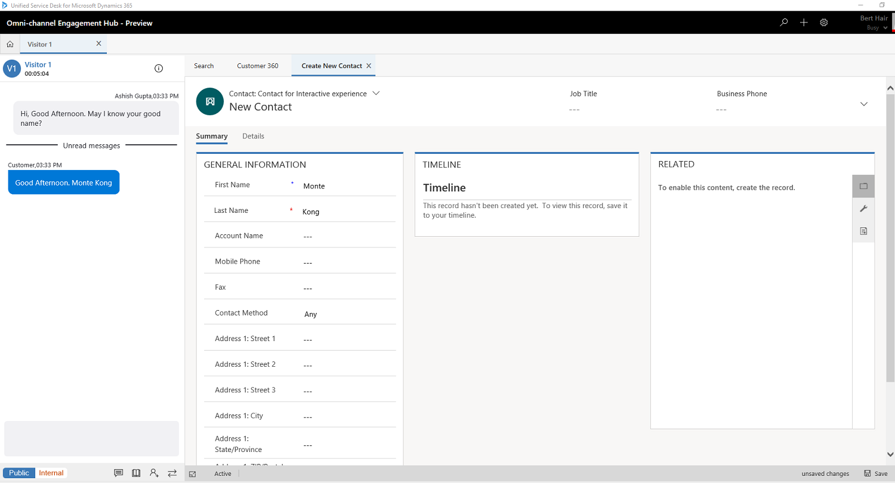

# Create a record in Omni-channel Engagement Hub

Applies to Dynamics 365 for Customer Engagement apps version 9.1.0

[!include[cc-beta-prerelease-disclaimer](../../../includes/cc-beta-prerelease-disclaimer.md)]

If no records are linked to a conversation in Omni-channel Engagement Hub, you can create a record by using the quick create option. To use this option, select the plus sign (**+**). After you create the record, the record is automatically linked to the conversation.

## Create a record

1. Select the plus sign (**+**) to create a record.
 
 > [!div class=mx-imgBorder]
 > 

2. Select a record type from the list. 
    - Case
    - Contact
    - Account

    A page for the new record appears on the **Application management** toolbar.

3. Specify the details on the page, and then save your changes.

 > [!div class=mx-imgBorder]
 > 

> [!div class="nextstepaction"]
> [Next topic: Search for records](search-record.md)

## See also

- [View customer summary and know everything about customers](customer360-overview-existing-challenges.md)
- [View communication panel](left-control-panel.md)
- [View call scripts, take notes, and search knowledge articles](right-control-panel.md)
- [View customer summary for an incoming conversation request](view-customer360-incoming-conversation-request.md)
- [Link and unlink a record](link-unlink-record.md)