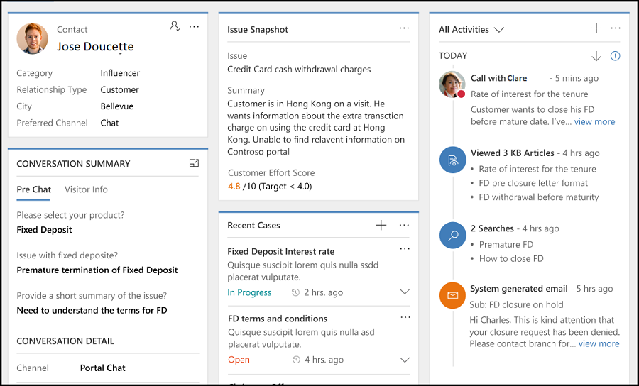
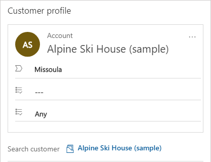
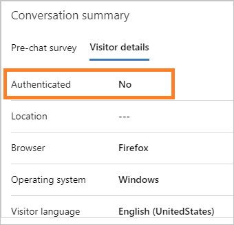
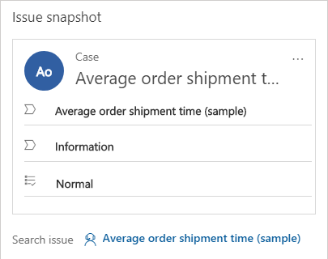
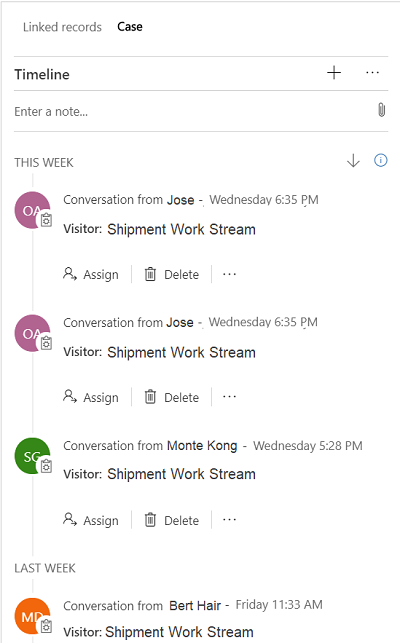

# View customer summary and know everything about customers

Applies to Dynamics 365 for Customer Engagement apps version 9.1.0

[!include[cc-beta-prerelease-disclaimer](../../../includes/cc-beta-prerelease-disclaimer.md)]

## Overview of the existing challenges

One of the major challenges that customers face when contacting customer support is providing repetitive information about the issue with the support agent. Also, if the customer wants to review the status of the request raised at a later stage, the customer shares the same information with another support agent to explain the context of the conversation. To avoid this situation, the support agent must access the customer information with details about the product/service, issue, cases history, related cases, location, and so on.

By having this information ready, when customers reach out to contact center, support agents can help reduce the hold time that they spend retrieving customer information, reduce average handling time (AHT), and increase customer satisfaction through faster resolution of the issue.

### What is Customer summary?

**Customer summary** is a page where you can get complete information about a customer when you accept an incoming request from any engagement channel. The default view of the **Customer summary** page provides the following sections:

   - Customer profile

   - Conversation summary

   - Issue snapshot

   - Recent cases

   - Recent activities

> [!div class=mx-imgBorder]
>   

#### Customer profile

The **Customer profile** section provides details about the customer, such as the name of the customer or account, job, title, relationship type, city, category, relationship type, primary contact for the account, and preferred channel for engagement.

> [!div class='mx-imgBorder']
> 

#### Conversation summary

This section provides two tabs with details that help you to understand the information about the conversation with the customer. **Pre-chat** and **Visitor info** are the tabs in the Conversation summary card. The Pre-chat tab displays the survey answers against the questions that are requested by your organization, which helps your interaction with the customer. The Visitor info tab provides some information like the browser used by the customer for contacting support, the operating system used by the customer, location of the customer, interacting language of the customer and so on.

> [!div class='mx-imgBorder']
> 

If the customer signs in to the portal to initiate a chat with the support, then as an agent, you can see the **Authenticated** field value as **Yes** in the **Visitor details** tab of the **Conversation summary** section. Otherwise, the **Authenticated** field value is shown as **No**.

 

To learn more, see [Create chat authentication settings](../../administrator/create-chat-auth-settings.md)

#### Issue snapshot

For an incoming conversation request, the system links an existing case to the conversation and shows it in the **Issue snapshot** section. This section shows  information such as the title of the case, its priority, its status, the product, and the owner.

> [!div class='mx-imgBorder']
> 

#### Recent cases

This section displays the recent cases that relate to the customer.

> [!div class='mx-imgBorder']
> 

#### All activities

This section displays the case- and customer-related activities in the form of a timeline. You can create quick notes based on the discussion with the customer. Also, you can filter the timeline to view it based on Customer activities, Case activities, and Conversation activities.

> [!div class='mx-imgBorder']
> 

> [!div class="nextstepaction"]
> [Next topic: View communication panel](left-control-panel.md)

## See also

- [Introduction to the agent interface in Omni-channel Engagement Hub](introduction-agent-interface-omni-channel-engagement-hub.md)
- [View call scripts, take notes, and search knowledge articles](right-control-panel.md)
- [View customer summary for an incoming conversation request](view-customer360-incoming-conversation-request.md)
- [Create a record](create-record.md)
- [Search for records](search-record.md)
- [Link and unlink a record](link-unlink-record.md)