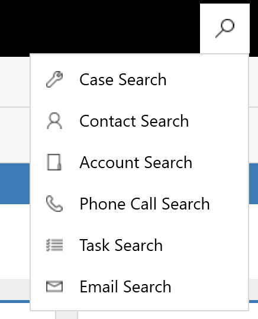
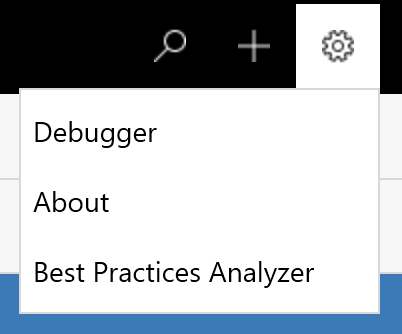
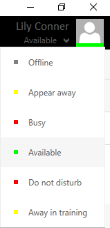
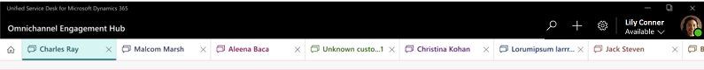
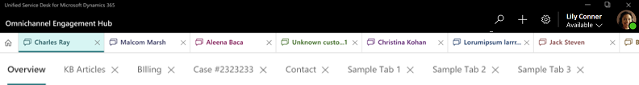

# Introduction to the agent interface in Omni-channel Engagement Hub

When you sign in to Unified Service Desk, the Omni-channel Engagement Hub interface has the following components:

 - Omni-channel toolbar

 - Session tab management toolbar

 - Application tab management toolbar

 > [!div class=mx-imgBorder]
 >  

## Default global toolbar

The Omni-channel toolbar also called as default global toolbar as the components are

 - Search

 - Create

 - Settings

 - Presence

 > [!div class=mx-imgBorder]
 >   

### Search

The **Search** button lets you to search for records and open them in a new active session. You can use the **Search** button to search for the following types of records:

 - Case

 - Contact

 - Account

 - Phone call

-   Task Email
 
 > [!div class=mx-imgBorder]
 >   

### Create

The **Create** button provides a list of related options (entities), so that you can access existing entities and create new entities.

### Settings

The **Settings** menu has **Debugger** and **About** options. These options provide insight into code runs and Unified Service Desk, respectively. There is also an option that opens the Best Practices Analyzer.

 > [!div class=mx-imgBorder]
 >   

#### Debugger

Use the **Debugger** option to gain insight into the process and code runs in the agent application.

#### About

Use the **About** option to view information about the user (agent), the agent's email ID, the Microsoft Dynamics 365 server and organization, Shell Version, and much more.

#### Best Practices Analyzer

Best practices are the guidelines about system configurations, Unified Service Desk, Internet Explorer settings, and Unified Service Desk configurations in Microsoft Dynamics 365 for Customer Engagement. Consider these guidelines our recommended way to use Unified Service Desk and serve your customers.

### Presence

The **Presence** area shows the agent's presence status. Presence status indicates an agent's availability or status. It consists of two elements:

 1. **Base status**: The availability or status category. There are five standard bases statuses: **Available**, **Away**, **Busy**, **Do Not Disturb**, and **Offline**. 

 2. **Presence text**: The text that is associated with a specific base status. For example, in the **Away – Away for lunch** presence status, **Away** is the base status, and **Away for lunch** is the presence text.

 > [!div class=mx-imgBorder]
 >   

## Session management toolbar

Each session in the Unified Service Desk client is shown on the session tab toolbar on the main page. You can identify a session by the session name that is shown on the tab. You can switch between sessions to handle cases without affecting key performance indicators (KPIs).

> [!div class=mx-imgBorder]
>   

## Application management toolbar

The application management toolbar lets you see the all the related information for a session. For example, you can use this toolbar to open the **My Dashboard** page, search, use Customer 360, view a knowledge base (KB) article, or view case details. You can also switch between the application and session tab toolbars to effectively manage your sessions and related applications.

> [!div class=mx-imgBorder]
>  

> [!div class="nextstepaction"]
> [Next topic: View agent dashboard and agent work items](introduction-agent-dashboard.md)

## See also

- [Sign in to Unified Service Desk – Omni-channel Engagement Hub](signin-unified-service-desk-omni-channel-engagement-hub.md)
- [View notifications and screen pops](notifications-screen-pop.md)
- [View customer summary and know everything about customers](customer360-overview-existing-challenges.md)
- [View conversation control](left-control-panel.md)
- [View call scripts, take notes, and search knowledge articles](right-control-panel.md)
- [View conversation and session forms in Dynamics 365 for Customer Engagement apps](view-omni-channel-conversation-omni-channel-session-dynamics365-apps.md)
- [View customer summary for an incoming conversation request](view-customer360-incoming-conversation-request.md)
- [Create a record](create-record.md)
- [Search and link a record](search-link-record.md)