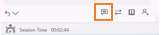
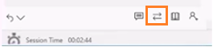

# Conversation panel

The left control panel is a communication or conversation panel. The conversation panel hosts the conversations and you can engage with you customers.

Using the chat conversation channel, you can send quick replies, search and share knowledge articles to the customer with whom you are interacting. Transfer the work item to another agent or queue. Use the consult option if you need help to resolve the work item. Also, you can switch between the internal and public mode to send messages to the internal participants (other agents and/or supervisor).

  

### Reply message as Internal and Public

While you consult with an agent or supervisor, the customer is also present, and you may not want to share certain messages with the customer. In this situation, you can choose to reply only to the agent or supervisor. The messages you send are visible only the agent or supervisor and are classified as **Internal**. The customer who is on the interaction cannot see the **Internal** messages.

When you want to send a message to the customer and agent and or supervisor who are present in the interaction, you can send these messages using the **Public** button. These messages are classified as public messages.

You can use the keyboard shortcut to reply only to the agent or supervisor and to all the participants in the interaction.

**/i** (forward slash, letter i) is the keyboard shortcut to send the message as internal to the agents and/or supervisor.

**/p** (forward slash, letter p) is the keyboard shortcut to send the message as public to the all the participants in the interaction.

### Send quick replies in the chat

When you chat with a customer, your organization may have a process that requires you to interact with a set of standard questions and answers. You can use the **Quick replies** options to retrieve the standard set of questions and replies when you are interacting with the customers.

  

These questions and answers are stored as quick replies and you can use keyboard shortcut to see the list of quick replies.

**/q** (forward slash and letter q) is the keyboard shortcut to see list of quick replies.

### Search and knowledge articles

From the conversation panel you can search for the relevant knowledge articles based on the context of the session and share it with the customers through the conversation panel. Use the shortcut to launch knowledge articles search control in the right panel.

**/kb** (forward slash, letter, and letter b) is the keyboard shortcut to launch the knowledge articles search control. You can search and share the article with the customer through the conversation panel. Use the **Send link** button to share the knowledge article link with the customer.

### Consult with agent or supervisor

When you are interacting with a customer, you want the expertise of another agent or with supervisor. In such scenario, you can Invite the agent or supervisor using consult option in the chat panel.

  

You can use the keyboard shortcut to see the list of available agents and/or supervisor with whom you can consult.

**/co** (forward slash, letter c and letter o) is the keyboard shortcut to see list of agents and/or supervisor who are available for consult.

### Transfer the conversation

When you work on conversation request, you may come across the following scenarios:

-   You have minimal knowledge and want to route the request to another agent in the same queue.

-   You identify the request belongs to a different queue.

In above-mentioned scenarios, you can transfer the request. You can transfer the request only to the agents who are configured with in the same work stream and queue. If the request belongs to another queue, then you can transfer the request and the routing rules will push the queue accordingly.

> [!div class="nextstepaction"]
> [Next topic: Right control panel](right-control-panel.md)

## See also

- [Sign in to Unified Service Desk – Omni-channel Engagement Hub](signin-unified-service-desk-omni-channel-engagement-hub.md)
- [Introduction to the agent interface in Omni-channel Engagement Hub](introduction-agent-dashboard.md)
- [Introduction to agent dashboard](introduction-agent-dashboard.md)
- [Notifications and screen pop](notifications-screen-pop.md)
- [Customer 360 – know everything about customers](customer360-overview-existing-challenges.md)
- [View conversation and session forms in Dynamics 365 for Customer Engagement apps](view-omni-channel-conversation-omni-channel-session-dynamics365-apps.md)
- [View Customer 360 for an incoming conversation request](view-customer360-incoming-conversation-request.md)
- [Create a record](create-record.md)
- [Search and link a record](search-link-record.md)