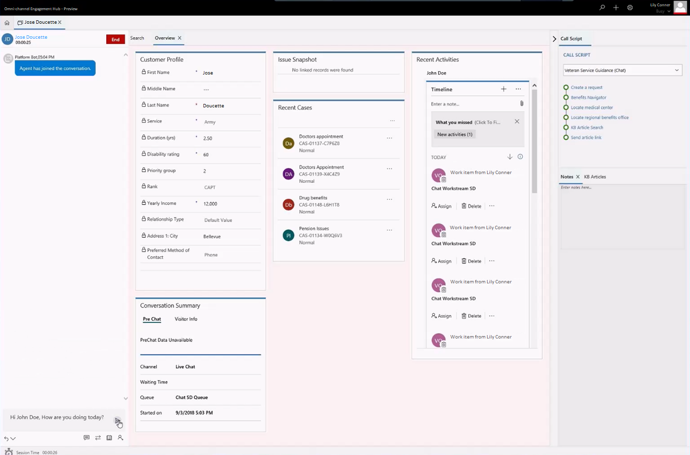

# View alert and toast notifications

Applies to Dynamics 365 for Customer Engagement apps version 9.1.0

[!include[cc-beta-prerelease-disclaimer](../../../includes/cc-beta-prerelease-disclaimer.md)]

A notification is a visual alert that you see as a message box each time that you receive a call, email, chat, or Short Message Service (SMS) conversation request from a customer. You receive notifications even when the Omni-channel Engagement Hub application is minimized.

Notifications show the details of the customer that you will interact with. In addition, some types of notifications include **Accept** and **Reject** buttons and indicate the action that you must perform to accept or reject the incoming conversation request. If you accept the request, a screen pop appears and shows the contextual information of the customer and case.

Here are some of the scenarios where you can receive notifications or see screen pops:

 - Incoming chat

 - Incoming email

 - Case assignment

 - Case transfer

 - Case escalation

### Type of notifications

There are two types of notifications:

 - Toast notifications (floating notifications)

 - Alert notifications

#### Toast notifications (floating notifications)

A toast notification, or floating notification, is a type of notification where information is shown in a screen pop that disappears after a specific time. If you select the notification, the associated session or application is shown.

Toast notifications or floating notifications appear for SMS, email, voice call, consult, and transfer scenarios. This kind of notification may or may not have buttons that require your actions, which depends on your business requirements.

> [!div class=mx-imgBorder]
>   

#### Alert notifications

An alert notification appears as a dialog box that contains buttons. When you select the **Accept** button, a screen pop appears and shows Customer summary details. You must take action within a specific time. After that time passes, the screen pop disappears. If your business requires an auto-accept request for an incoming request based on the routing rules, the alert notification doesn't contain buttons.

##### Incoming chat notification

When a chat conversation request comes in, you receive a notification. When you accept the chat request, a screen pop appears and shows the customer's details on the **Customer summary** page. Simultaneously, a session is started, and the chat window is expanded in the left panel of Unified Service Desk.

> [!div class=mx-imgBorder]
>   

You see the following details for a chat channel:

-   Customer profile

-   Snapshot

-   Conversation summary

-   Recent cases

-   Recent activities

> [!div class=mx-imgBorder]
> 

> [!div class="nextstepaction"]
> [Next topic: View customer summary and know everything about customers](customer360-overview-existing-challenges.md)

## See also

- [View communication panel](left-control-panel.md)
- [View customer summary for an incoming conversation request](view-customer360-incoming-conversation-request.md)