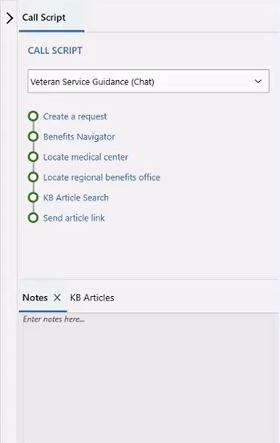
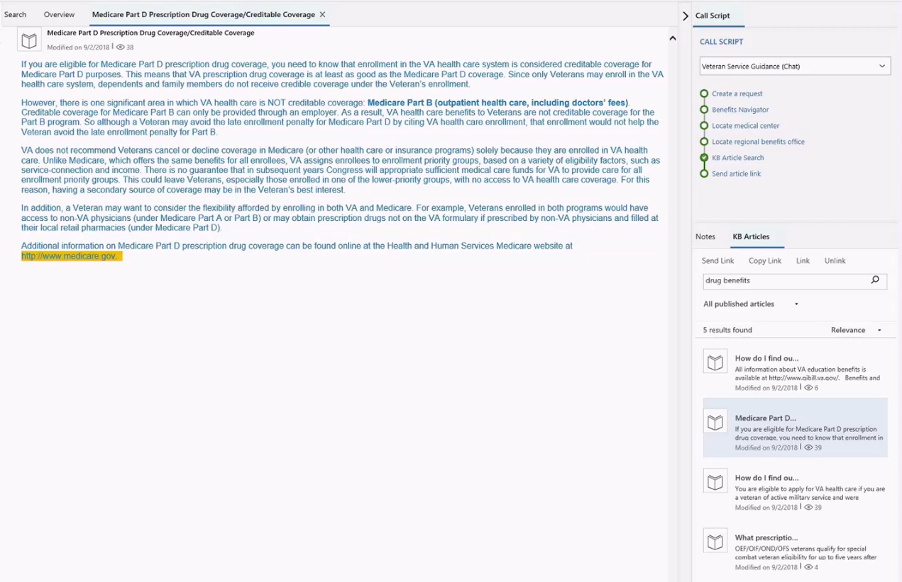

# Right control panel

The right panel consists of agent scripts, notes, and knowledge management search controls.

### Call scripts control

The **Call script** section in the right panel provides guidance about what you should say during calls, or what you should type during chat conversations.

  

### Search for knowledge articles

Knowledge management plays an important part in the customer service process. Access to up-to-date information can help you provide quick and accurate answers to your customers, and can therefore help reduce the average handling time.

Omni-channel Engagement Hub lets you use the rich knowledge base (KB) in Microsoft Dynamics 365 from the desktop. Therefore, you can quickly search for relevant knowledge articles while you're working on a case, and can provide accurate answers to customers, without having to switch applications.

You can search for a KB article and open it as a tab on the Application tab management toolbar. You can also use the **Send Link** button to share the link to a KB article with the customer that you're interacting with. When you select **Send Link**, the link is pasted into the chat window (conversation control).

> [!div class="nextstepaction"]
> [Next topic: View conversation and session forms in Dynamics 365 for Customer Engagement apps](view-omni-channel-conversation-omni-channel-session-dynamics365-apps.md)

## See also

- [Sign in to Unified Service Desk – Omni-channel Engagement Hub](signin-unified-service-desk-omni-channel-engagement-hub.md)
- [Introduction to the agent interface in Omni-channel Engagement Hub](introduction-agent-interface-omni-channel-engagement-hub.md)
- [Introduction to agent dashboard](introduction-agent-dashboard.md)
- [Notifications and screen pop](notifications-screen-pop.md) 
- [Customer 360 – know everything about customers](customer360-overview-existing-challenges.md)
- [Conversation panel](left-control-panel.md)
- [View Customer 360 for an incoming conversation request](view-customer360-incoming-conversation-request.md)
- [Create a record](create-record.md)
- [Search and link a record](search-link-record.md)