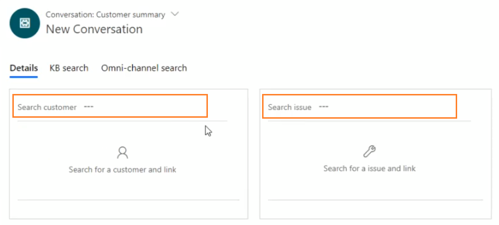
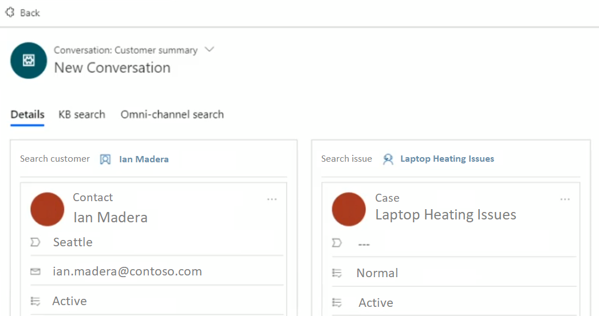

# Search for and link a record in Omni-channel Engagement Hub

[!INCLUDE[cc-applies-to-update-9-0-0](../../../includes/cc_applies_to_update_9_0_0.md)]

The topic explains how to search for a record in Omni-channel Engagement Hub and link it to a conversation.

## Search for a record
You can search for the records in two ways.

### Search for a record using inline search option

You accept an incoming conversation request and there is no customer record identified in the Omni-channel Engagement Hub. In this case, use the inline search option in the **Customer profile** form and **Issue snapshot** form to search for a contact or account and case respectively.

The inline search is based on the Lookup view. You can search the fields (attributes) that is based on the lookup view.

| Entity | Searchable fields (attributes) | Status |
|--------|--------------------------------|--------|
| Accounts | Email |  |
|  | Phone |  |
|  | Name |  |
|  | Address |  |
|  | City |  |
|  | Pin code |  |
| Incident | Case number |  |
|  | Title |  |

Only active lookup views are displayed for the search results. Also, you can customize the lookup views to change the searchable fields as per your business requirements.

> [!div class=mx-imgBorder]
> 

After the search results, selecting a record links the conversation to the selected record and loads the **Customer summary** form with the details.

> [!div class=mx-imgBorder]
> 

### Search for a record using the search option

You can search for omni-channel records by using the search functionality. When you select the **Search** button, the **Search** page appears on the application management toolbar. Specify the details, and then select **Search**. The results appear in the form of a list.

1. Select the search icon , and select **Omni-channel Search**.

2. Specify any of the following values as per your search requirements:

 - Account Name
 - Address 1: State/Province
 - Main Phone
 - Email
 - Address 1: ZIP/Post Code
 - First Name
 - Last Name
 - Address 1: State/Province
 - Business Phone
 - Email
 - Address 1: ZIP/Post Code
 - Case Number

3. Select **Search**. The list of search results appear.

## Link a record

You can link a record in the list of search results to a conversation. You can link only one record to a conversation.

1. Select the  icon to view the selection list.

 > [!div class=mx-imgBorder]
 > 

2. Select the check box next to the record you want to link.

 > [!div class=mx-imgBorder]
 > 

3. Select the link button at the top.

 > [!div class=mx-imgBorder]
 > 

After you link the record to the conversation, the Customer summary form is refreshed and reflects the details. Similarly, you can link other record types.

## See also

- [Sign in to Unified Service Desk – Omni-channel Engagement Hub](signin-unified-service-desk-omni-channel-engagement-hub.md)
- [Introduction to the agent interface in Omni-channel Engagement Hub](introduction-agent-interface-omni-channel-engagement-hub.md)
- [View agent dashboard and agent work items](introduction-agent-dashboard.md)
- [View notifications and screen pops](notifications-screen-pop.md)
- [View customer summary and know everything about customers](customer360-overview-existing-challenges.md)
- [View conversation control](left-control-panel.md)
- [View call scripts, take notes, and search knowledge articles](right-control-panel.md)
- [View conversation and session forms in Dynamics 365 for Customer Engagement apps](view-omni-channel-conversation-omni-channel-session-dynamics365-apps.md)
- [View customer summary for an incoming conversation request](view-customer360-incoming-conversation-request.md)
- [Create a record](create-record.md)
