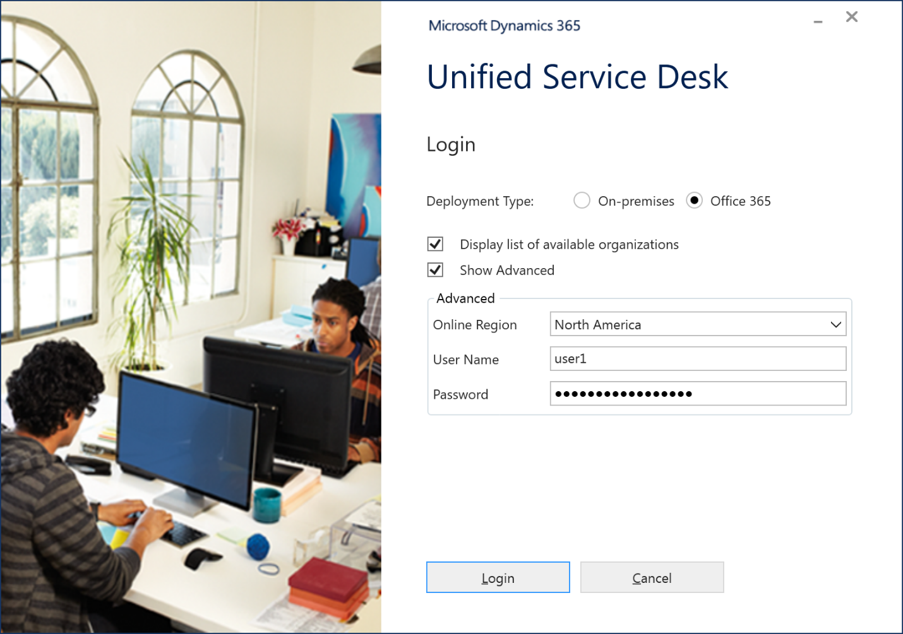

# Sign in to Unified Service Desk – Omni-channel Engagement Hub

Applies to Dynamics 365 for Customer Engagement apps version 9.1.0

[!include[cc-beta-prerelease-disclaimer](../../../includes/cc-beta-prerelease-disclaimer.md)]

1. Start the Unified Service Desk client by double-clicking the application shortcut on your desktop.

2. In the Unified Service Desk sign-in dialog box, provide authentication details to connect to your Dynamics 365 for Customer Engagement server, and then select **Login**.

     **For online deployments**

     | Field | Value | Example |
     |-------|-------|---------|
     | Deployment Type  | Office 365 for online deployments |  |
     | Display list of available organizations | Select the checkbox to display organizations on which the Omni-channel Engagement Hub is deployed   |   |
     | Show Advanced | Select the checkbox to display the following fields:    - Online Region    - Username    - Password |                       |
     | Online Region | The datacenter region where your Dynamics 365 (online) instance is hosted | North America |
     | Username | The username of the user (agent, supervisor, and administrator) signing in to Unified Service Desk | user1@onmicrosoft.com |
     | Password | The password associated with the username |  |

   

3. If you have multiple organizations, select the organization you want to connect to.

4. In the app selection dialog, select the **Omni-channel Administrator - Preview** app from the list.

You signed in to Unified Service Desk - Omni-channel Engagement Hub application.

> [!div class="nextstepaction"]
> [Next topic: Introduction to the agent interface in Omni-channel Engagement Hub](introduction-agent-interface-omni-channel-engagement-hub.md)

## See also

- [Omni channel engagement hub for agent](omni-channel-engagement-hub-agent.md)
- [View agent dashboard and agent work items](introduction-agent-dashboard.md)
