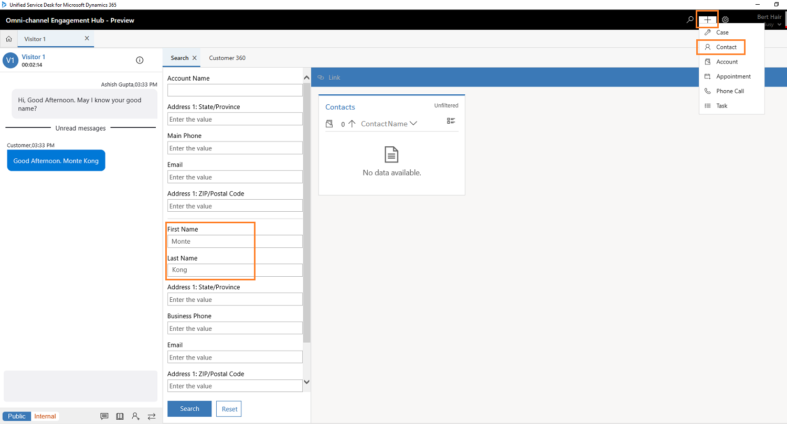
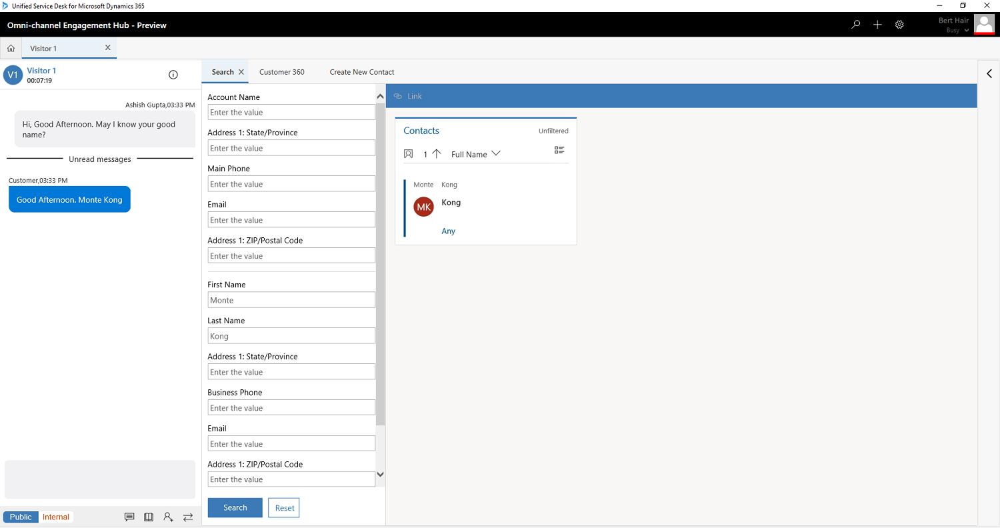

# View customer summary for an incoming conversation request

Applies to Dynamics 365 for Customer Engagement apps version 9.1.0

[!include[cc-beta-prerelease-disclaimer](../../../includes/cc-beta-prerelease-disclaimer.md)]

## Scenario 1: Incoming conversation request for an existing customer record that already has a case in Omni-channel Engagement Hub  

When you receive an incoming conversation request, you see a notification (screen pop) that contains contextual information for the request. When you accept or select the notification, the **Customer summary** page appears. This page shows the details of the customer and case.

## Scenario 2: Incoming conversation request where you find several customer records in the Omni-channel Engagement Hub 

When you receive an incoming conversation request, you see a notification (screen pop) that contains contextual information for the request. Omni-channel Engagement Hub shows the following message: **One or more records found. Select a record or create new**.
### Select a record

If you select a case, the contact or account opens the **Customer summary** page by prepopulating the details.

If you select a contact or account, the **Customer summary** page is refreshed, and the **Issue Snapshot** section is updated with the current case details.

If you select a case that differs from the case that is assigned to you, you receive a warning message and must link the conversation to the record.

### Create a record

You can create a contact or account by using the quick create option. After you create the record, the case is automatically linked to the conversation. However, no records are present in Omni-channel Engagement Hub, based on the contextual information that is obtained from the notifications (screen pops).

However, there are no records present in Omni-channel Engagement Hub based on the contextual information obtained from the notification (screen pop).

> [!div class=mx-imgBorder]
>   

## Scenario 3: Incoming conversation request where you find no customer records in Omni-channel Engagement Hub 

When you get an incoming conversation request, you see a notification (screen pop) with contextual information for an incoming request. However, if there are no records present in Omni-channel Engagement Hub based on the incoming conversation request, you see a message stating - **No records found. Search for an existing customer record or create a new one to link to this conversation**.

### Search for records

When you choose to Search for records, the application opens the **Search** on the toolbar. You can search by using the following fields:

-   First name

-   Last name

-   Account name

-   Address

-   City

-   State

-   Phone number

-   Email ID

-   Case ID

After the search is completed, the results are shown in the form of a list.

> [!div class=mx-imgBorder]
>   

If you select a case, the contact or account opens the **Customer summary** page by prepopulating the details.

If you select a contact or account, the **Customer summary** page is refreshed, and the **Issue Snapshot** section is updated with the current case details.

If you choose a case that is different than the one you are assigned, then you see a warning message that needs your action to link the conversation to the record.

### Create a record

When no record is found in Omni-channel Engagement Hub, you can create a contact or account by using the quick create option. After you create the record, the case is automatically linked to the conversation. However, no records are present in Omni-channel Engagement Hub, based on the contextual information that is obtained from the notification (screen pop).

> [!div class=mx-imgBorder]
>   

> [!div class="nextstepaction"]
> [Next topic: Create a record](create-record.md)

## See also

- [View customer summary and know everything about customers](customer360-overview-existing-challenges.md)
- [View communication panel](left-control-panel.md)
- [View call scripts, take notes, and search knowledge articles](right-control-panel.md)
- [View conversation and session forms in Dynamics 365 for Customer Engagement apps](view-omni-channel-conversation-omni-channel-session-dynamics365-apps.md)
- [Search for records](search-record.md)
- [Link and unlink a record](link-unlink-record.md)