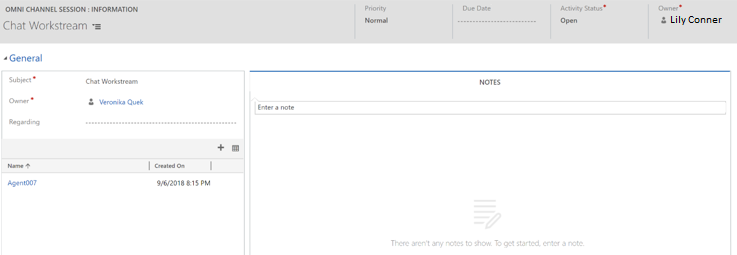

# View omni-channel conversations and omni-channel session in Dynamics 365 apps

Applies to Dynamics 365 for Customer Engagement apps version 9.1.0

[!include[cc-beta-prerelease-disclaimer](../../../includes/cc-beta-prerelease-disclaimer.md)]

In your organization, some agents might work in a contact center that uses Omni-channel Engagement Hub, whereas other agents work in a different contact center that uses Microsoft Dynamics 365 apps, such as Omni-channel Engagement Hub app. In this case, if you're an agent who works in Dynamics 365 apps, and you must analyze a conversation request from Omni-channel Engagement Hub, you can find the information through **activities** in Dynamics 365.

You can find the following activity types in Dynamics 365 for Customer Engagement apps:

 - Conversation form

 - Omni-channel session

### Conversation form

The conversation form displays information about a conversation request.

| Section         | Field            |
|-----------------|-------------------|
| Details         | <ul> <li>Title</li> <li>Customer</li> <li>Live work stream</li> <li>Active agent</li>  <li>Activity status</li> <li>Status reason</li> <li>Status updated on</li> <li>Regarding</li> <li>Queue</li> </ul> |
| History         | <ul> <li>Created on</li> <li>Closed on</li> <li>Modified on</li> <li>Transfer count</li> <li>Escalation count</li> </ul> |
| Session details | <ul> <li>Subject</li> <li>Date created</li> </ul> |

> [!div class=mx-imgBorder]
>   

### Session form

The omni-channel session displays information about a conversation request.

| Section | Field           |
|---------|-----------------|
| Header  | <ul> <li>Priority</li> <li>Due Date</li> <li>Activity Status</li> </ul> |
| General | <ul> <li>Subject</li> <li>Owner</li> <li>Regarding</li> <li>Name</li> <li>Created on</li> </ul>|
| Notes   | <ul> <li>Notes</li> </ul> |

> [!div class=mx-imgBorder]
>  

> [!div class="nextstepaction"]
> [Next topic: View customer summary for an incoming conversation request](view-customer360-incoming-conversation-request.md)

## See also

- [View customer summary and know everything about customers](customer360-overview-existing-challenges.md)
