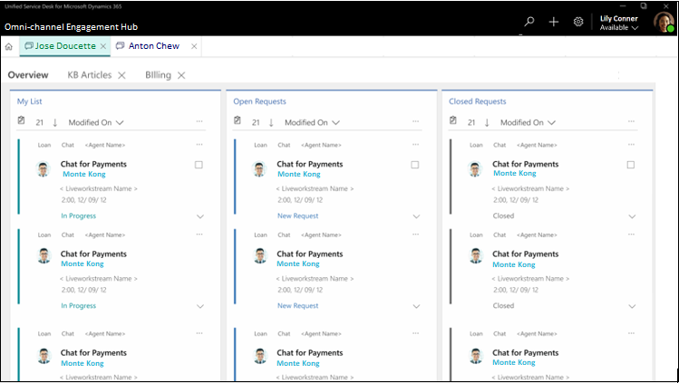

# Introduction to agent dashboard

When you sign in to Unified Service Desk, you see the **My Dashboard** page of the Omni-channel Engagement Hub. The **My Dashboard** page is a multi-stream view of the conversations where you can view the conversations that you are actively working on, conversations that are available for you to pick from the queues, and conversations that you completed within the last 24 hours.

The **Home** button on the **Session Management** tab provides a quick navigation to the dashboard page, and when you select the button, the dashboard appears on the **Application Management** tab. The **My Dashboard** page consists of the following work streams:

-   My conversations

-   Open conversations

-   Closed conversations

   

### My conversations

In this work stream, you see the conversations that you are actively working. Select the ellipsis and select the **Open** option to open the work item as a session in the session management tab.

### Open conversations

In this work stream, you see the conversations in waiting state from all queues that are available for you to pick. You can see the conversations for the work streams where you are added as a member. Select the ellipsis and select the **Pick** option to assign the work item to you. When you select **Pick**, the system moves the work item from **Open conversations** stream to **My conversations** stream and you can see the message - **Work item picked successfully. Work item: <subject of work item>** . You can see the subject of the work item that you picked.

### Closed conversations

In this work stream, you see the conversations that you completed during the past 24 hours. The work stream refreshes every business to reflect the conversations that you closed in past 24 hours. To view a closed work item, select the ellipsis and then select the **Open** option to view the details in a form.

