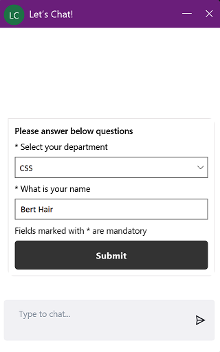

# Omni-channel Engagement Hub for customers

These days, customers expect a great customer experience regardless of the channel that they use to contact an organization. In this situation, messaging is as a key support channel that lets customers instantly interact with an organization.

The chat widget lets your customers connect with you in a way that is convenient for them (for example, from their mobile devices or a computer). Available agents can then connect with the customers to respond to their queries.

To show the chat widget on a website or a portal, the admin who is configuring the chat widget must embed the JavaScript snippet in the code. By default, the chat widget on websites and portals is shown to customers in minimized mode.

After the chat widget is configured, it has the following capabilities:

- **Minimized mode**: By default, the chat widget is shown in minimized mode. If any messages are received while the widget is in this mode, a count of the messages is shown.

    > [!div class=mx-imgBorder]
    > 

- **Maximized mode**: A user can maximize the chat widget to start a conversation with an agent.

    > [!div class=mx-imgBorder]
    > 

- **System events**: System-generated messages are shown for events, such as when an agent joins a chat or a chat is transferred to another agent.
- **Pre-chat survey**: If a survey has been configured by an admin, it's shown to the user before the conversation is started. This survey also helps the user connect to an appropriate agent.
- **Chat notifications**: Chat notifications are shown when the chat widget is in minimized mode, and when it's opened on a different browser tab. When the chat widget is in minimized mode, it shows a message count. If you move away from the browser tab where you're chatting, the message count is shown on the tab.
- **End chat**: A customer can end the chat by selecting the **Close chat** button. A confirmation message is displayed before ending the chat.